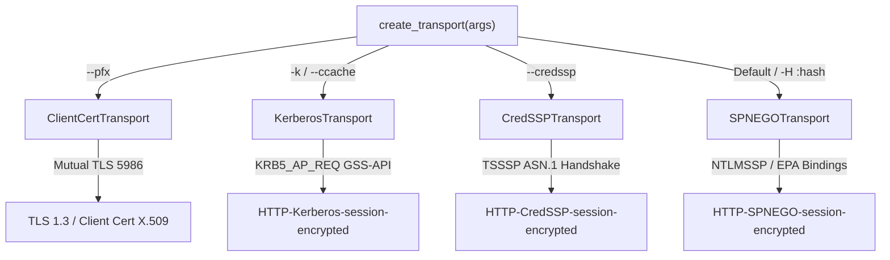
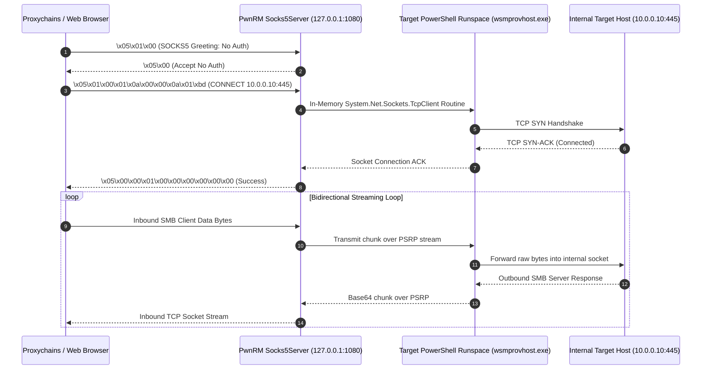

# 01 — Architecture, Core Subsystems & Wire Protocols

## 1. MS-PSRP Wire Protocol & Binary Framing Specification

PowerShell Remoting does not transmit raw plaintext command strings across the network. It operates as a layered protocol stack defined by the **Microsoft PowerShell Remoting Protocol ([MS-PSRP])**, encapsulated within **WS-Management ([MS-WSMV])** SOAP envelopes transported over HTTP (port 5985) or HTTPS (port 5986).

```
+-------------------------------------------------------------------------------+
| HTTP / HTTPS Request Layer (POST /wsman)                                      |
+-------------------------------------------------------------------------------+
| WS-Management SOAP Envelope (<s:Envelope xmlns:s=".../soap-envelope">)        |
+-------------------------------------------------------------------------------+
| PSRP Stream Message (<rsp:Stream Name="stdin" CommandId="...">)               |
+-------------------------------------------------------------------------------+
| PSRP Binary Fragment Header (ObjectId, FragmentId, Flags, BlobLength)         |
+-------------------------------------------------------------------------------+
| PSRP Message Data (Destination, MessageType, RPID, PID, Payload Data)         |
+-------------------------------------------------------------------------------+
| CLIXML Serialized Payload (<Obj RefId="0"><MS><S N="...">...</S></MS></Obj>)  |
+-------------------------------------------------------------------------------+
```

---

### 1.1 WS-Management SOAP Envelope Anatomy ([MS-WSMV])

Every interaction with the WinRM service (`wsmprovhost.exe`) begins with a WS-Management SOAP request. A standard command creation envelope contains strict WS-Addressing and WS-Transfer XML headers:

```xml
<s:Envelope xmlns:s="http://www.w3.org/2003/05/soap-envelope"
            xmlns:a="http://schemas.xmlsoap.org/ws/2004/08/addressing"
            xmlns:w="http://schemas.dmtf.org/wbem/wsman/1/wsman.xsd"
            xmlns:p="http://schemas.microsoft.com/wbem/wsman/1/powershell">
  <s:Header>
    <a:To>http://10.0.0.5:5985/wsman</a:To>
    <a:Action>http://schemas.microsoft.com/wbem/wsman/1/windows/shell/Command</a:Action>
    <a:MessageID>uuid:8C892160-5028-4BC3-9C1C-036B9F2A669B</a:MessageID>
    <w:ResourceURI>http://schemas.microsoft.com/powershell/Microsoft.PowerShell</w:ResourceURI>
    <w:MaxEnvelopeSize mustUnderstand="true">512000</w:MaxEnvelopeSize>
    <w:SelectorSet>
      <w:Selector Name="ShellId">uuid:3838E7E4-5CD8-4F11-9A74-12C85A80DB14</w:Selector>
    </w:SelectorSet>
    <w:OptionSet>
      <w:Option Name="protocolversion" MustComply="true">2.3</w:Option>
    </w:OptionSet>
  </s:Header>
  <s:Body>
    <rsp:CommandLine xmlns:rsp="http://schemas.microsoft.com/wbem/wsman/1/windows/shell">
      <rsp:Command>powershell</rsp:Command>
      <rsp:Arguments>-NoProfile -NonInteractive -ExecutionPolicy Bypass</rsp:Arguments>
    </rsp:CommandLine>
  </s:Body>
</s:Envelope>
```

---

### 1.2 Binary Fragment Header Layout ([MS-PSRP] §2.2.4)

When higher-layer PSRP messages exceed the maximum fragment payload capacity (typically 32,768 bytes), the PSRP engine slices the message into binary fragments. Each fragment begins with a mandatory 21-byte binary header:

```text
 0                   1                   2                   3
 0 1 2 3 4 5 6 7 8 9 0 1 2 3 4 5 6 7 8 9 0 1 2 3 4 5 6 7 8 9 0 1
+-+-+-+-+-+-+-+-+-+-+-+-+-+-+-+-+-+-+-+-+-+-+-+-+-+-+-+-+-+-+-+-+
|                          ObjectId (8 bytes)                   |
|                      (Big-Endian uint64)                      |
+-+-+-+-+-+-+-+-+-+-+-+-+-+-+-+-+-+-+-+-+-+-+-+-+-+-+-+-+-+-+-+-+
|                         FragmentId (8 bytes)                  |
|                      (Big-Endian uint64)                      |
+-+-+-+-+-+-+-+-+-+-+-+-+-+-+-+-+-+-+-+-+-+-+-+-+-+-+-+-+-+-+-+-+
|     Flags     |              Blob Length (4 bytes)            |
|    (1 byte)   |               (Big-Endian uint32)             |
+-+-+-+-+-+-+-+-+-+-+-+-+-+-+-+-+-+-+-+-+-+-+-+-+-+-+-+-+-+-+-+-+
|                         Fragment Data ...                     |
|                      (Blob Length bytes)                      |
+---------------------------------------------------------------+
```

#### Field Definitions:
- **`ObjectId` (8 bytes, `uint64_be`)**: Unique integer identifier assigned to a single logical PSRP message. All fragments belonging to the same logical message share identical `ObjectId` values.
- **`FragmentId` (8 bytes, `uint64_be`)**: Monotonically increasing zero-based fragment sequence number (`0, 1, 2, ...`).
- **`Flags` (1 byte, bitmask)**:
  - `0x01` (`StartFragment`): Marks the initial fragment of a fragmented message.
  - `0x02` (`EndFragment`): Marks the terminal fragment of a fragmented message.
  - `0x03` (`StartFragment | EndFragment`): Unfragmented message (entire message fits in one fragment).
- **`Blob Length` (4 bytes, `uint32_be`)**: Exact byte count of the fragment payload following the header.

---

### 1.3 PSRP Message Types & Internal Payload Framing ([MS-PSRP] §2.2.1)

Once all fragments for an `ObjectId` are assembled, the inner PSRP message is unpacked according to the following byte layout:

```text
+-+-+-+-+-+-+-+-+-+-+-+-+-+-+-+-+-+-+-+-+-+-+-+-+-+-+-+-+-+-+-+-+
|                      Destination (4 bytes)                    |
+-+-+-+-+-+-+-+-+-+-+-+-+-+-+-+-+-+-+-+-+-+-+-+-+-+-+-+-+-+-+-+-+
|                      MessageType (4 bytes)                    |
+-+-+-+-+-+-+-+-+-+-+-+-+-+-+-+-+-+-+-+-+-+-+-+-+-+-+-+-+-+-+-+-+
|                     RunspacePoolId (16 bytes)                 |
|                            (GUID)                             |
+-+-+-+-+-+-+-+-+-+-+-+-+-+-+-+-+-+-+-+-+-+-+-+-+-+-+-+-+-+-+-+-+
|                      PipelineId (16 bytes)                    |
|                            (GUID)                             |
+-+-+-+-+-+-+-+-+-+-+-+-+-+-+-+-+-+-+-+-+-+-+-+-+-+-+-+-+-+-+-+-+
|                      Data (CLIXML Payload)                    |
+---------------------------------------------------------------+
```

#### PSRP Message Type Reference Table:

| Message Type Name | Hex Opcode | Direction | Description |
|---|---|---|---|
| `SESSION_CAPABILITY` | `0x00010004` | Client ⇄ Server | Initial protocol handshake negotiating protocol version (`2.1`, `2.2`, `2.3`) and serialization configuration. |
| `INIT_RUNSPACEPOOL` | `0x0001000B` | Client → Server | Initializes the execution context, Min/Max Runspace boundaries, host info, and apartment state. |
| `PUBLIC_KEY_REQUEST` | `0x00010014` | Client ⇄ Server | Exchanges RSA public keys for in-band secure credential serialization. |
| `SET_MAX_RUNSPACES` | `0x00010002` | Client → Server | Adjusts the maximum concurrent Runspace worker pool allocation on the target. |
| `RUNSPACEPOOL_STATE` | `0x00021005` | Server → Client | Reports status changes (`BeforeOpen`, `Opening`, `Opened`, `Closed`, `Broken`). |
| `CREATE_PIPELINE` | `0x00021006` | Client → Server | Dispatches a PowerShell ScriptBlock or Cmdlet pipeline for execution inside the pool. |
| `GET_AVAILABLE_RUNSPACES` | `0x0001000C` | Client → Server | Queries the count of idle Runspaces ready to accept pipeline tasks. |
| `PIPELINE_INPUT` | `0x00041002` | Client → Server | Feeds pipeline input objects into the executing command standard input stream. |
| `PIPELINE_OUTPUT` | `0x00041003` | Server → Client | Streams real-time `stdout` objects serialized as CLIXML from the target process. |
| `ERROR_RECORD` | `0x00041004` | Server → Client | Streams structured `stderr` / exception records (`System.Management.Automation.ErrorRecord`). |
| `PIPELINE_STATE` | `0x00041005` | Server → Client | Emits execution state updates (`Running`, `Completed`, `Failed`, `Stopped`). |

---

### 1.4 CLIXML Serialization & Extended Type System (ETS)

PowerShell serializes all pipeline data into **CLIXML** (Common Language Infrastructure XML). Unlike simple plaintext streams, CLIXML preserves rich .NET type fidelity, Extended Type System (ETS) properties, and nested object hierarchies:

```xml
<Obj RefId="0">
  <TN RefId="0">
    <T>System.Diagnostics.Process</T>
    <T>System.ComponentModel.Component</T>
    <T>System.MarshalByRefObject</T>
    <T>System.Object</T>
  </TN>
  <ToString>System.Diagnostics.Process (wsmprovhost)</ToString>
  <MS>
    <S N="ProcessName">wsmprovhost</S>
    <I32 N="Id">1844</I32>
    <I64 N="WorkingSet64">48234496</I64>
    <B N="Responding">true</B>
    <DT N="StartTime">2026-08-29T10:15:30.1234567+07:00</DT>
    <Obj N="Threads" RefId="1">
      <TNRef RefId="0" />
      <LST>
        <Obj RefId="2">
          <I32 N="Id">1848</I32>
          <S N="ThreadState">Running</S>
        </Obj>
      </LST>
    </Obj>
  </MS>
</Obj>
```

#### CLIXML Type Tags:
- `<S>`: Unicode String.
- `<I32>` / `<I64>`: Signed 32-bit / 64-bit Integers.
- `<B>`: Boolean (`true` / `false`).
- `<DT>`: ISO 8601 DateTime.
- `<BA>`: Base64-encoded Byte Array.
- `<Obj>` / `<MS>`: Complex Object with MemberSet property dictionary.
- `<LST>` / `<Arr>`: Generic Lists and Arrays.
- `<Nil />`: Null / None value.

#### Real-Time Generator Stream Extraction:
PwnRM's execution engine (`pwnrm.core.runspace.Runspace.run_command`) consumes CLIXML streams dynamically via Python generators. As chunked XML packets arrive:
1. Extracts `ToString` textual representations and raw object properties.
2. Passes raw text through `strip_ansi()` to scrub ANSI/VT100 escape codes and prevent terminal injection.
3. Yields structured dictionary records to the caller:
   ```python
   {"stdout": "..."}      # Standard pipeline output
   {"error": "..."}       # Error stream (Exception details, fully qualified error ID)
   {"warn": "..."}        # Warning stream (Write-Warning)
   {"verbose": "..."}     # Verbose stream (Write-Verbose)
   {"info": "..."}        # Information stream (Write-Information)
   {"progress": "..."}    # Progress indicator updates
   ```

---

## 2. Authentication Transports & Cryptographic Mechanisms

PwnRM supports four distinct enterprise authentication transports implemented under `pwnrm.core.transports`:



---

### 2.1 SPNEGO with Extended Protection for Authentication (EPA / CBT)

When authenticating via NTLM over HTTPS, Windows WinRM enforces **Extended Protection for Authentication (EPA)** using **Channel Binding Tokens (CBT)** to eliminate NTLM relay attacks.

```text
+-------------------------------------------------------------------------------+
| NTLMSSP Authenticate (Type 3) Message Structure                               |
+-------------------------------------------------------------------------------+
| Signature: "NTLMSSP\0" | MessageType: 0x00000003                              |
+-------------------------------------------------------------------------------+
| LmChallengeResponse / NtChallengeResponse (NTLMv2 Compute)                   |
+-------------------------------------------------------------------------------+
| TargetName: "CORP" | UserName: "Administrator" | Workstation: "PWN-NODE"      |
+-------------------------------------------------------------------------------+
| SessionKey / MIC (Message Integrity Check over Type 1 + Type 2 + Type 3)      |
+-------------------------------------------------------------------------------+
| ChannelBindings (MD5 of GSS Channel Binding Structure with Server Cert Hash)  |
+-------------------------------------------------------------------------------+
```

#### Low-Level NTLMv2 & CBT Derivation Algorithm:
1. **NTLMv2 Hash Calculation**:
   $$\text{ResponseKeyNT} = \text{HMAC-MD5}(\text{NT\_Hash}, \text{Upper}(\text{UserName}) + \text{TargetName})$$
   $$\text{NTLMv2\_Response} = \text{HMAC-MD5}(\text{ResponseKeyNT}, \text{ServerChallenge} + \text{ClientChallenge})$$
2. **Server Certificate Extraction**: Fetches remote server public TLS certificate DER bytes via `get_server_certificate(url)`.
3. **Endpoint Hash**: Calculates SHA-256 digest over the DER certificate:
   $$\text{cert\_hash} = \text{SHA-256}(\text{der\_certificate})$$
4. **Application Data Binding**: Constructs RFC 5929 `tls-server-end-point` application channel binding:
   $$\text{app\_data} = \text{"tls-server-end-point:"} + \text{cert\_hash}$$
5. **GSS Channel Binding Struct**:
   $$\text{gss\_data} = \text{zeros}(16) + \text{pack\_uint32\_le}(\text{len}(\text{app\_data})) + \text{app\_data}$$
   $$\text{cbt\_md5} = \text{MD5}(\text{gss\_data})$$
6. **NTLMv2 Attribute Insertion**: Injects `cbt_md5` into the `MsvChannelBindings` target information AV_PAIR (`0x000A`) within the NTLMSSP Type 3 authenticate token.

---

### 2.2 Kerberos GSS-API Transport & Session Encryption

Under Active Directory environments, PwnRM leverages native Kerberos authentication:
1. Resolves SPN target: `WSMAN/<hostname>` or `HTTP/<hostname>`.
2. Obtains Kerberos service ticket (via `.ccache` or ticket granting service).
3. Constructs `GSS_Wrap` tokens conforming to RFC 4121 (Kerberos Version 5 GSS-API Mechanism):
   - Header `0x0504` (Wrap Token).
   - Flags `0x01` (`SentByAcceptor` = false), `0x02` (`Sealed` = true).
   - Sequence Number verification and replay protection.
   - Encrypts payload with session subkey using **AES256-CTS-HMAC-SHA1-96**.
4. Wraps HTTP traffic in multipart encrypted boundaries:
   ```http
   POST /wsman HTTP/1.1
   Content-Type: multipart/x-multi-encrypted;protocol="application/HTTP-Kerberos-session-encrypted";boundary="Encrypted Boundary"

   --Encrypted Boundary
   Content-Type: application/HTTP-Kerberos-session-encrypted
   OriginalContent: type=application/soap+xml;charset=UTF-8;Length=1024
   --Encrypted Boundary
   Content-Type: application/octet-stream
   [4-byte Signature Length][GSS-API Wrap Token Header + Signature][Encrypted SOAP Body]
   --Encrypted Boundary--
   ```

---

### 2.3 CredSSP (TSSSP) Multi-Hop Credential Delegation

When accessing secondary network resources from a remote WinRM session (solving the "Double-Hop" Kerberos problem), PwnRM initializes a **Credential Security Support Provider (CredSSP)** transport (`CredSSPTransport`):

```asn1
TSRequest ::= SEQUENCE {
    version     [0] INTEGER,
    negoTokens  [1] NegoData OPTIONAL,
    authInfo    [2] OCTET STRING OPTIONAL,
    pubKeyAuth  [3] OCTET STRING OPTIONAL
}

TSCredentials ::= SEQUENCE {
    credType    [0] INTEGER,
    credentials [1] OCTET STRING
}

TSPasswordCreds ::= SEQUENCE {
    domainName  [0] OCTET STRING,
    userName    [1] OCTET STRING,
    password    [2] OCTET STRING
}
```

#### Handshake Sequence:
1. **TLS Handshake**: Initiates an inner TLS tunnel within the SPNEGO/Kerberos authentication exchange.
2. **TSSSP ASN.1 Negotiation**: Exchanges `TSRequest` tokens containing `NegoTokens` and `pubKeyAuth` to cryptographically bind the inner TLS session with the outer authentication layer.
3. **Encrypted Credential Delegation**: Encrypts and transmits the user's plaintext credentials or Kerberos ticket credentials encapsulated within a `TSCredentials` ASN.1 structure to the target's LSASS process.

---

### 2.4 Mutual TLS Client Certificate Transport (PKCS#12)

For environments configured with certificate-based WinRM authentication (e.g. smart cards or ADCS user certificates):
1. `ClientCertTransport` extracts private key and client certificate from `.pfx` or `.pem` files.
2. Injects client certificate material directly into the HTTPS mutual TLS handshake on port 5986.
3. Maps certificate subject SID to user account via Active Directory explicit certificate mapping (`altSecurityIdentities`).

---

## 3. In-Band SOCKS5 Multiplexer & Port Forwarding Mechanics

PwnRM replaces external binary pivoting agents (Chisel, Ligolo, FRP) with a zero-binary, in-band **SOCKS5 proxy multiplexer** (`pwnrm.core.tunnel.Socks5Server`).



### 3.1 RFC 1928 State Machine Breakdown:
1. **Method Selection**:
   - Client sends: `\x05` (Version), `NMETHODS`, `[METHODS...]`.
   - Server returns: `\x05\x00` (`NO_AUTHENTICATION_REQUIRED`).
2. **Connection Request Evaluation**:
   - Client sends: `\x05` (VER), `\x01` (`CONNECT`), `\x00` (RSV), `ATYP` (`0x01` IPv4, `0x03` Domain, `0x04` IPv6), `[DST.ADDR]`, `[DST.PORT]` (2 bytes Big-Endian).
   - If unsupported command (`BIND` `0x02` or `UDP ASSOCIATE` `0x03`): returns `\x05\x07` (`COMMAND_NOT_SUPPORTED`) and terminates socket.
3. **Data Streaming & Buffer Management**:
   - Implements non-blocking `select.select()` polling with **32,768 byte (32 KB)** chunk buffers.
   - Automatically handles socket backpressure, connection resets, and graceful teardown when either endpoint closes the connection.

---

## 4. Multi-Session Graph Orchestration (`pwnrm.core.session_mgr`)

The `SessionManager` tracks and coordinates multiple concurrent PSRP sessions across enterprise domains:

```python
class SessionNode:
    session_id: int          # Unique integer identifier (0, 1, 2...)
    name: str                # Human-readable alias (e.g. "dc01-primary")
    runspace: Runspace       # Stateful MS-PSRP Runspace instance
    transport: Transport     # Underlying SPNEGO/Kerberos/Cert transport
    target_info: dict        # {"host": "...", "user": "...", "domain": "..."}
    created_at: datetime     # Timestamp of session initialization
    last_active: datetime    # Timestamp of most recent command execution
    is_alive: bool           # Real-time health status flag
```

### 4.1 Topology & Graph Operations:
- **`!session list`**: Renders formatted ASCII session table with active pointer (`[*]`), target IP, transport mode, and latency.
- **`!session switch <ID>`**: Updates active console context and recalculates remote working directory (`cwd`).
- **`!session exec-all <CMD>`**: Fan-out command execution across all active nodes using a worker thread pool, isolating stdout/stderr per host.
- **`!session save`**: Atomically serializes active topology to `~/.pwnrm/sessions/sessions.json` using atomic file descriptors (`O_CREAT | O_WRONLY | O_TRUNC`, mode `0o600`).

---

## 5. Structured & Hardened Loot Pipeline (`pwnrm.core.loot`)

All harvested credentials, tickets, certificates, and dumps are automatically cataloged per target host:

```text
~/.pwnrm/loot/dc01.corp.local/
├── credentials.json       # Array of {"type", "account", "secret", "source", "timestamp"}
├── tickets/               # Kerberos ccache / kirbi ticket blobs
├── certs/                 # ADCS user/machine .pfx and .pem certificates
├── dpapi/                 # DPAPI master keys and encrypted blobs
├── bloodhound/            # In-memory BloodHound CE JSON datasets
└── dumps/                 # LSASS snapshots & memory dumps
```

### 5.1 Permission Hardening & NTFS ACL Stripping:
- **POSIX (Linux/macOS)**: Enforces `0o700` (`S_IRWXU`) on all directories and `0o600` on files.
- **Windows (NTFS)**: Standard `os.mkdir()` inherits permissions from parent folders, allowing other non-admin users on shared jump boxes to read harvested credentials. PwnRM invokes `icacls` with `creationflags=0x08000000` (`CREATE_NO_WINDOW`):
  ```powershell
  icacls "<loot_dir>" /inheritance:r /grant "%USERNAME%:(OI)(CI)F"
  ```

---

## 6. OPSEC Profile & Traffic Shaper (`pwnrm.core.opsec`)

Controls timing jitter, User-Agent header rotation, and command chunking:

| Profile Mode | Minimum Sleep | Maximum Sleep | Command Obfuscation | Chunk Size |
|---|---|---|---|---|
| **`stealth`** | 1.5 s | 5.0 s | Active (Variable & AST split) | 16 KB |
| **`balanced`** | 0.1 s | 0.5 s | Inactive | 64 KB |
| **`aggressive`** | 0.0 s | 0.0 s | Inactive | 128 KB |
| **`hybrid-cloud`** | 0.5 s | 2.0 s | Active (Browser Header Masquerade) | 32 KB |

- **`jitter_sleep()`**: Samples a pseudo-random float from `uniform(min_delay, max_delay)` between PSRP execution turns to defeat statistical network anomaly detection.


