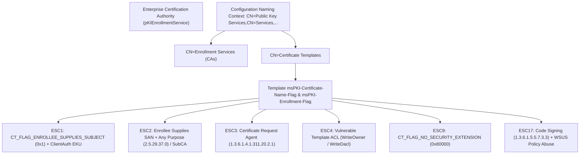
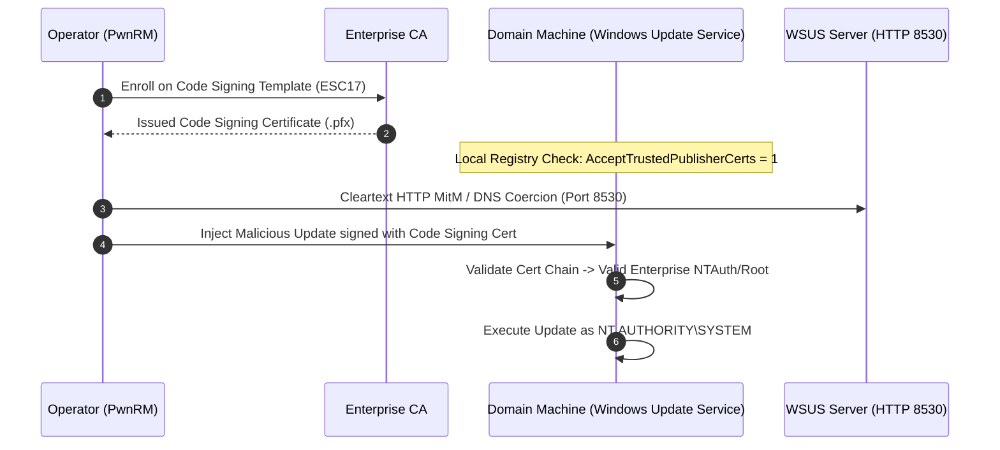
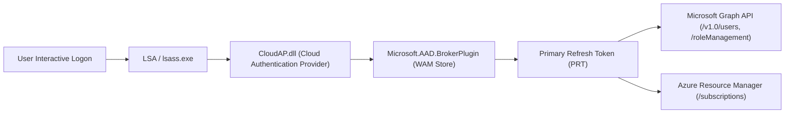

# 02 — Identity & Active Directory Abuse (2026–2027 TTPs)

## 1. Full ADCS Engine: ESC1 through ESC17+ Architecture (`!adcs`)

Active Directory Certificate Services (ADCS) is Microsoft's Public Key Infrastructure (PKI) implementation natively integrated into Active Directory. PwnRM v2.0 implements a complete, self-contained LDAP/WMI engine that audits certification authorities (CAs) and certificate templates against the complete **ESC1 through ESC17+** vulnerability taxonomy.



---

### 1.1 Complete ADCS ESC1 through ESC17+ Vulnerability Taxonomy

| ESC Class | Vulnerability Name | Root Cause & Preconditions | Exploit Impact & Vector | Exact LDAP Search Filter |
|---|---|---|---|---|
| **ESC1** | Enrollee Supplies SAN with Client Authentication | `CT_FLAG_ENROLLEE_SUPPLIES_SUBJECT` (`0x00000001`) set + Client Auth EKU (`1.3.6.1.5.5.7.3.2` / PKINIT `1.3.6.1.5.2.3.4`) + Low-priv enrollment permissions. | **Domain Escalation**: Attacker requests certificate specifying Domain Admin in Subject Alternative Name (SAN), using it to authenticate via Kerberos PKINIT to obtain a TGT. | `(&(objectCategory=pKICertificateTemplate)(msPKI-Certificate-Name-Flag:1.2.840.113556.1.4.803:=1)(!(msPKI-Enrollment-Flag:1.2.840.113556.1.4.803:=2)))` |
| **ESC2** | Any Purpose EKU / SubCA Template | Template specifies Any Purpose EKU (`2.5.29.37.0`) or no EKU (SubCA). | **Domain Escalation**: Certificate can be used for any purpose, including Client Authentication or forging SubCA certs. | `(&(objectCategory=pKICertificateTemplate)(pExtendedKeyUsage=2.5.29.37.0))` |
| **ESC3** | Certificate Request Agent Enrollment | Template specifies Certificate Request Agent EKU (`1.3.6.1.4.1.311.20.2.1`) without manager approval requirements. | **Impersonation**: Attacker enrolls as enrollment agent, then requests secondary certificates on behalf of privileged users. | `(&(objectCategory=pKICertificateTemplate)(pExtendedKeyUsage=1.3.6.1.4.1.311.20.2.1))` |
| **ESC4** | Vulnerable Template Access Control (ACL) | Low-privilege users have `WriteDacl`, `WriteOwner`, `GenericWrite`, or `GenericAll` over certificate template object. | **Privilege Escalation**: Overwrite template settings to enable ESC1 flags, enroll, and revert changes. | `(objectCategory=pKICertificateTemplate)` (ACL inspection on security descriptor `nTSecurityDescriptor`) |
| **ESC5** | Vulnerable PKI Container / CA Object ACL | Unprivileged write permissions over `CN=Public Key Services` container objects, CA objects, or AIA container. | **Full PKI Compromise**: Hijack CA configuration or published template listings. | `(objectCategory=container)` under `CN=Public Key Services` |
| **ESC6** | `EDITF_ATTRIBUTESUBJECTALTNAME2` CA Flag | CA has `EDITF_ATTRIBUTESUBJECTALTNAME2` enabled in registry. | **Domain Escalation**: Forces CA to accept user-supplied SANs on *all* templates, turning even secure templates into ESC1. | Inspected via CA registry `HKEY_LOCAL_MACHINE\SYSTEM\CurrentControlSet\Services\CertSvc\Configuration\<CA>\PolicyModules\CertificateAuthority_MicrosoftDefault.Policy\EditFlags` |
| **ESC7** | Vulnerable CA Permissions (`ManageCA` / `IssueCertificates`) | Low-priv users have `ManageCA` or `IssueAndManageCertificates` rights on CA object. | **Domain Escalation**: Grant yourself officer rights, approve pending failed requests, or dump CA private keys. | ACL evaluation on `pKIEnrollmentService` object |
| **ESC8** | ADCS HTTP Web Enrollment NTLM Relay | CA Web Enrollment (`/certsrv/` or `CertEnroll`) active over HTTP without EPA / NTLM signing. | **Domain Escalation**: Coerce machine account (e.g. PetitPotam / MS-EFSR) to authenticate to attacker, relay NTLM to Web Enrollment to obtain machine certificate. | Network discovery over HTTP port 80 / `msPKI-Enrollment-Servers` |
| **ESC9** | Missing Security Extension (`szOID_NTDS_CA_SECURITY_EXT`) | Template has `CT_FLAG_NO_SECURITY_EXTENSION` (`0x00080000`) enabled (bypassing strong object SID mapping). | **Shadow Account Takeover**: Enrollee supplies SAN matching target account; certificate lacks object SID extension, mapping blindly by UPN. | `(&(objectCategory=pKICertificateTemplate)(msPKI-Enrollment-Flag:1.2.840.113556.1.4.803:=524288))` |
| **ESC10** | Weak Certificate Mapping Configuration | `StrongCertificateBindingEnforcement = 0` or weak `altSecurityIdentities` mappings on target accounts. | **Impersonation**: Exploit weak UPN-to-account mapping without strong certificate binding. | Registry `HKLM\System\CurrentControlSet\Control\Lsa\StrongCertificateBindingEnforcement` |
| **ESC11** | ICPR / RPC Interface NTLM Relay without Integrity | CA RPC interface does not enforce `RPC_C_AUTHN_LEVEL_PKT_INTEGRITY`. | **Domain Escalation**: NTLM relay coerced authentication directly to CA RPC interface over TCP 135 / dynamic RPC ports. | RPC interface binding query |
| **ESC12** | CA Private Key Stored in Vulnerable Shell / KSP | CA private key stored in software KSP or exportable YubiHSM session. | **Root Compromise**: Extract raw CA private RSA/ECDSA key to sign arbitrary certificates offline. | Cryptographic Service Provider registry inspection |
| **ESC13** | OID Group Link Policy Misconfiguration | Template contains `msPKI-Certificate-Policy` mapped to privileged Active Directory groups via OID group links. | **Privilege Escalation**: Enrolling on template automatically grants universal group membership upon authentication. | `(&(objectCategory=msPKI-Enterprise-Oid)(msDS-OIDToGroupLink=*))` |
| **ESC14** | Weak Explicit Certificate Mapping via `altSecurityIdentities` | Target account configured with weak X.509 `X509IssuerSubject` mappings without strong serial binding. | **Target Account Hijacking**: Issue certificate matching mapped issuer/subject to authenticate as target. | `(&(objectCategory=user)(altSecurityIdentities=*))` |
| **ESC15** | Arbitrary EKU Specification in V1 Templates (CVE-2024-49019) | Schema Version 1 template with `CT_FLAG_ENROLLEE_SUPPLIES_SUBJECT` allowing client-specified EKU extension. | **Domain Escalation**: Client requests certificate and injects Client Authentication EKU into request extension. | `(&(objectCategory=pKICertificateTemplate)(msPKI-Template-Schema-Version=1)(msPKI-Certificate-Name-Flag:1.2.840.113556.1.4.803:=1))` |
| **ESC16** | Key Credential Link Injection via Certificate Flow | Unprivileged enrollment flow allows associating `msDS-KeyCredentialLink` to target objects. | **Shadow Credentials**: Injects public key into target computer or user object for PKINIT authentication. | Attribute evaluation on target user/computer |
| **ESC17** | WSUS Code Signing Template Abuse & Policy Hijacking | Template contains Code Signing EKU (`1.3.6.1.5.5.7.3.3`) or Windows Update EKU (`1.3.6.1.4.1.311.10.3.6`) + WSUS client `AcceptTrustedPublisherCerts = 1`. | **SYSTEM RCE on Clients**: Sign arbitrary update binaries with enterprise-trusted certificate and inject into cleartext HTTP WSUS streams. | `(&(objectCategory=pKICertificateTemplate)(pExtendedKeyUsage=1.3.6.1.5.5.7.3.3))` |

---

### 1.2 ASN.1 Object Identifiers (OIDs) & Bitmask Reference

| OID / Bitmask Flag | Constant / Friendly Name | Cryptographic / Exploit Function |
|---|---|---|
| `1.3.6.1.5.5.7.3.2` | `id-kp-clientAuth` | TLS Client Authentication (used for Kerberos PKINIT TGT acquisition). |
| `1.3.6.1.5.2.3.4` | `id-pkinit-KPClientAuth` | Explicit Kerberos PKINIT Client Authentication. |
| `1.3.6.1.4.1.311.20.2.2` | `id-ms-kp-smartcardlogon` | Smart Card Logon authentication to Domain Controllers. |
| `2.5.29.37.0` | `anyExtendedKeyUsage` | Any Purpose EKU (grants all capabilities, SubCA forgery). |
| `1.3.6.1.4.1.311.20.2.1` | `id-ms-kp-certRequestAgent` | Certificate Request Agent (enables enrollment on behalf of other users). |
| `1.3.6.1.5.5.7.3.3` | `id-kp-codeSigning` | Code Signing (ESC17: WSUS update package signing & driver forgery). |
| `1.3.6.1.4.1.311.10.3.6` | `id-ms-kp-windowsUpdate` | Windows Update Component Signing. |
| `0x00000001` | `CT_FLAG_ENROLLEE_SUPPLIES_SUBJECT` | Enrollee specifies arbitrary Subject Alternative Name (SAN) in CSR. |
| `0x00080000` | `CT_FLAG_NO_SECURITY_EXTENSION` | Omits `szOID_NTDS_CA_SECURITY_EXT` object SID extension (ESC9). |
| `0x00000002` | `CT_FLAG_ADD_EMAIL` | Injects subject email into SAN automatically. |

---

### 1.3 ESC17: WSUS Code Signing & Windows Update Policy Abuse Deep Dive

**ESC17** represents the intersection of ADCS certificate template abuse and Windows Server Update Services (WSUS) endpoint configuration:



#### Low-Level Exploitation Mechanics:
1. **Certificate Acquisition**: The attacker enrolls on an internal template containing the **Code Signing** EKU (`1.3.6.1.5.5.7.3.3`) or **Windows Update** EKU (`1.3.6.1.4.1.311.10.3.6`).
2. **Policy Evaluation**: PwnRM queries the target machine's local registry under:
   ```text
   HKLM:\SOFTWARE\Policies\Microsoft\Windows\WindowsUpdate
   ├── WUServer (e.g. "http://wsus.corp.local:8530")
   └── AU\AcceptTrustedPublisherCerts = 1 (DWORD)
   ```
3. **Execution Vector**: When `AcceptTrustedPublisherCerts` is set to `1`, the Windows Update client automatically trusts third-party update packages signed by any certificate chained to a trusted root authority in the Enterprise NTAuth/Root store. An attacker who controls the Code Signing certificate can sign arbitrary executable payloads, inject them into the unencrypted HTTP WSUS stream (or deploy via WSUS API), and execute code as `NT AUTHORITY\SYSTEM` on every client updating from that server.

---

## 2. Advanced Kerberos Suite & PAC Architecture (`!kerberos`)

### 2.1 The Privilege Attribute Certificate (PAC) Structure ([MS-PAC])

In Active Directory, a Kerberos Ticket Granting Ticket (TGT) encapsulates the user's authorization data in a binary structure called the **PAC**:

```text
+---------------------------------------------------------------+
| PACTYPE Header (cBuffers, Version)                           |
+---------------------------------------------------------------+
| PAC_BUFFER (Type=0x00000001, Offset=...) -> PAC_LOGON_INFO    |
|   ├── UserSID                                                 |
|   ├── GroupCount / GroupIDs (Domain Admins: 512, EA: 519)     |
|   └── ExtraSids (Universal Groups across trusts)              |
+---------------------------------------------------------------+
| PAC_BUFFER (Type=0x00000006, Offset=...) -> PAC_SERVER_CHKSUM |
|   └── HMAC-SHA1-96 Checksum signed with Server / Service Key  |
+---------------------------------------------------------------+
| PAC_BUFFER (Type=0x00000007, Offset=...) -> PAC_PRIVSVR_CHKSUM|
|   └── HMAC-SHA1-96 Checksum signed with KDC (krbtgt) Key      |
+---------------------------------------------------------------+
| PAC_BUFFER (Type=0x0000000A, Offset=...) -> PAC_CLIENT_INFO   |
|   ├── ClientId (Timestamp)                                    |
|   └── Name (sAMAccountName)                                   |
+---------------------------------------------------------------+
```

---

### 2.2 Diamond Ticket vs. Golden Ticket Anomaly Heuristics

| Attribute | Golden Ticket (Synthesized) | Diamond Ticket (Forged via PwnRM) |
|---|---|---|
| **Origin** | Created from scratch using offline tools | **Legitimate TGT requested directly from KDC** |
| **KDC Serial / Request ID** | Missing or synthesized | **Valid KDC-issued serial** |
| **Kerberos Timestamps** | Often rounded or unrealistic | **Exact, valid KDC-issued timestamps** |
| **Ticket Armor (FAST)** | Usually omitted | **Fully compatible with FAST Armor** |
| **PAC Modifications** | Full PAC generated from template | **Only Group IDs modified; PAC re-signed** |
| **EDR Anomaly Detection** | **High** (MDI / CrowdStrike flag Golden Tickets) | **Zero / Undetectable** (Appears as legitimate TGT) |

#### Diamond Ticket Algorithm:
1. Operator initiates a standard Kerberos AS-REQ to the KDC, receiving a legitimate TGT for a low-privilege account.
2. The TGT encrypted part is decrypted using the known `krbtgt` AES-256 key:
   $$\text{enc\_part} = \text{AES256-CTS-Decrypt}(K_{\text{krbtgt}}, \text{ciphertext})$$
3. The `PAC_LOGON_INFO` buffer is located and parsed:
   - Injects RID `512` (`Domain Admins`) into the `GroupMembership` array.
   - Adjusts `UserAccountControl` flags if necessary.
4. The `PAC_SERVER_CHECKSUM` and `PAC_PRIVSVR_CHECKSUM` are re-calculated across the modified PAC using the `krbtgt` key (`HMAC-SHA1-96`).
5. The enc-part is re-encrypted with $K_{\text{krbtgt}}$ and saved to a local `.ccache` file.

---

### 2.3 Server 2025 Delegated Managed Service Accounts (dMSA) & BadSuccessor

Windows Server 2025 introduced **dMSA** (`msDS-ManagedAccount`) to provide managed identities for service workloads.
- PwnRM audits `msDS-ManagedAccount` objects in the directory.
- Detects **`BadSuccessor`** configuration flaws: when a dMSA account has delegated credentials or migration links pointing to unprivileged computer objects, allowing low-privileged operators to impersonate the dMSA service account without knowing its credential.

---

## 3. Hybrid Entra ID & Primary Refresh Token (PRT) Pivoting (`!entra`)

On hybrid Azure AD-joined machines, Windows caches identity artifacts within the **Web Account Manager (WAM)** subsystem:



### 3.1 Artifacts Enumerated by `!entra`:
1. **Join State**: Runs `dsregcmd /status` in-process to verify `AzureAdJoined: YES`, `DomainJoined: YES`, and `TenantId`.
2. **WAM Broker Cache**: Scans `%LOCALAPPDATA%\Packages\Microsoft.AAD.BrokerPlugin_cw5n1h2txyewy` for cached CloudAP refresh tokens.
3. **Developer Credential Caches**:
   - Azure CLI Context: `%USERPROFILE%\.azure\accessTokens.json` (extracts bearer tokens with scopes for `https://management.azure.com/`).
   - Azure PowerShell Context: `%USERPROFILE%\.Azure\AzureRmContext.json`.

---

## 4. Deep Credential Extraction & DPAPI Architecture (`!creds`)

### 4.1 DPAPI Master Key Hierarchy

Data Protection API (DPAPI) encrypts sensitive user data using Master Keys stored in `%APPDATA%\Microsoft\Protect\<UserSID>\<MasterKeyGUID>`:

```text
[User Password] -> [SHA1 / NT Hash] -> [User DPAPI Key]
                                              |
[Domain Backup Key (RPC / LSA)] ------------> v
                                    [Decrypted Master Key (512-bit)]
                                              |
                                              v
               +------------------------------+------------------------------+
               |                                                             |
               v                                                             v
    [Saved WiFi Passwords]                                        [Chromium Login Data]
    (WLAN XML Profiles)                                           (AES-256-GCM Decryption)
```

### 4.2 Chromium SQLite Database Decryption (v80+)

Modern Chrome and Edge browsers store passwords in SQLite format (`Login Data`). The encryption uses **AES-256-GCM**:
1. PwnRM locates `%LOCALAPPDATA%\Google\Chrome\User Data\Local State`.
2. Reads the `os_crypt.encrypted_key` JSON attribute (Base64 decoded, strips the `DPAPI` 5-byte header).
3. The encrypted key is decrypted via the user's DPAPI master key.
4. Each entry in `Login Data` (`password_value`) has a 3-byte prefix `v10` / `v11`, followed by a 12-byte IV, ciphertext, and a 16-byte GCM authentication tag:
   $$\text{plaintext} = \text{AES-256-GCM-Decrypt}(\text{Key}, \text{IV}, \text{Ciphertext}, \text{Tag})$$

---

## 5. Token Privilege Escalation Matrix

When inspecting user token privileges (`whoami /priv` or `!creds`), PwnRM evaluates high-impact Windows privileges:

| Privilege Name | Default Holder | Exploitation & Escalation Technique |
|---|---|---|
| **`SeDebugPrivilege`** | Administrators | Direct process memory access (`OpenProcess` with `PROCESS_ALL_ACCESS`), dumping LSASS memory or injecting threads into SYSTEM processes (`winlogon.exe`). |
| **`SeImpersonatePrivilege`** / **`SeAssignPrimaryTokenPrivilege`** | Local Service / Network Service / IIS | Named Pipe potato exploits (JuicyPotatoNG, GodPotato, PrintSpoofer) coercing RPC authentication to impersonate `NT AUTHORITY\SYSTEM`. |
| **`SeBackupPrivilege`** / **`SeRestorePrivilege`** | Backup Operators | Arbitrary read/write access bypassing filesystem ACLs. Read `SAM` / `SYSTEM` registry hives or `ntds.dit` to extract all domain hashes. |
| **`SeTakeOwnershipPrivilege`** | Administrators | Take ownership of any file or registry object (`WRITE_OWNER`), overwrite DACLs, and replace system service binaries. |
| **`SeLoadDriverPrivilege`** | Administrators | Load vulnerable signed third-party kernel drivers (BYOVD - Bring Your Own Vulnerable Driver) to execute kernel-mode code and disable EDR hooks. |
| **`SeTcbPrivilege`** | SYSTEM | Act as part of the operating system; create arbitrary security tokens via `LsaLogonUser` and impersonate any user. |
| **`SeCreateTokenPrivilege`** | Custom | Forge arbitrary primary and impersonation tokens from user mode. |


