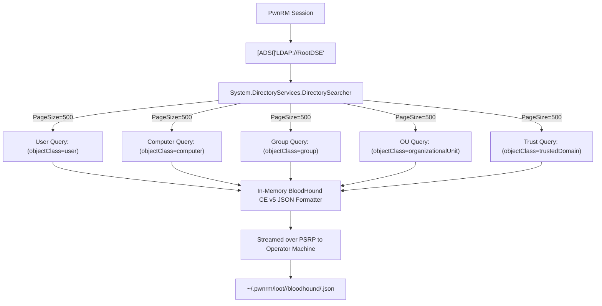
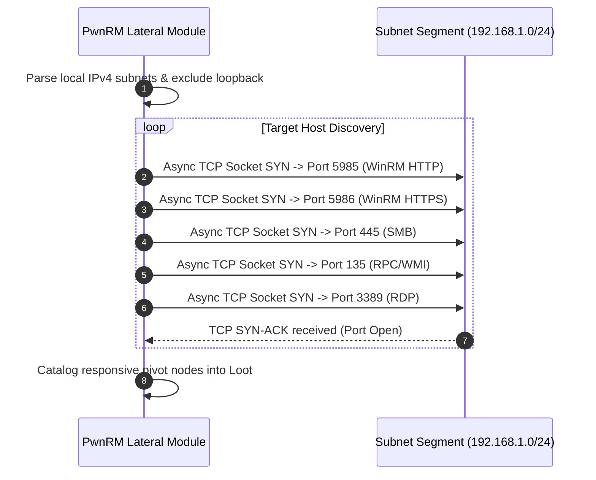
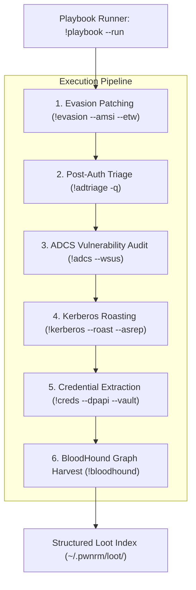
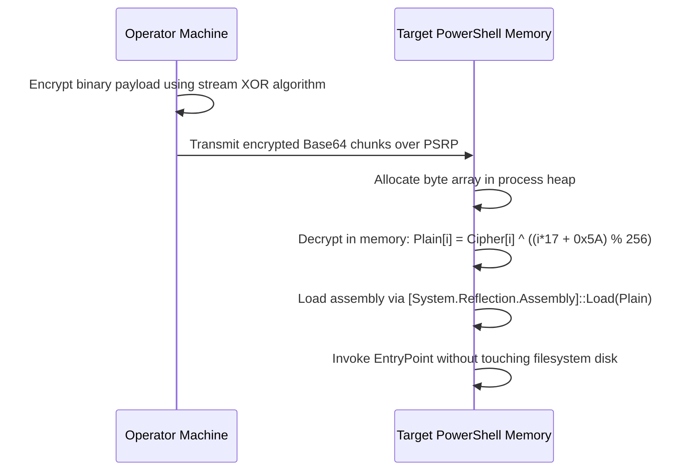

# 04 — Collection, Lateral Movement & Playbook Automation

## 1. In-Memory Active Directory Graph Collector (`!bloodhound`)

Traditional Active Directory graph mapping requires uploading standalone binaries (`SharpHound.exe`) or compiling large PowerShell scripts (`SharpHound.ps1`). These generate detectable process creations (Sysmon Event ID 1), high-entropy disk artifacts (Event ID 11), and high-frequency LDAP queries flagged by Microsoft Defender for Identity (MDI) heuristics.

PwnRM implements a **100% memory-only AD graph collector** utilizing native .NET directory interfaces (`System.DirectoryServices`):



---

### 1.1 LDAP Attribute Extraction & Graph Edge Matrix

The collector queries the domain partition using chunked paging (`PageSize = 500`) to prevent LDAP volumetric query threshold alerts, extracting key directory attributes:

| Object Class | Attributes Collected | Security Analysis / Graph Edges Resolved |
|---|---|---|
| **Users** | `objectSid`, `sAMAccountName`, `servicePrincipalName`, `userAccountControl`, `adminCount`, `memberOf`, `msDS-AllowedToDelegateTo`, `pwdLastSet`, `lastLogonTimestamp` | Kerberoastable SPNs, AS-REP roastable accounts (`DONT_REQ_PREAUTH`), Unconstrained / Constrained Delegation edges, AdminSDHolder protected objects. |
| **Computers** | `objectSid`, `dNSHostName`, `operatingSystem`, `operatingSystemVersion`, `msDS-AllowedToActOnBehalfOfOtherIdentity`, `msDS-AllowedToDelegateTo` | Resource-Based Constrained Delegation (RBCD) takeover edges, Domain Controllers, outdated OS targets. |
| **Groups** | `objectSid`, `sAMAccountName`, `member`, `adminCount` | Nested group membership resolution, Tier-0 administration groups (`Domain Admins`, `Enterprise Admins`, `Account Operators`). |
| **OUs & Containers** | `objectSid`, `name`, `gPLink`, `gPOptions`, `distinguishedName` | Group Policy Object (GPO) inheritance and link hijacking paths. |
| **Domain Trusts** | `objectSid`, `trustPartner`, `trustDirection`, `trustType`, `trustAttributes` | Inbound/Outbound forest trusts, SID filtering status, external domain compromise paths. |

---

### 1.2 BloodHound CE Schema (v5) Serialization

The collected objects are assembled directly in memory into BloodHound Community Edition (CE / v5) JSON format:

```json
{
  "data": [
    {
      "ObjectIdentifier": "S-1-5-21-1234567890-1234567890-1234567890-1104",
      "Properties": {
        "domain": "CORP.LOCAL",
        "name": "SVC_SQL@CORP.LOCAL",
        "distinguishedname": "CN=svc_sql,OU=ServiceAccounts,DC=corp,DC=local",
        "domainsid": "S-1-5-21-1234567890-1234567890-1234567890",
        "highvalue": false,
        "dontreqpreauth": false,
        "hasspn": true,
        "serviceprincipalnames": [
          "MSSQLSvc/db01.corp.local:1433"
        ],
        "admincount": false,
        "enabled": true
      },
      "Members": [],
      "Aces": []
    }
  ],
  "meta": {
    "methods": 0,
    "type": "users",
    "count": 1,
    "version": 5
  }
}
```

---

## 2. Subnet Scout & Lateral Movement Engine (`!lateral`)

The `!lateral` engine inspects the local host's active network routing table (`Get-NetRoute`, `Get-NetIPAddress`) and performs non-blocking asynchronous TCP socket probes against neighboring subnet hosts:



### 2.1 Low-Noise Socket Probe Implementation:

```powershell
$socket = New-Object System.Net.Sockets.TcpClient
$asyncResult = $socket.BeginConnect($ip, $port, $null, $null)
$success = $asyncResult.AsyncWaitHandle.WaitOne(250, $false) # 250ms timeout
if ($success -and $socket.Connected) {
    $socket.EndConnect($asyncResult)
    $socket.Close()
    # Port is OPEN -> Catalog target host and port in PwnRM loot
}
```

---

### 2.2 Lateral Movement Execution Vectors

| Vector | Protocol / Port | Execution Subsystem | Stealth / OPSEC Considerations |
|---|---|---|---|
| **WinRM Remoting** | HTTP 5985 / HTTPS 5986 | MS-PSRP `RunspacePool` | Native administrator management traffic; zero new processes spawned outside `wsmprovhost.exe`. |
| **WMI Process Execution** | RPC 135 + Dynamic RPC | `Win32_Process.Create` via DCOM | Spawns child process under `WmiPrvSE.exe`; generates Process Creation Event 4688 / Sysmon 1. |
| **SMB Named Pipe Service** | SMB 445 | Service Control Manager (`CreateServiceW`, `StartServiceW`) | High visibility; generates System Event ID 7045 (New Service Installed). |
| **Scheduled Tasks** | RPC 135 / SMB 445 | `ITaskService` COM Interface | Configurable hidden triggers and user context; generates Task Scheduler Event ID 106. |

---

## 3. Declarative Playbook Automation Engine (`!playbook`)

Playbooks allow operators to define reproducible assessment workflows. Each playbook defines a sequence of module invocations, arguments, and failure handling conditions:



### 3.1 Built-in Playbook Configurations:

#### 1. `default_triage`
Executes rapid host-level reconnaissance and credential artifact collection:
```yaml
name: default_triage
description: Standard post-exploitation triage and credential extraction
steps:
  - module: evasion
    args: ["--amsi", "--etw"]
  - module: sysinfo
    args: []
  - module: sessions
    args: ["-q"]
  - module: shares
    args: ["-q"]
  - module: creds
    args: ["--dpapi", "--vault"]
```

#### 2. `ad_recon`
Executes comprehensive Active Directory domain reconnaissance:
```yaml
name: ad_recon
description: Deep Active Directory identity and PKI infrastructure recon
steps:
  - module: evasion
    args: ["--amsi", "--etw"]
  - module: adtriage
    args: ["-q"]
  - module: adcs
    args: ["--wsus"]
  - module: kerberos
    args: ["--roast", "--asrep"]
  - module: bloodhound
    args: []
```

#### 3. `stealth_audit`
Executes minimal-noise reconnaissance with randomized jitter delays:
```yaml
name: stealth_audit
description: Low-noise situational awareness for hardened environments
steps:
  - module: opsec
    args: ["stealth"]
  - module: evasion
    args: ["--amsi", "--etw"]
  - module: sysinfo
    args: []
  - module: adcs
    args: ["-q"]
```

---

## 4. Hardened File Staging & In-Memory XOR Delivery

### 4.1 In-Memory XOR Encryption Protocol (`!upload -xor`, `!psrun -xor`, `!netrun -xor`)

To bypass perimeter and network-level signature scanners (Suricata, Zeek, deep packet inspection), payloads are encrypted with a dynamic stream cipher:

$$\text{CipherByte}[i] = \text{PlainByte}[i] \oplus ((i \times 17 + \text{0x5A}) \pmod{256})$$



---

### 4.2 Stream-Bounded Download & Integrity Validation (`!download`)

1. **Remote In-Memory Compression**: Directories are compressed into an in-memory `.zip` archive on the remote host using `System.IO.Compression.ZipFile`.
2. **Chunked Streaming**: Output is streamed back in 64 KB chunks over PSRP stream buffers.
3. **Hard Memory Cap**: Capped at 256 MB (`PWNRM_MAX_DL`) to prevent application-layer denial-of-service.
4. **MD5 Integrity Trailer**: An MD5 checksum trailer (32 hex characters) is appended to the stream:
   - PwnRM validates that $\text{MD5}(\text{received\_bytes}) == \text{trailer\_hash}$ before writing the file to disk, ensuring complete transport integrity and detecting corruption or truncation.
