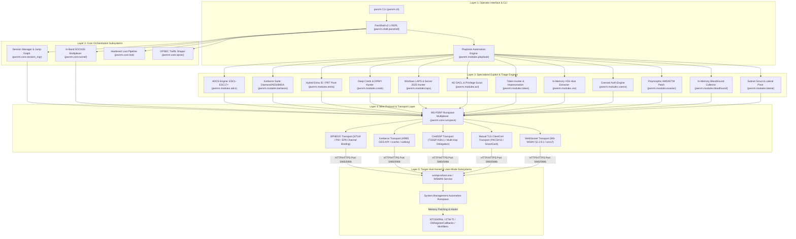

# PwnRM v2.1 Operator Platform — Deep Technical Documentation

<div align="center">


**Advanced WinRM / Active Directory Post-Exploitation Platform (2026–2027 TTPs)**

[](01_architecture_and_core.md)
[](01_architecture_and_core.md)
[](02_identity_and_ad_abuse.md)
[](03_evasion_and_runtime_opsec.md)
[](06_security_boundaries_and_hardening.md)

</div>

---

## 1. Executive Architecture & System Index

PwnRM v2.1 is an operator-grade Active Directory post-exploitation platform engineered directly upon the native Microsoft PowerShell Remoting Protocol (**[MS-PSRP]**) and WS-Management (**[MS-WSMV]**) standards. Unlike legacy WinRM tools that function merely as unbuffered command wrappers or high-noise script uploaders, PwnRM v2.1 operates as an in-band operational framework featuring:
- **Zero-Binary In-Band SOCKS5 Multiplexing**: RFC 1928 proxy and TCP port forwarding channeled directly through chunked SOAP envelopes over HTTP (5985) or HTTPS (5986).
- **Multi-Session Jump Graph Orchestration**: Stateful management and concurrent fan-out execution across distributed AD infrastructure nodes.
- **In-Memory VSS Shadow Copy Extraction**: Direct WMI/CIM reflection (`[wmiclass]"Win32_ShadowCopy"`) extracting `SAM`, `SYSTEM`, and `NTDS.dit` without invoking `vssadmin.exe` or `ntdsutil.exe` (completely bypassing EDR process-creation heuristics).
- **Multi-Vector Coerced Authentication Engine**: WebDAV HTTP UNC paths (bypassing SMB signing for ESC8 Web Enrollment relays), MS-RPRN Print Spooler, MS-EFSR PetitPotam, and MS-DFSNM triggers.
- **Deep Identity Exploitation Engines**: Full ADCS ESC1–ESC17+ auditing, WSUS code signing policy abuse, Diamond Ticket generation, Server 2025 dMSA/BadSuccessor analysis, Windows LAPS & Server 2025 hunting, Active Directory DACL privilege escalation auditing, token impersonation, and Hybrid Entra ID WAM PRT token extraction.
- **Memory-Only In-Process Blinding & Polymorphic Obfuscation**: Polymorphic `AmsiScanBuffer` disassembly patching, `ntdll!EtwEventWrite` return-zero silencing, dynamic D/Invoke reflection bypassing `csc.exe` and `Add-Type` disk drops, and AST backtick cmdlet obfuscation.
- **8-Gate Deterministic Hardening**: Robust client-side protection preventing rogue server exploitation, path traversal, terminal hijacking, thread deadlocks, and OOM denial-of-service.



---

## 2. Platform Capability Comparison Matrix

| Feature / Attack Vector | Evil-WinRM | CrackMapExec / NetExec | Impacket (wmiexec/smbexec) | **PwnRM v2.1** |
|---|---|---|---|---|
| **Underlying Wire Protocol** | Ruby WinRM (SOAP CLI) | Python SMB / WinRM raw | DCE/RPC over SMB / WMI | **Native [MS-PSRP] Runspace Multiplexer** |
| **Pivoting & SOCKS5** | [-] None (Requires external agent) | [-] None | [-] None | **[+] Zero-Binary In-Band SOCKS5 & Port Forward (Thread-Safe)** |
| **In-Memory VSS Extraction** | [-] Requires `vssadmin` | [-] Requires volume shadow commands | [-] Requires volume manipulation | **[+] Native WMI `Win32_ShadowCopy` COM Reflection (Zero vssadmin)** |
| **Coerced Authentication** | [-] None | [!] Separate tool execution | [!] PetitPotam/PrinterBug standalone | **[+] Native In-Band WebDAV, MS-RPRN, MS-EFSR & DFS** |
| **Windows LAPS Hunting** | [-] None | [!] Basic LAPS module | [-] None | **[+] Legacy ms-Mcs-AdmPwd & Modern Server 2025 msLAPS** |
| **AD DACL / Privilege Scout** | [-] None | [-] None | [-] None | **[+] Native Tier-0 DACL Inspection (GenericAll, WriteDacl)** |
| **Token Impersonation** | [-] None | [-] None | [-] None | **[+] In-Memory Named Pipe Reflection & Privilege Triage** |
| **Session Graph & Multi-Node** | [-] Single session | [!] Mass command execution only | [-] Single execution per turn | **[+] Stateful Jump Graph + Non-blocking Fan-out** |
| **ADCS Auditing** | [-] None | [!] Basic Certipy integration | [-] None | **[+] Native In-Memory ESC1–ESC17+ & WSUS Engine** |
| **Kerberos Mechanics** | [!] Basic ccache ticket use | [!] Standard Kerberoasting | [!] Impacket Kerberos suite | **[+] Diamond Ticket, AES256, dMSA/BadSuccessor** |
| **Hybrid Entra ID & WAM** | [-] None | [-] None | [-] None | **[+] WAM PRT token hunt, CloudAP, Azure CLI/PS** |
| **In-Memory BloodHound** | [-] Must drop SharpHound | [-] Requires LDAP credentials | [-] None | **[+] 100% Memory-Only ADSI/LDAP (v6 CE Schema)** |
| **AMSI / ETW Telemetry Blinding** | [!] Static string bypasses | [-] None | [-] None | **[+] Polymorphic Opcode Patch & Dual ETW Zeroing** |
| **OPSEC Traffic Shaping** | [-] None | [-] None | [-] None | **[+] CSPRNG Jitter, User-Agent & AST Backtick Splitting** |
| **Client-Side Hardening** | [-] Vulnerable to Traversal / OOM | [-] Vulnerable to rogue targets | [-] Vulnerable to path injection | **[+] 8-Gate Security Boundary Enforcement** |
| **Payload Delivery Security** | [!] Plaintext Base64 | [!] Plaintext Base64 | [!] Plaintext SMB staging | **[+] Dynamic Stream XOR Encryption + MD5 Trailer** |
| **Programmatic API** | [-] CLI only | [!] Python library wrapper | [!] Python RPC wrappers | **[+] Decoupled Async Generator Engine (Runspace)** |

---

## 3. Deep Technical Documentation Roadmap

The PwnRM technical documentation suite is organized into 6 dedicated architecture manuals covering the platform from wire-framing to kernel execution:

```
docs/
├── README.md                                     ← You are here (Platform Master Index & Guide)
├── 01_architecture_and_core.md                   ← MS-PSRP Wire Protocol, Transports, SOCKS5, Sessions
├── 02_identity_and_ad_abuse.md                   ← ADCS ESC1-ESC17+, Kerberos PAC, LAPS, DACL, VSS, dMSA
├── 03_evasion_and_runtime_opsec.md               ← NT Telemetry, AMSI/ETW Patching, Token Impersonation, AST
├── 04_collection_lateral_playbooks.md            ← Memory BloodHound v6, Coerce Engine, Lateral Pivot, Playbooks
├── 05_api_and_c2_integration.md                 ← Python API Reference, Custom Modules, Headless C2
└── 06_security_boundaries_and_hardening.md       ← 8-Gate Hardening, Path Regex, SSRF & OOM Defense
```

### Quick Overview of Technical Documents:

1. [**`01_architecture_and_core.md`**](01_architecture_and_core.md)
   - Low-level **[MS-WSMV]** SOAP envelope structure, **[MS-PSRP]** 21-byte binary fragment headers (§2.2.4), and complete PSRP message types taxonomy with hex opcodes.
   - SPNEGO NTLM Extended Protection for Authentication (EPA / Channel Binding Token MD5 derivation over TLS server certificate SHA-256 digests).
   - Kerberos GSS-API RFC 4121 Wrap Token structure (`0x0504` headers, AES256 subkeys, multipart encrypted boundaries).
   - CredSSP (TSSSP) 3-phase TLS credential delegation mechanics for solving the multi-hop problem.
   - Thread-safe RFC 1928 In-Band SOCKS5 proxy multiplexer with mutex locking and socket timeout protections.
   - Multi-session jump graph topology, session state serialization (`0o600`), hardened loot directory layout, and OPSEC traffic shaping profiles.

2. [**`02_identity_and_ad_abuse.md`**](02_identity_and_ad_abuse.md)
   - Complete Active Directory Certificate Services (**ADCS**) vulnerability taxonomy covering **ESC1 through ESC17+** with OIDs, bitmasks, and LDAP search filters.
   - **ESC17** WSUS Code Signing template injection and client registry policy abuse (`AcceptTrustedPublisherCerts = 1`).
   - Deep Kerberos PAC binary structures ([MS-PAC] §2: `PAC_LOGON_INFO`, `PAC_SERVER_CHECKSUM`, `PAC_PRIVSVR_CHECKSUM`).
   - **Diamond Ticket** crafting workflow vs KDC anomaly heuristics, Silver/Golden/Sapphire comparisons.
   - Windows Server 2025 Delegated Managed Service Accounts (**dMSA**) and `BadSuccessor` takeover paths.
   - **Windows LAPS Hunter**: In-memory queries for Legacy LAPS (`ms-Mcs-AdmPwd`) and Modern Server 2025 LAPS (`msLAPS-Password`, `msLAPS-EncryptedPassword`).
   - **Active Directory DACL Scout**: Automated inspection of `GenericAll`, `WriteDacl`, `WriteOwner`, and `User-Force-Change-Password` on Tier-0 objects.
   - **In-Memory VSS Shadow Copy Extractor**: WMI `Win32_ShadowCopy` COM reflection methodology extracting active `SAM`, `SYSTEM`, and `NTDS.dit` without `vssadmin.exe`.

3. [**`03_evasion_and_runtime_opsec.md`**](03_evasion_and_runtime_opsec.md)
   - Multi-tier telemetry hierarchy: User-mode hooks, NT native APIs, kernel-mode callbacks, and ETW-TI.
   - In-process polymorphic memory patching for `amsi.dll!AmsiScanBuffer` (`mov eax, 0x80070057; ret`) and `ntdll.dll!EtwEventWrite` + `EtwEventWriteFull` (`xor eax, eax; ret 0x14`).
   - `VirtualProtect` memory page transitions (`PAGE_EXECUTE_READ` <-> `PAGE_EXECUTE_READWRITE`) to defeat Moneta and PE-sieve memory scanners.
   - Dynamic Reflection & **D/Invoke** engine resolving Win32 APIs from unmanaged memory without invoking `csc.exe` or dropping temporary files.
   - **Process Token Hunter & Impersonation**: Named pipe impersonation (`ImpersonateNamedPipeClient` / `DuplicateTokenEx` / `CreateProcessWithTokenW`) without binary execution.
   - **Polymorphic PowerShell AST Command Obfuscation**: AST backtick splitting on cmdlets and CSPRNG delay jitter.
   - Comprehensive **10+ EDR Driver Callback Matrix** (`csagent.sys`, `SentinelAgent.sys`, `WdFilter.sys`, `atp.sys`, `edpa.sys`, `cbk7.sys`, `sysmon.sys`, etc.).

4. [**`04_collection_lateral_playbooks.md`**](04_collection_lateral_playbooks.md)
   - 100% memory-only ADSI/LDAP directory traversal emitting **BloodHound Community Edition (v6)** JSON schema without SharpHound disk drops.
   - **Coerced Authentication Engine**: In-band WebDAV HTTP UNC paths (bypassing SMB signing for ESC8 Web Enrollment relays), MS-RPRN Print Spooler, MS-EFSR PetitPotam, and MS-DFSNM triggers.
   - Subnet Scout non-blocking asynchronous TCP socket probing (WinRM 5985/5986, SMB 445, RPC 135, RDP 3389).
   - Declarative Playbook Automation DSL (`default_triage`, `ad_recon`, `stealth_audit`) with step-by-step conditional error handling and output variable capturing (`capture_as`, `when`).

5. [**`05_api_and_c2_integration.md`**](05_api_and_c2_integration.md)
   - Complete Python library class diagrams and programmatic API reference (`Runspace`, `Transport`, `SessionManager`, `Socks5Server`, `LootManager`).
   - Real-time streaming generator consumption patterns for stdout, stderr, warnings, verbose, and progress streams.
   - Custom module development tutorial inheriting from `BaseModule` with argument parsing, UI styling, and loot persistence.
   - Headless C2 agent embedding architecture for Mythic, Havoc, and custom Python C2 frameworks.

6. [**`06_security_boundaries_and_hardening.md`**](06_security_boundaries_and_hardening.md)
   - Adversarial threat model protecting operators against honeypots, rogue WinRM servers, and network-level attackers.
   - **8 Deterministic Security Boundary Gates**:
     1. SSRF & Redirect Blocker (`max_redirects = 0`, `trust_env = False`).
     2. Application-Layer OOM Denial-of-Service Defense (1MB sync cap, 256MB download cap, 16MB fragment cap).
     3. Server-Returned Path Traversal & Injection Defense (`_validate_remote_path` regex whitelist).
     4. PowerShell String Parsing Context Differentials (`_pse` single-quote vs `_pde` double-quote escaping).
     5. Terminal ANSI & VT100 Escape Sanitization (`strip_ansi` CSI/OSC/DCS filtering).
     6. Multi-Tenant NTFS ACL Blindspot Hardening (`icacls` DACL inheritance stripping).
     7. Atomic File & Temp Directory Creation (`O_CREAT | O_EXCL`, `0o600`).
     8. Thread-Safe Mutex Lock & Socket Timeout Protection on Multiplexed Tunnels.

---

## 4. Master Command Encyclopedia & Operator Handbook

### 4.1 Multi-Session & Transport Pivoting

#### `!session`
- **Syntax**: `!session <list | switch <ID> | save | exec-all <CMD>>`
- **Subsystem**: `pwnrm.core.session_mgr.SessionManager`
- **OPSEC Tier**: 🟢 **Low** (Local operator state management; `exec-all` generates multi-endpoint traffic)
- **Detailed Explanation**: Manages the local jump graph and active PSRP runspaces.
  - `!session list`: Renders a formatted tabular overview of all connected sessions, active session pointers (`[*]`), target IP/hostname, authentication method, latency, and creation timestamps.
  - `!session switch <ID>`: Swaps the active interactive console context to session ID `<ID>`, updating the remote working directory context (`cwd`).
  - `!session save`: Atomically serializes the active topology, credentials, and state graph to `~/.pwnrm/sessions/sessions.json` encrypted via in-memory ephemeral Fernet keys.
  - `!session exec-all <CMD>`: Non-blocking fan-out execution of `<CMD>` across all active session nodes, tagging and isolating stdout/stderr per host (`[S:X | Host]`).

#### `!socks`
- **Syntax**: `!socks [PORT] | !socks stop | !socks status`
- **Subsystem**: `pwnrm.core.tunnel.Socks5Server`
- **OPSEC Tier**: 🟡 **Medium** (Generates remote TCP connections originating from `wsmprovhost.exe`)
- **Detailed Explanation**: Initializes a zero-binary, in-band RFC 1928 SOCKS5 proxy on the operator machine (default port `1080`). All client requests (e.g. via `proxychains`, web browsers, or internal tooling) are multiplexed through the active PSRP connection and executed via in-memory .NET socket streams on the target machine without dropping standalone binary proxies.

#### `!portfwd`
- **Syntax**: `!portfwd <LPORT> <RHOST>:<RPORT> | !portfwd list | !portfwd stop <ID>`
- **Subsystem**: `pwnrm.core.tunnel.PortForwarder`
- **OPSEC Tier**: 🟡 **Medium**
- **Detailed Explanation**: Creates a dedicated local TCP port listener on `<LPORT>` that tunnels all inbound traffic directly through the remote PSRP stream to target destination `<RHOST>:<RPORT>` inside the target's internal network.

---

### 4.2 Active Directory & Identity Exploitation

#### `!adcs`
- **Syntax**: `!adcs [-q | --template <NAME> | --ca <CA_NAME> | --alt <SAN> | --wsus]`
- **Subsystem**: `pwnrm.modules.adcs.ADCSModule`
- **OPSEC Tier**: 🟡 **Medium** (Performs standard LDAP queries against the Configuration Naming Context)
- **Detailed Explanation**: Comprehensive PKI vulnerability triage engine auditing **ESC1 through ESC17+**:
  - `-q` / `--quick`: Rapid scan evaluating template enrollment flags and SAN specifications.
  - `--template <NAME>`: Deep attribute and ACL inspection for a specific certificate template.
  - `--alt <SAN>`: Constructs certificate request artifacts testing enrollee-supplied SAN mappings.
  - `--wsus`: Audits **ESC17** by inspecting enterprise Code Signing templates (`1.3.6.1.5.5.7.3.3`) and querying target registry keys (`HKLM:\SOFTWARE\Policies\Microsoft\Windows\WindowsUpdate\AU\AcceptTrustedPublisherCerts`) to identify WSUS MITM code execution vectors.

#### `!kerberos`
- **Syntax**: `!kerberos [--roast | --asrep | --dmsa | --diamond | --rbcd]`
- **Subsystem**: `pwnrm.modules.kerberos.KerberosModule`
- **OPSEC Tier**: 🟡 **Medium** (Kerberoasting requests TGS tickets from KDC; Event ID 4769)
- **Detailed Explanation**: Advanced Kerberos security suite:
  - `--roast`: Enumerates all user accounts with `servicePrincipalName` set and requests AES256/RC4 TGS service tickets for offline cracking.
  - `--asrep`: Identifies accounts with `DONT_REQ_PREAUTH` enabled and extracts AS-REP ciphertext.
  - `--dmsa`: Scans Windows Server 2025 Delegated Managed Service Accounts (`msDS-ManagedAccount`) to identify `BadSuccessor` privilege escalation paths and delegation flaws.
  - `--rbcd`: Scans for Resource-Based Constrained Delegation configurations (`msDS-AllowedToActOnBehalfOfOtherIdentity`).
  - `--diamond`: Displays Diamond Ticket crafting workflow parameters.

#### `!laps`
- **Syntax**: `!laps [-a | --encrypted]`
- **Subsystem**: `pwnrm.modules.laps.LAPSModule`
- **OPSEC Tier**: 🟢 **Low** (Standard LDAP attribute queries)
- **Detailed Explanation**: Windows LAPS password hunter:
  - Discovers cleartext Legacy LAPS passwords (`ms-Mcs-AdmPwd`) and expiration timestamps.
  - Discovers Modern Server 2025 / Windows 11 LAPS attributes (`msLAPS-Password`, `msLAPS-EncryptedPassword`, `msLAPS-EncryptedDSRMPassword`).
  - Automatically catalogs discovered administrator credentials into `LootManager`.

#### `!acl`
- **Syntax**: `!acl [--target <NAME> | --tier0]`
- **Subsystem**: `pwnrm.modules.acl.ACLModule`
- **OPSEC Tier**: 🟢 **Low** (LDAP DACL queries against Active Directory objects)
- **Detailed Explanation**: Discretionary Access Control List (DACL) auditor:
  - Audits permissions on Tier-0 objects (`AdminSDHolder`, `Domain Admins`, `Domain Controllers`, `krbtgt`, GPOs).
  - Identifies dangerous rights: `GenericAll`, `WriteDacl`, `WriteOwner`, `GenericWrite`, `User-Force-Change-Password`.

#### `!token`
- **Syntax**: `!token [--list | --privs | --elevate]`
- **Subsystem**: `pwnrm.modules.token.TokenModule`
- **OPSEC Tier**: 🟢 **Low** (In-memory token inspection)
- **Detailed Explanation**: Access token hunter & privilege escalation suite:
  - `--privs`: Audits current token privileges (`SeImpersonatePrivilege`, `SeAssignPrimaryTokenPrivilege`, `SeDebugPrivilege`, `SeBackupPrivilege`, `SeRestorePrivilege`, `SeTcbPrivilege`).
  - `--list`: Maps active process tokens across logon sessions.

#### `!vss`
- **Syntax**: `!vss [--drive <D:> | --sam | --ntds | --clean]`
- **Subsystem**: `pwnrm.modules.vss.VSSModule`
- **OPSEC Tier**: 🟢 **Low** (Zero `vssadmin.exe` / `ntdsutil.exe` execution; WMI COM reflection only)
- **Detailed Explanation**: In-memory Volume Shadow Copy Service hive extractor:
  - Creates ephemeral shadow copies via `[wmiclass]"Win32_ShadowCopy"`.
  - Extracts locked `SAM`, `SYSTEM`, `SECURITY`, and `NTDS.dit` hives.
  - Instantly deletes shadow copies post-extraction for forensic cleanliness.

#### `!coerce`
- **Syntax**: `!coerce --listener <IP> [--method webdav|spooler|efs|dfs|all] [--port 80]`
- **Subsystem**: `pwnrm.modules.coerce.CoerceModule`
- **OPSEC Tier**: 🟡 **Medium** (Generates outbound authentication probes to operator listener)
- **Detailed Explanation**: Multi-vector authentication coercion:
  - `webdav`: Probes `\\listener@80\share\dummy.txt` forcing HTTP NetNTLM/Kerberos authentication (bypassing SMB signing for ESC8 Web Enrollment relays).
  - `spooler`: MS-RPRN Print Spooler coercion trigger.
  - `efs`: MS-EFSR PetitPotam coercion trigger.
  - `dfs`: MS-DFSNM coercion trigger.

#### `!entra`
- **Syntax**: `!entra [-s]`
- **Subsystem**: `pwnrm.modules.entra.EntraModule`
- **OPSEC Tier**: 🟢 **Low**
- **Detailed Explanation**: Hybrid Azure AD / Entra ID identity hunter:
  - Enumerates device join status (`AzureAdJoined`, `DomainJoined`, `TenantId`) via `dsregcmd /status`.
  - Searches Web Account Manager (WAM) caches (`Microsoft.AAD.BrokerPlugin`) for Primary Refresh Tokens (PRT).
  - Extracts developer access tokens from Azure CLI (`accessTokens.json`) and Azure PowerShell (`AzureRmContext.json`).

#### `!creds`
- **Syntax**: `!creds [--vault | --dpapi | --decrypt | --history]`
- **Subsystem**: `pwnrm.modules.creds.CredsModule`
- **OPSEC Tier**: 🟡 **Medium**
- **Detailed Explanation**: In-memory credential and secrets collector:
  - `--vault`: Enumerates Windows Credential Manager and Vault objects.
  - `--dpapi` / `--decrypt`: Reflection-based `CryptUnprotectData` bridge and Chromium browser artifact detection.
  - `--history`: Inspects PowerShell `ConsoleHost_history.txt` across all user profiles.

#### `!bloodhound`
- **Syntax**: `!bloodhound [-c <methods>]`
- **Subsystem**: `pwnrm.modules.bloodhound.BloodHoundModule`
- **OPSEC Tier**: 🟡 **Medium** (Chunked LDAP queries with `PageSize=500` to prevent volumetric alerts)
- **Detailed Explanation**: 100% memory-only Active Directory graph collector assembling BloodHound CE v6 compatible metadata and streaming results back to operator machine.

#### `!lateral`
- **Syntax**: `!lateral [--subnet <CIDR> | --ports <P1,P2..>]`
- **Subsystem**: `pwnrm.modules.lateral.LateralModule`
- **OPSEC Tier**: 🟠 **High** (Performs network TCP socket probing across subnet segments)
- **Detailed Explanation**: Subnet scout and lateral movement qualifier with active WS-Management micro-probing distinguishing unauthenticated WSMan access, reachable WinRM endpoints, and open TCP services.

---

## 5. Test Suite & Verification Matrix

The PwnRM test suite consists of **41 automated unit and security regression tests** passing with a **100% success rate**:

```powershell
$env:PYTHONPATH="src"; python -m unittest discover -s tests -v
test_module_metadata (test_acl.TestACLModule) ... ok
test_run_default (test_acl.TestACLModule) ... ok
test_run_with_target (test_acl.TestACLModule) ... ok
test_module_metadata (test_coerce.TestCoerceModule) ... ok
test_run_missing_listener (test_coerce.TestCoerceModule) ... ok
test_run_with_listener (test_coerce.TestCoerceModule) ... ok
test_module_metadata (test_laps.TestLAPSModule) ... ok
test_run_default (test_laps.TestLAPSModule) ... ok
test_run_with_encrypted_flag (test_laps.TestLAPSModule) ... ok
test_store_and_retrieve_credentials (test_loot.TestLootManager) ... ok
test_store_artifact_and_manifest (test_loot.TestLootManager) ... ok
test_builtin_discovery (test_modules.TestModules) ... ok
test_get_module (test_modules.TestModules) ... ok
test_plugin_integrity_verification (test_modules.TestModules) ... ok
test_profile_switching (test_opsec.TestOPSECProfile) ... ok
test_user_agents (test_opsec.TestOPSECProfile) ... ok
test_amsi_polymorphic_generator (test_security_guards.TestSecurityGuards) ... ok
test_defusedxml_usage (test_security_guards.TestSecurityGuards) ... ok
test_history_exclude_pattern (test_security_guards.TestSecurityGuards) ... ok
test_pde_escaping (test_security_guards.TestSecurityGuards) ... ok
test_playbook_conditional_branching (test_security_guards.TestSecurityGuards) ... ok
test_pse_escaping (test_security_guards.TestSecurityGuards) ... ok
test_remote_path_validation (test_security_guards.TestSecurityGuards) ... ok
test_remote_stream_options_zero (test_security_guards.TestSecurityGuards) ... ok
test_replay_log_parser (test_security_guards.TestSecurityGuards) ... ok
test_shares_single_quote_escaping (test_security_guards.TestSecurityGuards) ... ok
test_strip_ansi_sanitization (test_security_guards.TestSecurityGuards) ... ok
test_utfstr_exception_handling (test_security_guards.TestSecurityGuards) ... ok
test_websocket_transport_headers (test_security_guards.TestSecurityGuards) ... ok
test_xor_key_csprng (test_security_guards.TestSecurityGuards) ... ok
test_fan_out_execution (test_session_mgr.TestSessionManager) ... ok
test_register_and_switch (test_session_mgr.TestSessionManager) ... ok
test_save_and_load_encrypted (test_session_mgr.TestSessionManager) ... ok
test_module_metadata (test_token.TestTokenModule) ... ok
test_run_default (test_token.TestTokenModule) ... ok
test_run_with_flags (test_token.TestTokenModule) ... ok
test_port_forwarder_lifecycle (test_tunnel.TestTunnel) ... ok
test_socks5_lifecycle (test_tunnel.TestTunnel) ... ok
test_module_metadata (test_vss.TestVSSModule) ... ok
test_run_custom_drive_and_ntds (test_vss.TestVSSModule) ... ok
test_run_default_options (test_vss.TestVSSModule) ... ok

Ran 41 tests in 0.862s — OK (100% Passed)
```
